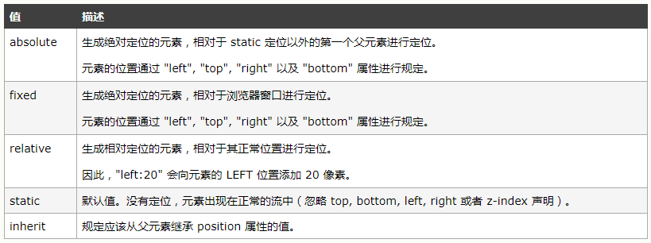
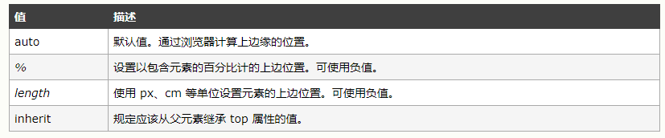

# CSS布局

## 一、定位内容

### 1、position和top

`position` 属性规定元素的定位类型。这个属性定义建立元素布局所用的定位机制。任何元素都可以定位，使用*absolute*和*fixed*定位的元素会表现的像inline-block元素，使用*fixed*定位的元素表现的原本一样。*absolute*和*fixed*定位会是元素脱离文档流。



*top*、*bottom*、*left*、*right*用来为定位元素设置偏移量。

`top` 属性规定元素的顶部边缘。该属性定义了一个定位元素的上外边距边界与其包含块上边界之间的偏移。



**注释：**

- 如果 "`position`" 属性的值为 "*static*"，那么设置 "`top`" 属性不会产生任何效果。

- 对于 static 元素，为 auto；对于长度值，则为相应的绝对长度；对于百分比数值，为指定值；否则为 auto。

- 对于相对定义元素，如果 top 和 bottom 都是 auto，其计算值则都是 0；如果其中之一为 auto，则取另一个值的相反数。

- 其他三个和top类似；　

### 2.absolute

```html
<!DOCTYPE html>
<html lang="en">
<head>
    <meta charset="UTF-8">
    <title>Title</title>
    <style type="text/css">
        img {
            position: absolute;
            top: 30px;
            left: 40px;
        }
    </style>
</head>
<body>
<p>元素定位</p>

<p>元素定位</p>
</body>
</html>
```

　　

*absolute*值会根据`position`值不是*static*的最近祖先元素来定位，上例不存在这样的元素，所以会相对于**body**元素来定位。后面的元素会向上浮动。

### 3.relative

```html
<!DOCTYPE html>
<html lang="en">
<head>
    <meta charset="UTF-8">
    <title>Title</title>
    <style type="text/css">
        img {
            position: relative;
            top: 30px;
            left: 40px;
        }
    </style>
</head>
<body>
<p>元素定位</p>

<p>元素定位</p>
</body>
</html>
```

　　

*relative*值会相对于`position`值为*static*的自身元素来定位。后面元素不会浮动。当*relative*定位元素超出父元素的范围，我们可以使用`overflow: hidden`来隐藏。

```html
<!DOCTYPE html>
<html lang="en">
<head>
    <meta charset="UTF-8">
    <title>Title</title>
    <style type="text/css">
        div {
            border: 1px solid darkred;
            background: #ccc;
        }
        .div1 {
            position: relative;
            top: 50px;
        }

        .div2 {
            text-indent: 2em;
        }
        section {
            border: 2px solid black;
        }
    </style>
</head>
<body>
<section>
    <div class="div1">hello</div>
    <div class="div2">hello world</div>
</section>
</body>
</html>
```

　　

对`section`使用*overflow*后。　

```html
<!DOCTYPE html>
<html lang="en">
<head>
    <meta charset="UTF-8">
    <title>Title</title>
    <style type="text/css">
        div {
            border: 1px solid darkred;
            background: #ccc;
        }
        .div1 {
            position: relative;
            top: 50px;
        }

        .div2 {
            text-indent: 2em;
        }
        section {
            border: 2px solid black;
            overflow: hidden;
        }
    </style>
</head>
<body>
<section>
    <div class="div1">hello</div>
    <div class="div2">hello world</div>
</section>
</body>
</html>
```

　　

当我们的使用*relative*定位的元素的父元素是`body`时候，我们对`body`使用`overflow:hidden`并不会隐藏定位元素，原因是`body`会默认将`overflow`属性传给`html`。我们可以给`html`也设置`overflow`属性，那么`body`的`overflow`属性就不会传给`html`.类似的属性还有`background`属性。

```html
<!DOCTYPE html>
<html lang="en">
<head>
    <meta charset="UTF-8">
    <title>Title</title>
    <style type="text/css">
        div {
            border: 1px solid darkred;
            background: #ccc;
        }
        .div1 {
            position: relative;
            top: 50px;
        }
        .div2 {
            text-indent: 2em;
        }
        body {
            border: 2px solid black;
            overflow: hidden;
        }
    </style>
</head>
<body>
<div class="div1">hello</div>
<div class="div2">hello world</div>
</body>
</html>
```

　　

给`html`使用*overflow*属性后：　

```html
<!DOCTYPE html>
<html lang="en">
<head>
    <meta charset="UTF-8">
    <title>Title</title>
    <style type="text/css">
        div {
            border: 1px solid darkred;
            background: #ccc;
        }
        .div1 {
            position: relative;
            top: 50px;
        }
        .div2 {
            text-indent: 2em;
        }
        body {
            border: 2px solid black;
            overflow: hidden;
        }
        html {
            overflow: hidden;
        }
    </style>
</head>
<body>
<div class="div1">hello</div>
<div class="div2">hello world</div>
</body>
</html>
```

　　

###4、fixed

元素相对于浏览器窗口(`viewport`)定位的，如果没有设置*top*等属性，元素会在原来的位置。元素会脱离文档流（元素所在的空间可以被其他的元素占据），定位后的元素表现的像一个`inline-block`。根据元素的内容占据宽度不会像块级元素一样占满一行。　

```html
<!DOCTYPE html>
<html lang="en">
<head>
    <meta charset="UTF-8">
    <title>Title</title>
    <style type="text/css">
        .div1 {
            background: red;
            font-size: 2em;
        }
        .div2 {
            background: green;
            font-size: 2em;
            text-indent: 2em;
        }
    </style>
</head>
<body>
<div class="div1">div1</div>
<div class="div2">div2</div>
</body>
</html>
```


`div1`使用*fixed*定位后

```html
<!DOCTYPE html>
<html lang="en">
<head>
    <meta charset="UTF-8">
    <title>Title</title>
    <style type="text/css">
        .div1 {
            background: red;
            font-size: 2em;
            position: fixed;
        }
        .div2 {
            background: green;
            font-size: 2em;
            text-indent: 2em;
        }
    </style>
</head>
<body>
<div class="div1">div1</div>
<div class="div2">div2</div>
</body>
</html>
```

　

### 5、z-index属性　

`z-index` 属性设置元素的堆叠顺序。拥有更高堆叠顺序的元素总是会处于堆叠顺序较低的元素的前面。属性值为数值，默认为`0`;如果使用定位的元素没有设置`z-index`,但是元素的位置发生了重叠，

后使用定位的元素在上面。如果使用定位的元素的子元素也使用了定位和z-index,子元素是否位于其他元素之上取决于父元素的z-index的值，这是因为子元素是在父元素的层叠上下文的范围内的，fixed定位的元素会立即获得层叠上下文，但是relative和absolute会在使用z-index属性后建立层叠上下文。不论父元素的z-index是否大于子元素的，父元素都不能覆盖子元素。

> 注释：元素可拥有负的 `z-index` 属性值。
>
> 注释：`z-index` 仅能在定位元素上奏效（例如 `position:absolute;`）！　

```html
<!DOCTYPE html>
<html lang="en">
<head>
    <meta charset="UTF-8">
    <title>Title</title>
    <style type="text/css">
        img {
            position: absolute;
            top: 20px;
            left: 20px;
        }
        p {
            position: relative;
            z-index: 1;
        }
    </style>
</head>
<body>
<p>元素定位</p>

<p>元素定位</p>
</body>
</html>
```

　　

---

