# CSS文本样式

## 一、对齐文本

### 1、text-align属性　

`text-align` 属性规定元素中的文本的水平对齐方式。该属性通过指定行框与哪个点对齐，从而设置块级元素内文本的水平对齐方式。通过允许用户代理调整行内容中字母和字之间的间隔，可以支持值 *justify*；不同用户代理可能会得到不同的结果。　　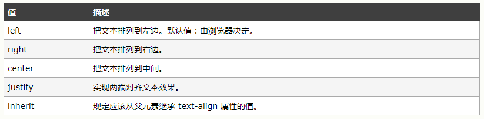

如果 `direction` 属性是 *ltr*，则默认值是 *left*；如果 `direction` 是 *rtl*，则为 *right*。　　

```html
<!DOCTYPE html>
<html lang="en">
<head>
    <meta charset="UTF-8">
    <title>Title</title>
    <style type="text/css">
        p {
            width: 101px;
            background: red;
            text-align: left;
        }
    </style>
</head>
<body>
<p>元素定位元素定位元素定位元素定位元素定位元素定位元素定位元素定位</p>
</body>
</html>
```

　　

属性值为*center*时：

```html
<!DOCTYPE html>
<html lang="en">
<head>
    <meta charset="UTF-8">
    <title>Title</title>
    <style type="text/css">
        p {
            width: 101px;
            background: red;
            text-align: center;
        }
    </style>
</head>
<body>
<p>元素定位元素定位元素定位元素定位元素定位元素定位元素定位元素定位</p>
</body>
</html>
```

　　

属性值为*right*时：　　

```html
<!DOCTYPE html>
<html lang="en">
<head>
    <meta charset="UTF-8">
    <title>Title</title>
    <style type="text/css">
        p {
            width: 101px;
            background: red;
            text-align: right;
        }
    </style>
</head>
<body>
<p>元素定位元素定位元素定位元素定位元素定位元素定位元素定位元素定位</p>
</body>
</html>
```

　　

如果属性值为*justify*值时，可以使用`text-justify`属性指定文本添加空白的方式。

`text-justify` 属性规定当 `text-align` 被设置为 text-align 时的齐行方法。该属性规定如何对齐行文本进行对齐和分隔。

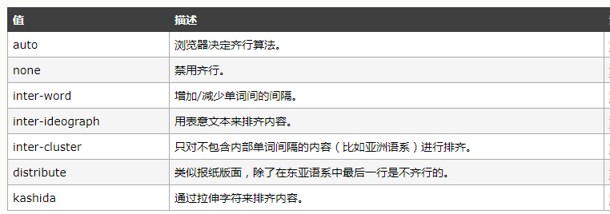

```html
<!DOCTYPE html>
<html lang="en">
<head>
    <meta charset="UTF-8">
    <title>Title</title>
    <style type="text/css">
        p {
            width: 101px;
            background: red;
            text-align: justify;
            text-justify: inter-word;
        }
    </style>
</head>
<body>
<p>元素定位元素定位元素定位元素定位元素定位元素定位元素定位元素定位</p>
</body>
</html>
```

　　

### 2、处理空白

空白在HTML文档中通常会被压缩或者直接忽略。这允许你讲HTML的布局和页面的外观分离。浏览器在遇到多个**空格**时，会将他们压缩成`一个空格`，遇到**换行符**等空白符则直接忽略。

`white-space` 属性设置如何处理元素内的空白。这个属性声明建立布局过程中如何处理元素中的空白符　

| **值**     | **说明**                                           |
| ---------- | -------------------------------------------------- |
| `normal`   | 默认值，空白符被压缩，文本行自动换行               |
| `nowrap`   | 空白符被压缩，文本行不换行                         |
| `pre`      | 空白符被保留，文本在遇到换行符的时候换行           |
| `pre-line` | 空白符被压缩，文本在一行排满或者遇到换行符时换行   |
| `pre-wrap` | 空白符被保留，文本会在一行排满或者遇到换行符时换行 |

```html
<!DOCTYPE html>
<html lang="en">
<head>
    <meta charset="UTF-8">
    <title>Title</title>
    <style type="text/css">
        p {
            width: 150px;
            background: red;
            white-space: nowrap;
        }
    </style>
</head>
<body>
<p>元素            定位元素
 定位元素定位元素定位元素定位元素定位元素定位元素定位</p>
</body>
</html>
```

　　

---

### 3、指定文本方向

`direction`属性规定文本的方向 / 书写方向。


```html
<!DOCTYPE html>
<html lang="en">
<head>
    <meta charset="UTF-8">
    <title>Title</title>
    <style type="text/css">
        p {
            width: 150px;
            background: red;
        }
        #first {
            direction: ltr;
        }
        #second {
            direction: rtl;
        }
    </style>
</head>
<body>
<p id="first">文本方向!</p>
<p id="second">文本方向!</p>
</body>
</html>
```

　　

---

### 4、指定单词、字母、行之间的间距　

#### a、letter-spacing

`letter-spacing` 属性增加或减少字符间的空白（字符间距）。该属性定义了在文本字符框之间插入多少空间。由于字符字形通常比其字符框要窄，指定长度值时，会调整字母之间通常的间隔。因此，*normal* 就相当于值为 0。

> 注释：允许使用负值，这会让字母之间挤得更紧。

```html
<!DOCTYPE html>
<html lang="en">
<head>
    <meta charset="UTF-8">
    <title>Title</title>
    <style type="text/css">
        p {
            width: 150px;
            background: red;
        }
        #first {
            letter-spacing: 10px;
        }
        #second {
            letter-spacing: -10px;
        }
    </style>
</head>
<body>
<p id="first">文本方向!</p>
<p id="second">文本方向!</p>
</body>
</html>
```

　　

#### b、word-spacing

`word-spacing` 属性增加或减少单词间的空白（即字间隔）。该属性定义元素中字之间插入多少空白符。针对这个属性，“字” 定义为由空白符包围的一个字符串。如果指定为长度值，会调整字之间的通常间隔；所以，*normal* 就等同于设置为 0。允许指定负长度值，这会让字之间挤得更紧。

> 注释：允许使用负值。该属性对中文无效。
>
> 设置中文字的间隔请使用`letter-spacing`属性。

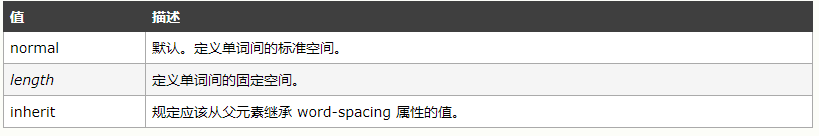

```html
<!DOCTYPE html>
<html lang="en">
<head>
    <meta charset="UTF-8">
    <title>Title</title>
    <style type="text/css">
        p {
            width: 150px;
            background: red;
        }
        #first {
            word-spacing: 10px;
        }
        #second {
            word-spacing: -1px;
        }
    </style>
</head>
<body>
<p id="first">I  love China!</p>
<p id="second">I  love China!</p>
</body>
</html>
```

　　

#### C、line-height

`line-height` 属性用于设置多行元素的空间量，比如文本。对于块级元素，它指定元素行盒（**line boxes**）的最小高度。对于非替代的 `inline` 元素，它用于计算行盒（line box）的高度。**注释：不允许使用负值。**

说明：　`line-height`属性的值可以是 `<数字>`、`<长度>`、`<百分比>` 、`normal`。推荐使用数字，因为`line-height`总是当前字体的大小的倍数。

```html
<!DOCTYPE html>
<html lang="en">
<head>
    <meta charset="UTF-8">
    <title>Title</title>
    <style type="text/css">
        p {
            width: 150px;
            background: red;
        }
        #first {
            line-height: 15px;
        }
        #second {
            line-height: 20px;
        }
    </style>
</head>
<body>
<p id="first">I  love China!</p>
<p id="second">I  love China!</p>
</body>
</html>
```

　　

### 5、控制断词

`word-wrap` 属性允许长单词或 URL 地址换行到下一行。

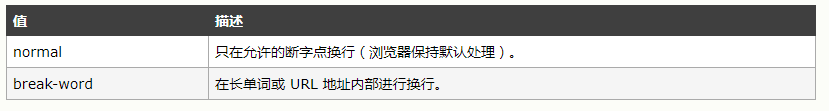

*normal*值单词不断开，即使无法完全放入包含块中。　　

```html
<!DOCTYPE html>
<html lang="en">
<head>
    <meta charset="UTF-8">
    <title>Title</title>
    <style type="text/css">
        p {
            width: 150px;
            background: red;
        }
        #first {
            word-wrap: normal;
        }
        #second {
            word-wrap: break-word;
        }
    </style>
</head>
<body>
<p id="first">I  love China! qqqqqqqqqqqqqqqqqqqqqqqqq</p>
<p id="second">I  love China! qqqqqqqqqqqqqqqqqqqqqqqqq</p>
</body>
</html>
```

　　

### 6、首行缩进　

`text-indent` 属性规定文本块中首行文本的缩进。

> 注释：允许使用负值。如果使用负值，那么首行会被缩进到左边。

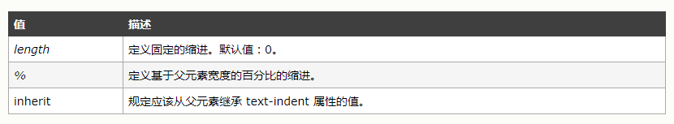

```html
<!DOCTYPE html>
<html lang="en">
<head>
    <meta charset="UTF-8">
    <title>Title</title>
    <style type="text/css">
        p {
            width: 150px;
            background: red;
        }
        #first {
            text-indent: 2em;
        }
        #second {
            text-indent: -2em;
        }
    </style>
</head>
<body>
<p id="first">I  love China! qqqqqqqqqqqqqqqqqqqqqqqqq</p>
<p id="second">I  love China! qqqqqqqqqqqqqqqqqqqqqqqqq</p>
</body>
</html>
```

　　

### 7、文本装饰与大小写转换

#### a、text-decoration

`text-decoration` 属性规定添加到文本的修饰。这个属性允许对文本设置某种效果，如加下划线。如果后代元素没有自己的装饰，祖先元素上设置的装饰会“延伸”到后代元素中。

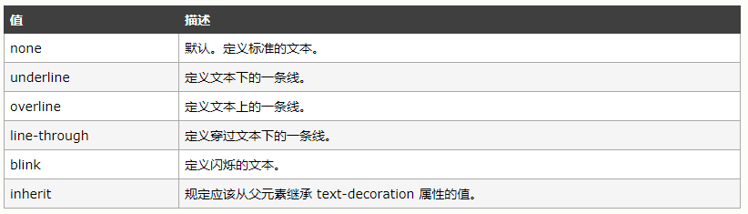

```html
<!DOCTYPE html>
<html lang="en">
<head>
    <meta charset="UTF-8">
    <title>Title</title>
    <style type="text/css">
        a {
            text-decoration: none;
        }
        p {
            text-decoration: underline;
        }
    </style>
</head>
<body>
<a href="http://www.baidu.com">百度</a>
 <p>下划线</p>
</body>
</html>
```

　　

#### b、text-transform

`text-transform` 属性控制文本的大小写。这个属性会改变元素中的字母大小写，而不论源文档中文本的大小写。如果值为 `capitalize`，则要对某些字母大写，但是并没有明确定义如何确定哪些字母要大写，这取决于用户代理如何识别出各个“词”。

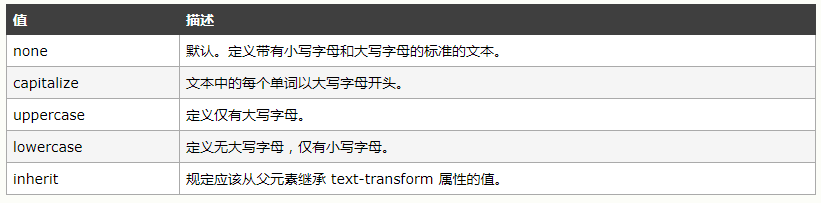

```html
<!DOCTYPE html>
<html lang="en">
<head>
    <meta charset="UTF-8">
    <title>Title</title>
    <style type="text/css">
        p {
            text-transform: capitalize;
        }
    </style>
</head>
<body>
 <p>abcd ads</p>
</body>
</html>
```

　　

#### 8、文本阴影（text-shadow）

`text-shadow` 属性向文本设置阴影。

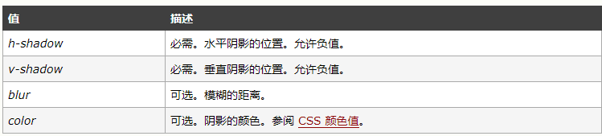

```html
<!DOCTYPE html>
<html lang="en">
<head>
    <meta charset="UTF-8">
    <title>Title</title>
    <style type="text/css">
        h1 {
            text-shadow: 5px 5px 5px red;
        }
    </style>
</head>
<body>
<h1>网站首页</h1>
</body>
</html>
```

　　

#### 9、设置字体

在设置css字体的时候，我们首先需要明白两个概念：族类和字体族.

**字体族名称（family-name）**

字体族名称（就是我们通常所说的“字体”）的例子包括“`Arial`”、“`Times New Roman`”、“`宋体`”、“`黑体`”等等。

**族类（generic family）**

一个族类是一组具有统一外观的字体族。`sans-serif`就是一例，它代表一组没有“脚”的字体。`serif`代表笔画两端有角的。`monospace`是指等宽地体，所有的字符宽度是一一致的。

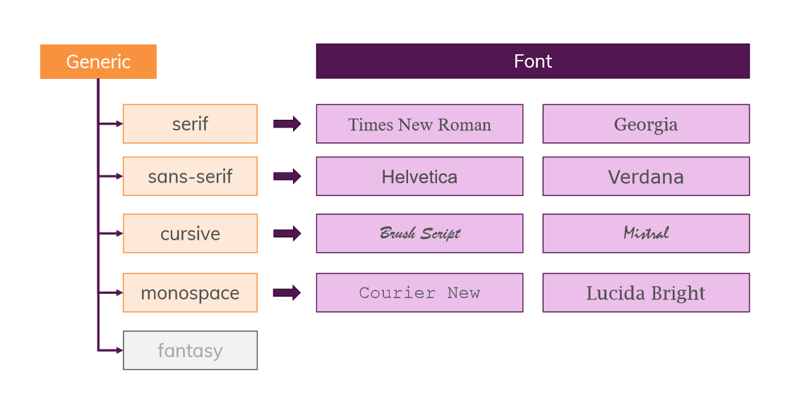

浏览器中的字体是如何显示的呢？google浏览者的字体设置如下：


​		如果我们在css中不设置字体的话使用的，浏览器会使用设置的标准字体，当我们`font-family`设置字体的时候，如果制定的字体族存在，会使用指定的字体族的字体。如果不存在，会使用下一个指定的字体族字体。一般会在`font-family`的最后指定一个`族类`，当前面的字体族不存在的时候，我们会使用这个族类中浏览器的设置中指定的字体族。　　

```css
/*前两个是字体族，第三个是族类。*/　 font-family: 'unknown1', 'unknown2', sans-serif;　
```

　　在css中使用上面的语句指定文档的字体，那么前两个字体族不存在，那么就会使用`sans-serif`族类中的字体，这个取决于我们在浏览器的设置中指定的`sans-serif`族类中所设置的字体族。

　　`font-family`中指定的字体组可以来自我们浏览器中支持的字体族，还可以是我们电脑中的字体族，也可以是web字体和来自其他服务器的字体，当使用浏览器中支持的字体族或我们电脑中的字体族时，字体依赖用户所使用的浏览器和电脑支持的字体（可以使用https://www.cssfontstack.com/查看不同系统对字体族的支持情况。

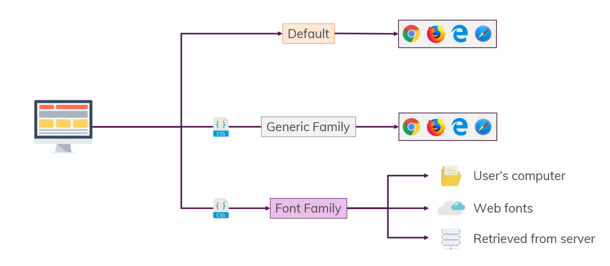

#### a、font

`font` 简写属性在一个声明中设置所有字体属性。可以不设置其中的某个值，比如 `font:100% verdana;` 也是允许的。未设置的属性会使用其默认值。

　　可以按顺序设置如下属性：

- `font-style`
- `font-variant`
- `font-weight`
- `font-size`/`line-height`
- `font-family`

```html
<!DOCTYPE html>
<html lang="en">
<head>
    <meta charset="UTF-8">
    <title>Title</title>
    <style type="text/css">
        p.ex1 {
            font: italic 12px Arial, Sans-Serif;
        }
        p.ex2 {
            font: italic bold 12px/30px Arial, Sans-Serif;
        }
    </style>
</head>
<body>
<p class="ex1">This is a paragraph. This is a paragraph. This is a paragraph. This is a paragraph. This is a paragraph. This is a paragraph. This is a paragraph. This is a paragraph.</p>
<p class="ex2">This is a paragraph. This is a paragraph. This is a paragraph. This is a paragraph. This is a paragraph. This is a paragraph. This is a paragraph. This is a paragraph.</p>
</body>
</html>
```


#### b、font-style

`font-style` 属性定义字体的风格。该属性设置使用斜体、倾斜或正常字体。斜体字体通常定义为字体系列中的一个单独的字体。理论上讲，用户代理可以根据正常字体计算一个斜体字体。

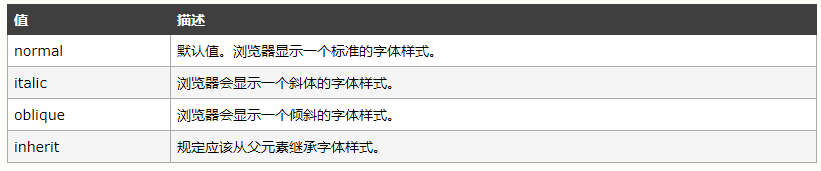

```html
<!DOCTYPE html>
<html lang="en">
<head>
    <meta charset="UTF-8">
    <title>Title</title>
    <style type="text/css">
        h1 {
            font-style: normal;
        }
        h2 {
            font-style: initial;
        }
        h3 {
            font-style: oblique;
        }
    </style>
</head>
<body>
<h1>网站首页</h1>
<h2>网站首页</h2>
<h3>网站首页</h3>
</body>
</html>
```

　　

#### c、font-size

`font-size` 属性可设置字体的尺寸。

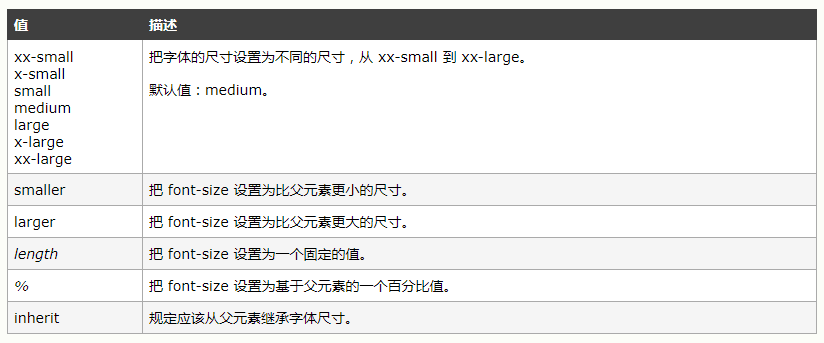

```html
<!DOCTYPE html>
<html lang="en">
<head>
    <meta charset="UTF-8">
    <title>Title</title>
    <style type="text/css">
        p {
            font-size: 30px;
        }
    </style>
</head>
<body>
<p>网站首页</p>
</body>
</html>
```

　　

#### d、font-family

`font-family` 规定元素的字体系列。`font-family` 可以把多个字体名称作为一个“回退”系统来保存。如果浏览器不支持第一个字体，则会尝试下一个。也就是说，`font-family` 属性的值是用于某个元素的字体族名称或/及类族名称的一个优先表。浏览器会使用它可识别的第一个值.　

```html
<!DOCTYPE html>
<html lang="en">
<head>
    <meta charset="UTF-8">
    <title>Title</title>
    <style type="text/css">
        p.serif {
            font-family: "Times New Roman", Georgia, Serif;
        }
        p.sansserif {
            font-family: Arial, Verdana, Sans-Serif;
        }
    </style>
</head>
<body>
<h1>CSS font-family</h1>
<p class="serif">This is a paragraph, shown in the Times New Roman font.</p>
<p class="sansserif">This is a paragraph, shown in the Arial font.</p>
</body>
</html>
```

　　

#### e、font-variant

`font-variant` 属性设置小型大写字母的字体显示文本，这意味着所有的小写字母均会被转换为大写，但是所有使用小型大写字体的字母与其余文本相比，其字体尺寸更小。

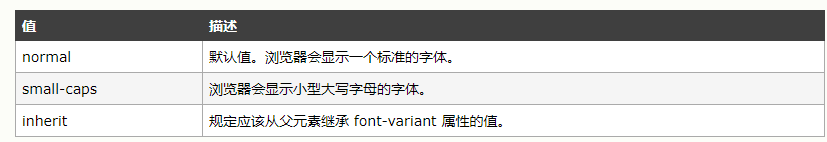

```html
<!DOCTYPE html>
<html lang="en">
<head>
    <meta charset="UTF-8">
    <title>Title</title>
    <style type="text/css">
        p.normal {
            font-variant: normal;
        }
        p.small {
           font-variant: small-caps;
        }
    </style>
</head>
<body>
<p class="normal">This is a paragraph</p>
<p class="small">This is a paragraph</p>
</body>
</html>
```

　　

#### f、font-weight

`font-weight` 属性设置文本的粗细。该属性用于设置显示元素的文本中所用的字体加粗。数字值 `400 `相当于 关键字 `normal`，`700 `等价于 `bold`。

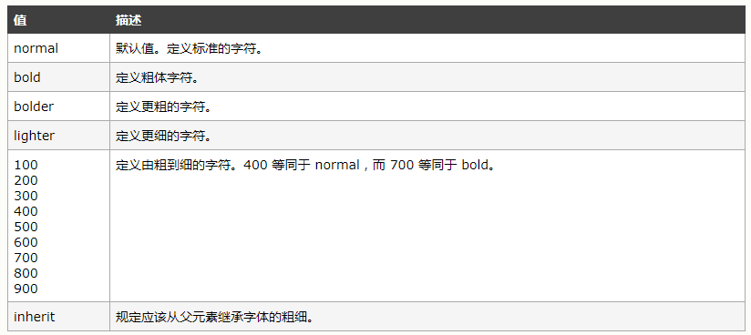

```html
<!DOCTYPE html>
<html lang="en">
<head>
    <meta charset="UTF-8">
    <title>Title</title>
    <style type="text/css">
        p.normal {
            font-weight: normal;
        }
        p.thick {
           font-weight: bold;
        }
        p.thicker {
           font-weight: 900;
        }
    </style>
</head>
<body>
<p class="normal">This is a paragraph</p>
<p class="thick">This is a paragraph</p>
<p class="thicker">This is a paragraph</p>
</body>
</html>
```

　　

### 10、使用web字体　　

在 CSS3 之前，web 设计师必须使用已在用户计算机上安装好的字体。通过 CSS3，web 设计师可以使用他们喜欢的任意字体。当你找到或购买到希望使用的字体时，可将该字体文件存放到 web 服务器上，它会在需要时被自动下载到用户的计算机上。您“自己的”的字体是在 CSS3 @font-face 规则中定义的。web字体可以在https://fonts.google.com/上下载。

在新的` @font-face` 规则中，您必须首先定义字体的名称（比如 `myFirstFont`），然后指向该字体文件。如需为 HTML 元素使用字体，请通过` font-family` 属性来引用字体的名称 (`myFirstFont`)：　

```
 1 <!DOCTYPE html>
 2 <html lang="en">
 3 <head>
 4     <meta charset="UTF-8">
 5     <title>Document</title>
 6     <link href='http://cdn.webfont.youziku.com/webfonts/nomal/114613/46121/5a926dd6f629d80784d8edb7.css' rel='stylesheet' type='text/css' />
 7     <style type="text/css">    
 8         p{
 9             font-family:'JetLinkMediumOl107126577a1bfb5';
10         }
11     </style>
12 </head>
13 <body>    
14     <p>使用WEB字体</p>    
15 </body>
16 </html>
```


网页引用的css文件内容　

```css
@font-face {font-family: 'JetLinkMediumOl107126577a1bfb5';
　　　　　　　　src: url('//cdn.webfont.youziku.com/webfonts/nomal/114613/46121/5a926dd6f629d80784d8edb7.gif?r=67939415062');
　　　　　　　　src: url('//cdn.webfont.youziku.com/webfonts/nomal/114613/46121/5a926dd6f629d80784d8edb7.gif?r=67939415062?#iefix') format('embedded-opentype'),url('//cdn.webfont.youziku.com/webfonts/nomal/114613/46121/5a926dd6f629d80784d8edb7.png?r=67939415062') format('woff2'),url('//cdn.webfont.youziku.com/webfonts/nomal/114613/46121/5a926dd6f629d80784d8edb7.bmp?r=67939415062') format('woff'),url('//cdn.webfont.youziku.com/webfonts/nomal/114613/46121/5a926dd6f629d80784d8edb7.jpg?r=67939415062') format('truetype');
　　　　　　　　font-weight: normal;
　　　　　　　　font-style: normal;}.css107126577a1bfb5{font-family: 'JetLinkMediumOl107126577a1bfb5';}
```

**总结：**　

`@font-face`规则，网页设计师再也不必使用的"web-safe"的字体之一。

字体的名称，`font- face`规则：

- `font-family: myFirstFont;`

　　字体文件包含在您的服务器上的某个地方，参考CSS：

- `src: url('Sansation_Light.ttf')`

　　如果字体文件是在不同的位置，请使用完整的URL：

- `src: url('http://www.w3cschool.css/css3/Sansation_Light.ttf')`

现在准备使用该字体，下面是如何使用它所有的div元素的一个例子：

```css
div {
　　font-family: myFirstFont;
}
```

我们也可以使用https://fonts.google.com/上面的web字体，找到我们喜欢的字体后，可以有两种方式引入样式。

```css
<link href="https://fonts.googleapis.com/css?family=Roboto" rel="stylesheet">
```

或者

```css
<style>
@import url('https://fonts.googleapis.com/css?family=Roboto');
</style>
```

在页面中可以这样使用：

```css
font-family: 'Roboto', sans-serif;
```

---

