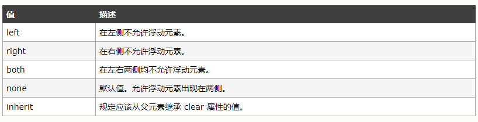

盒模型

## 一、盒模型

盒子是css中的基础概念，可见元素会在页面中占据一个矩形区域，这个区域就是元素的盒子。我们需要使用它来配置元素的外观以及文档的整体布局。

## 二、使用盒模型

### 1、为元素应用内边距

应用内边距会在元素的内容和边框之间添加空白。

　　　　

| **属性**         | **说明**             | **属性值**          |
| ---------------- | -------------------- | ------------------- |
| `padding-top`    | 设置元素的上内边距   | 长度值或者百分比    |
| `padding-right`  | 设置元素的左内边距   | 长度值或者百分比    |
| `padding-bottom` | 设置元素的下内边距   | 长度值或者百分比    |
| `padding-left`   | 设置元素的左内边距   | 长度值或者百分比    |
| `padding`        | 一次声明所有的内边距 | 1~4长度值或者百分比 |

如果使用百分数值指定内边距，百分数总是和包含块（父元素的内容盒子成为子元素的块容器）的**宽度**有关，高度不考虑在内。此处的`div`元素的`padding `与其父元素的`content`区域的宽度有关系。

 ```html
<!DOCTYPE html>
<html lang="en">
<head>
    <meta charset="UTF-8">
    <title>Title</title>
    <style type="text/css">
        div {
            border: red 2px solid;
            width: 100px;
            height: 200px;
            background: yellow;
            background-clip: content-box;
            padding: 10%;
        }
    </style>
</head>
<body>
<div>

</div>
</body>
</html>
 ```

 

---

### 2、为元素设置外边距

外边距是元素边框和页面上围绕在它周围的所有东西之间的空白区域。　　

| **属性**        | **说明**                 | **属性值**            |
| --------------- | ------------------------ | --------------------- |
| `margin-top`    | 设置元素的上外边距       | 长度值或者百分比      |
| `margin-right`  | 设置元素的右外边距       | 长度值或者百分比      |
| `margin-bottom` | 设置元素的下外边距       | 长度值或者百分比      |
| `margin-left`   | 设置元素的左外边距       | 长度值或者百分比      |
| `margin`        | 一次设置元素的所有外边距 | 1~4个长度值或者百分比 |

设置百分数值时，百分数的值和包含块的宽度有关。当一次设置多个外边距时，和`padding`属性类似。当为`display`设置成`inline`的元素设置外边距，顶边和底边的外边距不会显示。

```html
<!DOCTYPE html>
<html lang="en">
<head>
    <meta charset="UTF-8">
    <title>Title</title>
    <style type="text/css">
        span {
            background: blue;
            margin: 10px;
        }
    </style>
</head>
<body>
<span>I  love China!</span>
<span>I  love China!</span>
</body>
</html>
```

 

 ```html
<!DOCTYPE html>
<html lang="en">
<head>
    <meta charset="UTF-8">
    <title>Title</title>
    <style type="text/css">
        span {
            background: blue;
            /*margin: 10px;*/
        }
    </style>
</head>
<body>
<span>I  love China!</span>
<span>I  love China!</span>
</body>
</html>
 ```


---

### 3、控制元素的尺寸

浏览器会基于页面上内容的流设置元素的尺寸，使用尺寸相关的属性可以覆盖这些行为。　

| **属性**     | **说明**                         | **属性值**                  |
| ------------ | -------------------------------- | --------------------------- |
| `width`      | 设置元素的宽度                   | *auto*、长度值或者百分数    |
| `height`     | 设置元素的高度                   | *auto*、长度值或者百分数    |
| `min-width`  | 设置元素的最小可接受的宽度       | *auto*、长度值或者百分数    |
| `min-height` | 设置元素最小可接受的高度         | *auto*、长度值或者百分数    |
| `max-width`  | 设置元素最大可接受的宽度         | *auto*、长度值或者百分数    |
| `max-height` | 设置元素最大可接受的高度         | *auto*、长度值或者百分数    |
| `box-sizing` | 设置尺寸应用的元素盒子的那一部分 | *content-box*、*border-box* |

属性值为*auto*时，浏览器会为我们设置好元素的宽度和高度。百分数值是根据包含块的宽度来计算的（高度也是根据包含块的高度来计算的）。　　

 ```html
<!DOCTYPE html>
<html lang="en">
<head>
    <meta charset="UTF-8">
    <title>Title</title>
    <style type="text/css">
        img {
            width: 100%;
            min-width: 10px;
            max-width: 1000px;
        }
    </style>
</head>
<body>

</body>
</html>
 ```

如果包含块没有指定确切的高度（非百分比），那么不要使用百分比来设置元素的高度，因为包含块的高度是由其所包含的元素的高度决定的。

当包含块只有一个元素的时候，我们将元素的高度设置为`100%`时，但是包含块的高度默认是等于元素的高度所以没有作用。　

 ```html
<!DOCTYPE html>
<html lang="en">
<head>
    <meta charset="UTF-8">
    <title>Title</title>
    <style type="text/css">
        div {
            width: 100%;
            height: 100%;
            background: red;
        }
    </style>
</head>
<body>
<div>div1</div>
</body>
</html>
 ```

但是包含块包含多个块元素时，我们给元素的高度设置为`100%`，然后包含块的高度又是其所包含的所有的元素的高度，会造成无限循环去计算这个高度，所以这个高度计算不会生效。　

 ```html
<!DOCTYPE html>
<html lang="en">
<head>
    <meta charset="UTF-8">
    <title>Title</title>
    <style type="text/css">
        div {
            width: 100%;
            height: 100%;
            background: red;
        }
    </style>
</head>
<body>
<div>div1</div>
<div>div2</div>
</body>
</html>
 ```

**box-sizing属性**


其中`content-box`是默认值。　

```html
<!DOCTYPE html>
<html lang="en">
<head>
    <meta charset="UTF-8">
    <title>Title</title>
    <style type="text/css">
        img {
            background: red;
            border: 2px solid yellow;
        }
        img.first {
            width: 100px;
            height: 100px;
            box-sizing: border-box;
        }
        img.second {
            width: 100px;
            height: 100px;
            box-sizing: content-box;
        }
    </style>
</head>
<body>


</body>
</html>
```

---

### 4、处理浏览器溢出

如果设置了元素的尺寸，当内容太大，元素的内容盒无法完全显示的时，默认处理方式是内容溢出。可以通过`overfolow-x` ,`overflow-y`, `overflow`属性来设置溢出方式，`overfolow-x`, `oberflow-y`属性分别设置水平和方向的溢出方式, `overflow`可以一次设置两个方向的溢出方式，属性值如下：


其中当属性值设置为`scroll`时，必定会有滚动条。当设置为`auto`时，只有内容溢出太会显示滚动条。

### 5、设置元素的可见性

`visibility `属性规定元素是否可见。

> **提示：**即使不可见的元素也会占据页面上的空间。请使用 "`display`" 属性应用`none`来创建不占据页面空间的不可见元素。此外，还可以使用全局属性`hidden`来创建不占据页面空间的不可见元素。


```html
<!DOCTYPE html>
<html lang="en">
<head>
    <meta charset="UTF-8">
    <title>Title</title>
    <style type="text/css">
        .coll {
            visibility: collapse;
        }
    </style>
</head>
<body>
<table style="border: 1px black solid">
    <tr class="coll">
        <td>Adams</td>
        <td>John</td>
    </tr>
    <tr>
        <td class="coll">Bush</td>
        <td>George</td>
    </tr>
</table>
</body>
</html>
```


---

### 6、设置元素的盒类型

`display `属性规定元素的盒类型。


当`display`设置成*run-in*值时，元素的盒类型取决于周围的元素，称作插入元素。主流浏览器对该属性值并不友好。

　　1）当插入元素包含一个`display`属性值为*block*的元素，那么插入元素就是块级元素。

　　2）当插入元素周围的相邻兄弟元素是块级元素，那么插入元素就是兄弟元素中第一个行内元素。

　　3）其他情况下，插入元素均作为块级元素对待。

### 7、创建浮动盒

`float `属性定义元素在哪个方向浮动。以往这个属性总应用于图像，使文本围绕在图像周围，不过在 CSS 中，任何元素都可以浮动。浮动元素会生成一个块级框，而不论它本身是何种元素。

> **注释：**假如在一行之上只有极少的空间可供浮动元素，那么这个元素会跳至下一行，这个过程会持续到某一行拥有足够的空间为止。

　　

*left* 元素在所在行漂浮起来，移动元素，使元素左边界挨着包含块的左边界或者另一个元素的右边界。该元素的位置可以被其他元素占领，堆叠在其他元素的上面。

*right* 元素在所在行漂浮起来移动元素，使元素的右边界挨着包含块的右边界或者另一个元素的左边界。该元素的位置可以被其他元素占领，堆叠在其他元素的上面。

```html
<!DOCTYPE html>
<html lang="en">
<head>
    <meta charset="UTF-8">
    <title>Title</title>
    <style type="text/css">
        div {
            width: 30%;
            height: 100px;
            background: red;
        }
        .div1 {
            float: left;
            background: rgba(0,0,0,0.2);
        }
        .div2 {
            background: yellow;
        }
        .div3 {

        }
    </style>
</head>
<body>
<div class="div1"></div>
<div class="div2"></div>
<div class="div3"></div>
</body>
</html>
```


由于给*div1*设置了浮动，*div1*漂浮移动到所在行的最左边，div2会占据原来div1的位置。将div1的颜色设置成透明的，所以看见的是div2的颜色。

### 8、阻止浮动堆叠

`clear `属性规定元素的哪一侧不允许其他浮动元素。如果声明为左边或右边清除，会使元素的上外边框边界刚好在该边上浮动元素的下外边距边界之下。



```html
<!DOCTYPE html>
<html lang="en">
<head>
    <meta charset="UTF-8">
    <title>Title</title>
    <style type="text/css">
        div {
            width: 30%;
            height: 100px;
            background: red;
        }
        .div1 {
            float: left;
            background: rgba(0,0,0,0.2);
        }
        .div2 {
            clear: left;
            background: yellow;
        }
        .div3 {

        }
    </style>
</head>
<body>
<div class="div1"></div>
<div class="div2"></div>
<div class="div3"></div>
</body>
</html>
```


