# CSS边框和背景

## 一、设置边框

### 1、边框样式

| **属性**       | **说明**       |
| -------------- | -------------- |
| `border-width` | 设置边框的宽度 |
| `boder-style`  | 设置边框的样式 |
| `border-color` | 设置边框的颜色 |

#### a、border-width属性

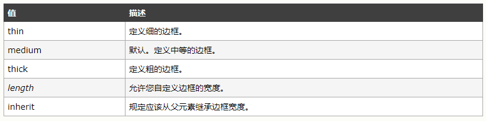

> 自定义边框的宽度时，不能定义为百分比。

#### b、border-style属性

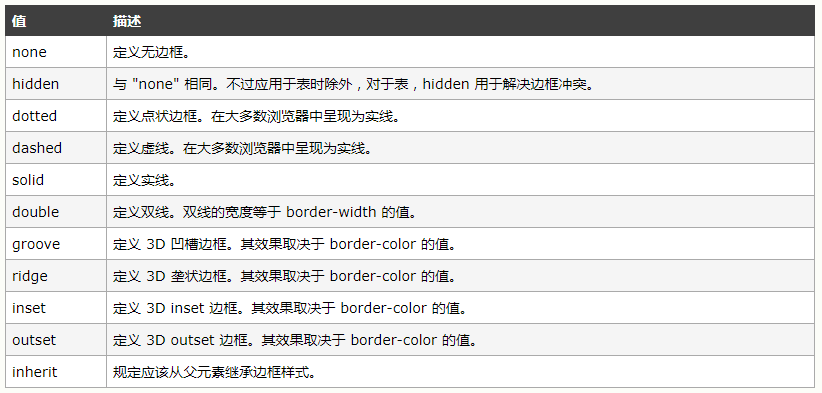

以上属性可以设置一个、二个、三个、四个属性值，当设置一个值得时候四条边框都应用该属性值，当设置两个的时候时候上下使用第一个属性值，左右使用第二个属性值，当设置三个值的时候，第一个值应用在上边框，第二个应用到左右边框，第三个属性值应用到下边框当设置了四个属性值，按着顺时针的方向一次应用。大部分情况下`groove`、`ridge`、`inset`、`outset`可以会使用双色边框，但是当`border-color`属性这设置成`black`是，两种颜色都会显示成黑色。

---

### 2、为一条边应用边框样式

`boder-top`/`bottom`/`right`/`left-width`/`style`/`color`  用来设置一条边框的样式，可以和通用属性结合使用。还可以使用`border-bottom`/`top`/`left`/`right`一次设置一条边框。　

```html
<!DOCTYPE html>
<html lang="en">
<head>
    <meta charset="UTF-8">
    <title>Title</title>
    <style type="text/css">
        div {
            width: 100px;
            height: 200px;
            border-width: 10px;
            border-style: ridge;
            border-color: red;
            border-top-style: double;
        }
    </style>
</head>
<body>
<div></div>
</body>
</html>
```


---

### 3、使用border简写属性

可以使用一次来设置`border`的宽度、样式、颜色，三个属性值之间用空格分开。三个属性之间的顺序可以打乱。　　

```html
<!DOCTYPE html>
<html lang="en">
<head>
    <meta charset="UTF-8">
    <title>Title</title>
    <style type="text/css">
        div {
            width: 100px;
            height: 200px;
            border: solid 2px red;
        }
    </style>
</head>
<body>
<div></div>
</body>
</html>
```

### 4、创建圆角边框

`border-top`/`bottom-left`/`right-radius`  设置一个圆角，一对长度值或者百分比，百分比跟边框盒子的宽度和高度有关。第一个值是椭圆边框的水平半径，第二个值是椭圆的垂直半径。如果只一个值是圆的半径，两个值之间用空格分开。

`border -radius`  一次设置边框的四个圆角，一对、两对、三对、四对长度值或者百分比，水平半径和垂直半径之间用/分开。　

```html
<!DOCTYPE html>
<html lang="en">
<head>
    <meta charset="UTF-8">
    <title>Title</title>
    <style type="text/css">
        div {
            width: 100px;
            height: 200px;
            border: solid 2px red;
            border-top-left-radius: 20px 10px;
        }
    </style>
</head>
<body>
<div></div>
</body>
</html>
```


一对或者一个属性值时，四个圆角是一样的，两个属性值时第一个属性值对应的是左上和右下，第二个对应的是右上和左下，三个属性值时对应的是左上、（右上、左下）、右下。四个属性值的时候是顺时针方向。

```html
<!DOCTYPE html>
<html lang="en">
<head>
    <meta charset="UTF-8">
    <title>Title</title>
    <style type="text/css">
        div {
            width: 100px;
            height: 200px;
            border: solid 2px red;
            border-radius: 20px/10px;
        }
    </style>
</head>
<body>
<div></div>
</body>
</html>
```


---

### 5、图像边框

图片边框的浏览器兼容并不好，很多时候下需要在属性前面加上浏览器厂商前缀。为了提供更好的兼容性，建议按下面的方式使用。

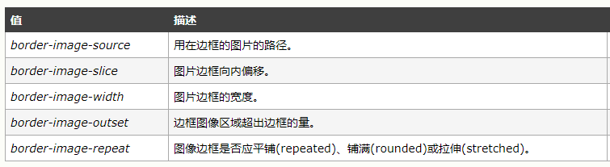

#### a、border-image-source

　必须使用`url`功能指定图像来源。

#### b、border-image-slice属性

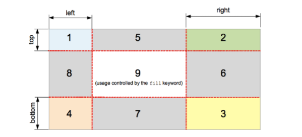

该属性规定图像的上、右、下、左侧边缘的向内偏移，图像被分割为九个区域：四个角、四条边以及一个中间区域。除非使用了关键词 `fill`，否则中间的图像部分会被丢弃。如果省略第四个数值/百分比，则与第二个值相同。如果省略第三个值，则与第一个值相同。如果省略第二个值，则与第一个值相同。　

```html
<!DOCTYPE html>
<html lang="en">
<head>
    <meta charset="UTF-8">
    <title>Title</title>
    <style type="text/css">
        div {
            width: 500px;
            height: 400px;
            border-image: url("1.png") 89 30 89 30 fill/89px repeat;
        }
    </style>
</head>
<body>
<div></div>
</body>
</html>
```

#### c、border-image-outset

当不设置这个属性时，边框会占据内容区域。需要设置的时候可以在边框的宽度后面加"`/`"设置属性值.

#### d、border-repeat

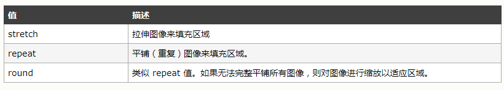

#### e、border-image

可以一次设置上面这些属性。`border-image:souce` slice/width/outset repeat 

---

## 二、设置元素的背景　

| 属性                    | 说明                                                         |
| ----------------------- | ------------------------------------------------------------ |
| `background-color`      | 设置元素的背景颜色，总是显示在元素的背景图片的下面           |
| `background-image`      | 设置元素的背景图片，可以指定多个值，最后面的图片绘制在前面的图片上面 |
| `background-repeat`     | 设置图片的重复方式                                           |
| `background-size`       | 设置背景图片的尺寸                                           |
| `background-position`   | 设置背景图片的位置                                           |
| `background-attachment` | 设置背景图片是否固定或随页面一起滚动                         |
| `background-clip`       | 设置背景图片的裁剪方式                                       |
| `background-origin`     | 设置背景图片绘制的起始位置                                   |
| `background`            | 设置上面属性的简写                                           |

### a、background-color

设置元素的背景颜色，属性值是颜色。　

```html
<!DOCTYPE html>
<html lang="en">
<head>
    <meta charset="UTF-8">
    <title>Title</title>
    <style type="text/css">
        div {
            width: 100px;
            height: 100px;
            background-color: red;
        }
    </style>
</head>
<body>
<div></div>
</body>
</html>
```

### b、background-image

通过`url`功能添加背景图片。同时设置背景色和背景图片，**背景图片会覆盖背景色**。　

```html
<!DOCTYPE html>
<html lang="en">
<head>
    <meta charset="UTF-8">
    <title>Title</title>
    <style type="text/css">
        div {
            width: 100px;
            height: 100px;
            background-color: red;
            background-image: url("1.png");
        }
    </style>
</head>
<body>
<div></div>
</body>
</html>
```

### c、background-repeat

设置背景图片的重复方式。属性值有：

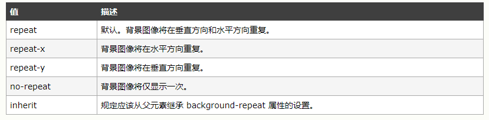

### d、background-size

设置背景图片的大小，属性值可以是长度值、百分比（跟图片的高度和宽度有关系），还可以是预定义值；

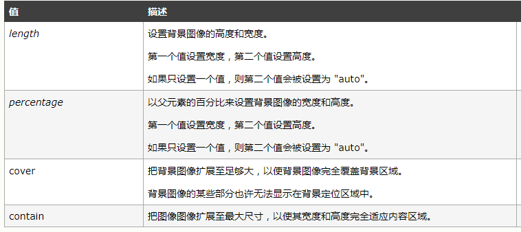

```html
<!DOCTYPE html>
<html lang="en">
<head>
    <meta charset="UTF-8">
    <title>Title</title>
    <style type="text/css">
        div {
            width: 200px;
            height: 100px;
            background-color: red;
            background-image: url("1.png");
            background-size: 100px auto;
            background-repeat: no-repeat;
        }
    </style>
</head>
<body>
<div></div>
</body>
</html>
```


### e、background-position　

设置背景图片的位置。图像不平铺的时候使用的最多。

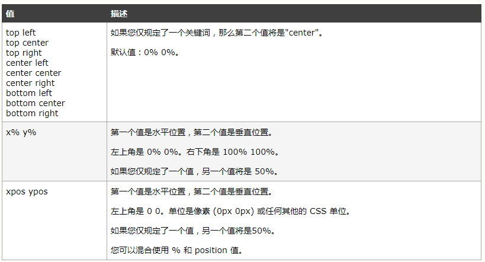

使用预定值得时候第一个垂直位置，第二个是水平位置。当设置了`background-size`为`contain`或者`cover`时，使用`position-position`会出现特殊情况。

```html
<!DOCTYPE html>
<html lang="en">
<head>
    <meta charset="UTF-8">
    <title>Title</title>
    <style type="text/css">
        div {
            width: 100px;
            height: 100px;
            background-color: red;
            background-image: url("1.png");
            background-size: 50px auto;
            background-repeat: no-repeat;
            background-position: top center;
        }
    </style>
</head>
<body>
<div></div>
</body>
</html>
```


### f、background-attachment

设置元素背景图片的辅着方式。

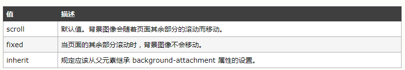

### g、background-clip和background-origin

`background-origin`决定背景图片的绘制区域，`background-cilp`设置背景图片的裁剪区域。两个属性值都如下所示。

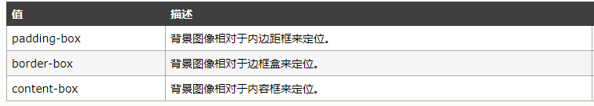

其中`background-origin`设置成`border-box`时，边框会绘制在背景图片之上。`background-clip`裁剪区域之外的背景不可见。　

将`background-origin`设置成`border-box`;

```html
<!DOCTYPE html>
<html lang="en">
<head>
    <meta charset="UTF-8">
    <title>Title</title>
    <style type="text/css">
        div {
            width: 100px;
            height: 100px;
            border: 10px double red;
            background-image: url("1.png");
            background-size: 50px auto;
            background-repeat: no-repeat;
            background-position: top center;
            background-origin: border-box;
        }
    </style>
</head>
<body>
<div></div>
</body>
</html>
```


 将`background-origin`设置成`border-box`;`background-clip`设置成`content-box`;　　

```html
<!DOCTYPE html>
<html lang="en">
<head>
    <meta charset="UTF-8">
    <title>Title</title>
    <style type="text/css">
        div {
            width: 100px;
            height: 100px;
            border: 10px double red;
            background-image: url("1.png");
            background-size: 50px auto;
            background-repeat: no-repeat;
            background-position: top center;
            background-origin: border-box;
            background-clip: content-box;
        }
    </style>
</head>
<body>
<div></div>
</body>
</html>
```


---

### h、background

一次设置背景相关的多个属性值。

```css
background: background-color 
			background-position 
			background-size 
			background-repeat  
			backgropund-origin 
			background-cilp  
			background-attachment 
			background-image;
```

对于省略的值会使用默认值。可以给一个元素设置多个背景图片，但是前面的背景图片需要是透明的，同时背景图片和背景色可以同时存在。如

```css
#product-overview {
	background: linear-gradient(to top, rgba(80, 68, 18, 0.6), transparent),
	url("1.png") left 10% bottom 20%/cover no-repeat border-box, #ff1b68;
}
```

背景图片和背景色之间用`逗号`分开，背景图片会遮挡住背景色，只有背景图片加载失败的时候，背景色才可见。

```html
<!DOCTYPE html>
<html lang="en">
<head>
    <meta charset="UTF-8">
    <title>Title</title>
    <style type="text/css">
        div {
            width: 200px;
            height: 100px;
            border: 10px double red;
            background: blue;
        }
    </style>
</head>
<body>
<div></div>
</body>
</html>
```

---

## 三、创建盒子阴影

### 1、box-shadow属性

属性值:

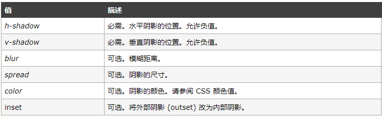

- *h-shadow*用来设置水平偏移量，正值代表向右偏移，负值代表向左偏移。

- *v-shadow*用来设置垂直偏移量，正值代表向下偏移，负值代表向上偏移。
- *spread*用来设置阴影的延伸半径，值可以是正的，也可以是负的。升值向各个方向延伸，负值向内收缩，`0px`的时候不会延伸。　

```html
<!DOCTYPE html>
<html lang="en">
<head>
    <meta charset="UTF-8">
    <title>Title</title>
    <style type="text/css">
        div {
            width: 200px;
            height: 100px;
            border: 10px double red;
            box-shadow: 5px 5px 5px 0 yellow, 5px 5px 5px 10px pink inset;
        }
    </style>
</head>
<body>
<div></div>
</body>
</html>
```


---

## 四、应用轮廓

轮廓对元素来说是可选的，轮廓最有用的地方在于短时间抓住用户的注意力。轮廓绘制在边框的外面**。边框和轮廓的最大区别在于轮廓不属于页面，应用轮廓不需要调整布局。**　

| 属性             | 说明                       | 值                               |
| ---------------- | -------------------------- | -------------------------------- |
| `outline-color`  | 设置外围轮廓的颜色         | 颜色                             |
| `outline-offset` | 设置轮廓距离元素边框的距离 | 长度                             |
| `outline-style`  | 设置轮廓的样式             | 和border-style属性的值一样       |
| `outline-width`  | 设置轮廓的宽度             | `thin`、`medium`、`thick`、长度  |
| `outline`        | 上面属性的简写             | 颜色 样式 宽度（outline-offset） |

```html
<!DOCTYPE html>
<html lang="en">
<head>
    <meta charset="UTF-8">
    <title>Title</title>
    <style type="text/css">
        p {
            width: 200px;
            height: 100px;
            border: 2px double red;
        }
        p:hover {
            outline: blue 3px solid;
        }
    </style>
</head>
<body>
<p>元素的轮廓</p>
<p>元素的轮廓</p>
<p>元素的轮廓</p>
<p>元素的轮廓</p>
</body>
</html>
```

鼠标悬停在对应的元素上，显示对应元素的轮廓。


---

## 五、图片

在页面中可以使用`img`标签嵌入图片，可以只用`width`、`height`、`title`、`alt`属性对图片的显示进行设置。　

```html
<!DOCTYPE html>
<html lang="en">
<head>
    <meta charset="UTF-8">
    <title>Title</title>
</head>
<body>
<span></span>
</body>
</html>
```

a.我们对图片的大小进行设置时，如果是采用百分比，图片是相对于**最近**的block祖先元素来计算的。

```html
<!DOCTYPE html>
<html lang="en">
<head>
    <meta charset="UTF-8">
    <title>Title</title>
    <style type="text/css">
        div {
            width: 300px;
            height: 300px;
        }
        a {
            width: 100px;
        }
        img {
            width: 100%;
        }
    </style>
</head>
<body>
<div>
    <a></a>
</div>
</body>
</html>
```


将a标签设置成`inline-block`;

```html
<!DOCTYPE html>
<html lang="en">
<head>
    <meta charset="UTF-8">
    <title>Title</title>
    <style type="text/css">
        div {
            width: 300px;
            height: 300px;
        }
        a {
            width: 100px;
            display: inline-block;
        }
        img {
            width: 100%;
        }
    </style>
</head>
<body>
<div>
    <a></a>
</div>
</body>
</html>
```


b、在`div`元素中包含`img`图片时，图片和`div`下变局间会有一个空白，导致这个的原因是`img`标签的`display`为`inline-block`.可以将图片设置为`block`或者`vertical-align: bottom`;　　

```html
<!DOCTYPE html>
<html lang="en">
<head>
    <meta charset="UTF-8">
    <title>Title</title>
    <style type="text/css">
        div {
            width: 30%;
            background: #2A7DB5;
        }
        div img {
            width: 100%;
        }
        img {
            width: 100%;
        }
    </style>
</head>
<body>
<div>
    <a></a>
</div>
</body>
</html>
```


```html
<!DOCTYPE html>
<html lang="en">
<head>
    <meta charset="UTF-8">
    <title>Title</title>
    <style type="text/css">
        div {
            width: 30%;
            background: #2A7DB5;
        }
        div img {
            width: 100%;
            vertical-align: bottom;
        }
        img {
            width: 100%;
        }
    </style>
</head>
<body>
<div>
    <a></a>
</div>
</body>
</html>
```


---

## 六、渐变色

渐变色可以用来代替图片，我们可以在需要使用图片的地方使用渐变色来代替，如设置背景图片。渐变可以分为两种，一种是 `linear-gradient()`,另一种是`radial-gradient().`

###a. linear-gradient()

这个css函数用来设置线性渐变。

语法：

```css
linear-gradient( 
  [ <angle> | to <side-or-corner> ,]? <color-stop> [, <color-stop>]+ )
  \---------------------------------/ \----------------------------/
    Definition of the gradient line        List of color stops  

where <side-or-corner> = [left | right] || [top | bottom]
  and <color-stop>     = <color> [ <percentage> | <length> ]?
```

例子：

```css
/* 渐变轴为45度，从蓝色渐变到红色 */
linear-gradient(45deg, blue, red);

/* 从右下到左上、从蓝色渐变到红色 */
linear-gradient(to left top, blue, red);

/* 从下到上，从蓝色开始渐变、到高度40%位置是绿色渐变开始、最后以红色结束 */
linear-gradient(0deg, blue, green 40%, red);
```

渐变渐变线由包含渐变图形的容器的中心点和一个角度来定义的。to top, to bottom, to left 和 to right这些值会被转换成角度0度、180度、270度和90度。其余值会被转换为一个以向顶部中央方向为起点顺时针旋转的角度。

```html
<!DOCTYPE html>
<html lang="en">
<head>
    <meta charset="UTF-8">
    <title>Title</title>
    <style type="text/css">
        div {
            display: inline-block;
            background-image: linear-gradient(90deg, red 30%, green 10%, blue 60%);
        }
    </style>
</head>
<body>
<div>
    使用线性渐变色
</div>
</body>
</html>
```

### b、radial-gradient()

`radial-gradient() `函数创建一个径向渐变。语法：　

```css
Formal grammar: radial-gradient( [ circle（圆） || <length>（渐变的半径） ] [ at <position> ]? 
（设置渐变开始位置默认为默认为中心点。）,
| [ ellipse（椭圆，默认值） || [<length> | <percentage> ]{2} 需要设置两个便半径] [ at <position> ]? ,
| [ [ circle | ellipse ] || <extent-keyword> ] [ at <position> ]? ,
| at <position> ,
<color-stop> [ , <color-stop> ]+ )
\------------------------------------------------------------------------------/\--------------------------------/ 

// Definition of the contour, size and position of the ending shape List of color stops 
where 
<extent-keyword> = closest-corner | closest-side | farthest-corner | farthest-side 
and 
<color-stop> = <color> [ <percentage> | <length> ]?
```


例子：　

```css
background-image: radial-gradient(ellipse farthest-corner at 45px 45px , #00FFFF 0%, rgba(0, 0, 255, 0) 50%, #0000FF 95%);

background-image: radial-gradient(ellipse farthest-corner at 20% 47px , #FFFF80 20%, rgba(204, 153, 153, 0.4) 30%, #E6E6FF 60%);
```

```html
<!DOCTYPE html>
<html lang="en">
<head>
    <meta charset="UTF-8">
    <title>Title</title>
    <style type="text/css">
        div {
            width: 400px;
            height: 400px;
            background-image: radial-gradient(ellipse 100px 200px, red, green, black);
        }
    </style>
</head>
<body>
<div>

</div>
</body>
</html>
```

如果设置的渐变半径小于元素的长和宽，使用最外层的颜色填充整个元素。

---

## 七、滤镜

`filter`属性将模糊或颜色偏移等图形效果应用于元素。滤镜通常用于调整图像，背景和边框的渲染。语法：　

```css
img {
  filter: grayscale(0.5) blur(10px);
}
```

使用高斯模糊函数`blur`;　

```html
<!DOCTYPE html>
<html lang="en">
<head>
    <meta charset="UTF-8">
    <title>Title</title>
    <style type="text/css">
        div {
            width: 40px;
            height: 40px;
            background: red;
            filter: blur(10px);
        }
    </style>
</head>
<body>
<div>

</div>
</body>
</html>
```

