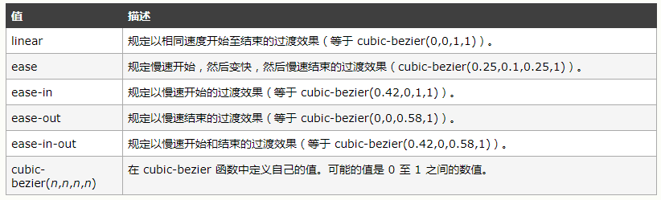

# CSS3中的过渡、动画和变换

## 一、过渡

过渡效果一般由浏览器直接改变元素的CSS属性实现。

### a、transition属性

`transition` 属性是一个简写属性，用于设置四个过渡属性：

- `transition-property`
- `transition-duration`
- `transition-timing-function`
- `transition-delay`

> 注释：请始终设置 `transition-duration` 属性，否则时长为 0，就不会产生过渡效果。　

```html
<!DOCTYPE html>
<html lang="en">
<head>
    <meta charset="UTF-8">
    <title>Title</title>
    <style>
        div {
            width: 100px;
            height: 100px;
            background: blue;
            transition: width 2s, background 3s, 3s linear 3s;
        }
        div:hover {
            width: 300px;
            background: red;
            transition: width, background, 3s linear 2s;
        }
    </style>
</head>
<body>
<div>

</div>
</body>
</html>
```

可以设置设置某个属性的过渡持续时间（`transition: width 2s, background 3s, 3s linear 3s;`），也可以设置所有的属性的过渡的持续时间（`transition: width, background, 3s linear 2s`）属性值和时间必须用逗号隔开;

### b、transition-property

`transition-property` 属性规定应用过渡效果的 CSS 属性的名称。（当指定的 CSS 属性改变时，过渡效果将开始）。

> 提示：过渡效果通常在用户将鼠标指针浮动到元素上时发生。 


### c、transition-duration 

`transition-duration` 属性规定完成过渡效果需要花费的时间（以秒或毫秒计）。


### d、transition-timing-funtion

`transition-timing-function` 属性规定过渡效果的速度曲线。该属性允许过渡效果随着时间来改变其速度。



### e、transition-delay

`transition-delay` 属性规定过渡效果何时开始。`transition-delay` 值以秒或毫秒计。


```html
<!DOCTYPE html>
<html lang="en">
<head>
    <meta charset="UTF-8">
    <title>Title</title>
    <style>
        div {
            width: 100px;
            height: 100px;
            background: blue;
        }
        div:hover {
            width: 300px;
            background: red;
            transition-property: width, background;
            transition-duration: 3s;
            transition-timing-function: linear;
            transition-delay: 0ms;
        }
    </style>
</head>
<body>
<div>

</div>
</body>
</html>
```

其中过渡属性之间用逗号隔开，可以为延迟时间和持续时间设置多个值，分别对应不同的属性。

变化过程

　　****

　　

　　

上面的过都效果只有鼠标悬停在元素上才会发生，当鼠标离开时，会恢复到元素的开始状态，可以设置反向过渡，使元素的过渡样式平滑的返回初始样式。　　

```html
<!DOCTYPE html>
<html lang="en">
<head>
    <meta charset="UTF-8">
    <title>Title</title>
    <style>
        div {
            width: 100px;
            height: 100px;
            background: blue;
            transition: width 2s, background 3s, 3s linear 1s;/*反向过渡*/
        }
        div:hover {
            width: 300px;
            background: red;
            transition: width, background, 3s linear 1s;
        }
    </style>
</head>
<body>
<div>

</div>
</body>
</html>
```

　　

　　

　　

　　

　　

> **注意：**
>
> Internet Explorer 10、Firefox、Opera 和 Chrome 支持 transition 属性。Safari 支持替代的 -webkit-transition 属性。
>
> 注释：Internet Explorer 9 以及更早版本的浏览器不支持 transition 属性。

## 二、动画　　

通过 CSS3，我们能够创建动画，这可以在许多网页中取代动画图片、Flash 动画以及 JavaScript。动画是使元素从一种样式逐渐变化为另一种样式的效果。您可以改变任意多的样式任意多的次数。

### a、animation

`animation` 属性是一个简写属性，用于设置动画属性：

- `animation-name`
- `animation-duration`
- `animation-timing-function`
- `animation-delay`
- `animation-iteration-count`
- `animation-direction`
- `animation-fill-mood`

> 注释：请始终规定 `animation-duration` 属性，否则时长为` 0`，就不会播放动画了。

### b、animation-name　

`animation-name` 属性为` @keyframes `动画规定名称。


### c、animation-duration

`animation-duration`属性定义动画完成一个周期所需要的时间，以秒或毫秒计。


### d、animation-timing-function

`animation-timing-function` 规定动画的速度曲线。速度曲线定义动画从一套 CSS 样式变为另一套所用的时间。速度曲线用于使变化更为平滑。


### e、animation-iteration-count

`animation-iteration-count` 属性定义动画的播放次数。


### f、animation-direction 

`animation-direction` 属性定义是否应该轮流反向播放动画。

- *normal*: 每个循环内动画向前循环，换言之，每个动画循环结束，动画重置到起点重新开始，这是默认属性。
- *alternate*: 动画交替反向运行，反向运行时，动画按步后退，同时，带时间功能的函数也反向，比如，*ease-in* 在反向时成为*ease-out*。
- *reverse*: 反向运行动画，每周期结束动画由尾到头运行。
- *alternate-reverse*: 反向交替， 反向开始交替动画,第一次运行时是反向的，然后下一次是正向，后面依次循环.

如果 `animation-direction` 值是 "*alternate*"，则动画会在奇数次数（1、3、5 等等）正常播放，而在偶数次数（2、4、6 等等）向后播放。　　 


```html
<!DOCTYPE html>
<html lang="en">
<head>
    <meta charset="UTF-8">
    <title>Title</title>
    <style>
        div {
            width: 100px;
            height: 100px;
            background: blue;
        }
        div:hover {
            animation: donghua 3s linear 1ms 1 normal;
        }
        @keyframes donghua {
            from {
                background: yellow;
            }
            50% {
                background: brown;
            }
            to {
                width: 300px;
                background: blue;
            }
        }
    </style>
</head>
<body>
<div>

</div>
</body>
</html>
```

　　

　　

　　

　　

　　

### 　　g.animation-fill

这个 CSS 属性用来指定在动画执行之前和之后如何给动画的目标应用样式。

- *none*: 动画执行前后不改变任何样式
- *forwards*: 目标保持动画最后一帧的样式
- *backwards*: 动画采用相应第一帧的样式
- *both*: 动画将会执行 forwards 和 backwards 执行的动作。

当动画的次数设置成一次时；动画最后即使鼠标还悬停在元素上面，元素也会恢复默认状态。这个是和过渡的区别之一，同时动画可以提供同一个属性的多个变化值，二过渡只有两设置两个值。

请用百分比来规定变化发生的时间，或用关键词 "`from`" 和 "`to`"，等同于 `0%` 和 `100%`。`0%` 是动画的开始，`100% `是动画的完成。为了得到最佳的浏览器支持，您应该始终定义 `0%` 和 `100%` 选择器。

使用动画：

1、在对应的元素上设置动画的相关属性（`animation`属性）

2、为动画设置多个关键帧。（`@keyframes` 动画名字）

可以为一个元素应用一个动画，元素选择器用逗号隔开即可。也可以为一个元素应用多个动画，元素同时执行多个关键帧。

### h、animation-play-state 

`animation-play-state` 属性规定动画正在运行还是暂停。注释：您可以在 JavaScript 中使用该属性，这样就能在播放过程中暂停动画。


## 三、变换

通过 CSS3 变换，我们能够对元素进行移动、缩放、转动、拉长或拉伸。使用transform属性为元素应用变换。

`translate`(长度值或者百分比) 在水平方向上、垂直方向上平移元素。`transform`属性可以指定为关键字值`none` 或一个或多个值。

常用的`<transform-function>`：

### a.translate()、translateX()、translateY()

`translate`用来在平面上平移一个元素。可以使用`translate(tx) `或`translate(tx, ty)`，第一个参数指定$x$轴的平移距离，第二个参数指定$y$轴的平移距离。如果只指定了一个参数，那么X和Y轴都采用整个值。

`translateX`和`translateY`时`translate`属性的分开表达。`translateX(tx)` 是 `translate(tx, 0) `的简写形式，`translateY(ty)` 是 `translate(0, ty)`的简写形式。

### b.translate3d()和translateZ()

`translate3d()` 这个CSS 函数用于移动元素在3D空间中的位置。语法`translate3d(tx, ty, tz)`。Z轴垂直X、Y轴向外。`translateZ(tz)`相当于`translate3d(0,0,tz)`;　　

### c.rotate(a deg)　


 

`rotate(a)` CSS 函数 定义一个旋转属性，将元素在不变形的情况下旋转到不动点周围(如 `transform-origin` 属性所指定) 。 移动量a由指定角度定义;如果为正值，则运动将为顺时针，如果为负值，则为逆时针 。默认是绕Z轴的旋转。

rotateX(a)、rotateY(a)、rotateZ(a)分别是设置绕X、Y、Z轴的旋转。　

可以和rotate()函数结合使用的是transform-origin: center;指定旋转变换的点，默认在元素的中心，可以使用两个百分数或者两个数字来指定。

### d.scale()

`scale()` CSS 函数可改变元素的大小。 它可以增大或减小元素的大小。

　　

scale()函数是scaleX()和scaleY()简写。当scale()函数只指定一个参数的时候，X、Y方向上共享整个参数。

### e.skew()

　　`skew()` 这个CSS函数是一种用于拉伸，或者说是平移，该函数会使得在每个方向上扭曲元素上的每个点以一定角度.skew(ax) 或skew(ax, ay).

　　skew()是skewX()和skewY()的简写。skewX()想做拉伸一个元素，skewY()向上拉伸一个元素。

----

