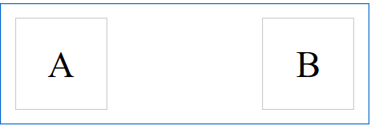
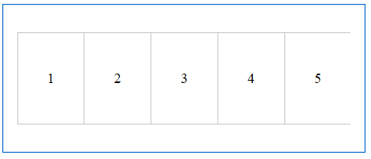
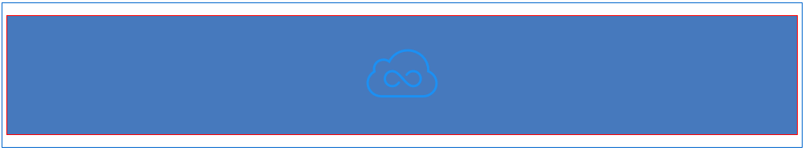
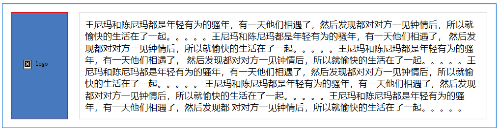
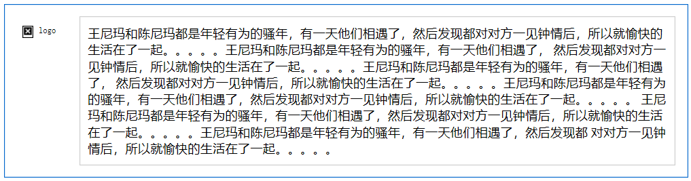

# display:table和display:table-cell的妙用

`display`的`table`和`table-cell`一般情况下用的不多，所以很少有人去关注它，但他们两个联手起来会给你惊喜！

这里抛出这样一个问题，如下，让块里的多行文字垂直居中？一说到垂直居中就会想到，单行文字垂直居中`line-height`等于`height`；块级元素垂直居中，`position`定位或者`flex`布局。但这里我介绍`display: table`和`table-cell`是如何让多行文字垂直居中的。

```html
<!DOCTYPE html>
<html lang="en">
<head>
    <meta charset="UTF-8">
    <title>Title</title>
    <style>
        .parent {
            display: table;
            width: 300px;
            height: 300px;
            text-align: center;
        }
        .son {
            display: table-cell;
            height: 200px;
            background-color: yellow;
            vertical-align: middle;
        }
    </style>
</head>
<body>
<div class="parent">
    <p class="son">会议认为，党的十八大以来，我国经济发展取得历史性成就、
                     发生历史性变革，为其他领域改革发展提供了重要物质条件。经济实力
                     再上新台阶，经济年均增长7.1%，成为世界经济增长的主要动力源和稳定器。
    </p>
</div>
</body>
</html>
```

这里我们只需要将容器设为`display:table`然他成为一个块级表格元素，子元`素display:table-cell`使子元素成为表格单元格，然后就像在表格里一样，给子元素加个`vertical-align: middle`就行了,多行文字垂直居中啦。

---

### 元素两端对齐

第一个案例是让两个元素分别向左和向右对齐，如果是过去，我一定会用`float`来实现，但其实用`table`可以这么做：

```css
/*demo.css*/
* {
    box-sizing: border-box;
}
.content {
    display: table;
    border: 1px solid #06c;
    padding: 15px 15px;
    max-width: 1000px;
    margin: 10px auto;
    min-width: 320px;
    width: 100%;
}
.box {
    width: 100px;
    height: 100px;
    border: 1px solid #ccc;
    text-align: center;
    display: inline-block;
    font-size: 40px;
    line-height: 100px;
}
.right {
    text-align: right;
    display: table-cell;
}
.left {
    text-align: left;
    display: table-cell;
}
```

```html
<!DOCTYPE html>
<html lang="en">
<head>
    <meta charset="UTF-8">
    <title>Title</title>
    <link rel="stylesheet" href="demo.css">
</head>
<body>
<div class="content">
    <div class="left">
        <div class="box">A</div>
    </div>
    <div class="right">
        <div class="box">B</div>
    </div>
</div>
</body>
</html>
```



---

### 自动平均划分每个小模块，使其一行显示

遇到上面这种布局，一般会用`float`来做，或者把每个`li`设置成`display:inline-block;`来做，并且都要给他们设置一个宽度，而且最痛苦的是`5`个`li`如果你设置`width:20%;`他们一定会掉下来，如果`li`都设置成`display:table-cell;`就不会出现这种情况，即使不设置宽度他们也会在一行显示，你在加多一行他也不会掉下来，依旧会在一样显示。

```css
/*demo.css*/
* {
    box-sizing: border-box;
}
.content {
    display: table;
    border: 1px solid #06c;
    padding: 15px 15px;
    max-width: 1000px;
    margin: 10px auto;
    min-width: 320px;
    width: 100%;
}
.content ul {
    display: table;
    width: 100%;
    padding: 0;
    /*border-right: 1px solid #ccc;*/
}
.content ul li {
    display: table-cell;
    border: 1px solid #ccc;
    text-align: center;
    height: 100px;
    border-right: none;
    line-height: 100px;
}
```

```html
<!DOCTYPE html>
<html lang="en">
<head>
    <meta charset="UTF-8">
    <title>Title</title>
    <link rel="stylesheet" href="demo.css">
</head>
<body>
<div class="content">
    <ul>
        <li>1</li>
        <li>2</li>
        <li>3</li>
        <li>4</li>
        <li>5</li>
    </ul>
</div>
</body>
</html>
```



---

### 图片垂直居中于元素

```css
/*demo.css*/
* {
    box-sizing: border-box;
}
.content {
    display: table;
    border: 1px solid #06c;
    padding: 15px 15px;
    max-width: 1000px;
    margin: 10px auto;
    min-width: 320px;
    width: 100%;
}
.img-box {
    height: 150px;
    width: 100px;
    border: 1px solid red;
    display: table-cell;
    vertical-align: middle;
    text-align: center;
    background-color: #4679bd;
}
```

```html
<!DOCTYPE html>
<html lang="en">
<head>
    <meta charset="UTF-8">
    <title>Title</title>
    <link rel="stylesheet" href="demo.css">
</head>
<body>
<div class="content">
    <div class="img-box">
        
    </div>
</div>
</body>
</html>
```



---

### 两box实现等高对齐

```css
/*demo.css*/
* {
    box-sizing: border-box;
}
.content {
    display: table;
    border: 1px solid #06c;
    padding: 15px 15px;
    max-width: 1000px;
    margin: 10px auto;
    min-width: 320px;
    width: 100%;
}
.img-box {
    height: 150px;
    width: 100px;
    border: 1px solid red;
    display: table-cell;
    vertical-align: middle;
    text-align: center;
    background-color: #4679bd;
}
.text-box {
    margin-left: 20px;
    border: 1px solid #ddd;
    padding: 10px;
}
```

```html
<!DOCTYPE html>
<html lang="en">
<head>
    <meta charset="UTF-8">
    <title>Title</title>
    <link rel="stylesheet" href="demo.css">
</head>
<body>
<div class="content">
    <div class="img-box">
        
    </div>
    <div class="text-box">
        <span>王尼玛和陈尼玛都是年轻有为的骚年，有一天他们相遇了，然后发现都对对方一见钟情后，所以就愉快的生活在了一起。。。。。王尼玛和陈尼玛都是年轻有为的骚年，有一天他们相遇了，
            然后发现都对对方一见钟情后，所以就愉快的生活在了一起。。。。。王尼玛和陈尼玛都是年轻有为的骚年，有一天他们相遇了，
            然后发现都对对方一见钟情后，所以就愉快的生活在了一起。。。。。王尼玛和陈尼玛都是年轻有为的骚年，有一天他们相遇了，然后发现都对对方一见钟情后，所以就愉快的生活在了一起。。。。。
            王尼玛和陈尼玛都是年轻有为的骚年，有一天他们相遇了，然后发现都对对方一见钟情后，所以就愉快的生活在了一起。。。。。王尼玛和陈尼玛都是年轻有为的骚年，有一天他们相遇了，然后发现都
            对对方一见钟情后，所以就愉快的生活在了一起。。。。。
        </span>
    </div>
</div>
</body>
</html>
```



上面的案例不对右侧的`box`设置`display:table-cell`，只对左侧设置，所以就会出现左侧跟随右侧高度变化而变化。

如果要实现不管两个`box`哪个高度产生变化另一个就跟随，只需要把右侧的`box`也设置成`display:table-cell`就可以实现了。

---

### 弹性、响应式布局

```css
/*demo.css*/
* {
    box-sizing: border-box;
}
.content {
    display: table;
    border: 1px solid #06c;
    padding: 15px 15px;
    max-width: 1000px;
    margin: 10px auto;
    min-width: 320px;
    width: 100%;
}
.left-box {
    float: left;
    margin-right: 10px;
    padding-top: 5px;
}
.right-box {
    display: table-cell;
    padding: 10px;
    border: 1px solid #ccc;
    margin-right: 10px;
    vertical-align: top;
}
```

```html
<!DOCTYPE html>
<html lang="en">
<head>
    <meta charset="UTF-8">
    <title>Title</title>
    <link rel="stylesheet" href="demo.css">
</head>
<body>
<div class="content">
    <div class="left-box">
        
    </div>
    <div class="right-box">
        <span>王尼玛和陈尼玛都是年轻有为的骚年，有一天他们相遇了，然后发现都对对方一见钟情后，所以就愉快的生活在了一起。。。。。王尼玛和陈尼玛都是年轻有为的骚年，有一天他们相遇了，
            然后发现都对对方一见钟情后，所以就愉快的生活在了一起。。。。。王尼玛和陈尼玛都是年轻有为的骚年，有一天他们相遇了，
            然后发现都对对方一见钟情后，所以就愉快的生活在了一起。。。。。王尼玛和陈尼玛都是年轻有为的骚年，有一天他们相遇了，然后发现都对对方一见钟情后，所以就愉快的生活在了一起。。。。。
            王尼玛和陈尼玛都是年轻有为的骚年，有一天他们相遇了，然后发现都对对方一见钟情后，所以就愉快的生活在了一起。。。。。王尼玛和陈尼玛都是年轻有为的骚年，有一天他们相遇了，然后发现都
            对对方一见钟情后，所以就愉快的生活在了一起。。。。。
        </span>
    </div>
</div>
</body>
</html>
```



---

