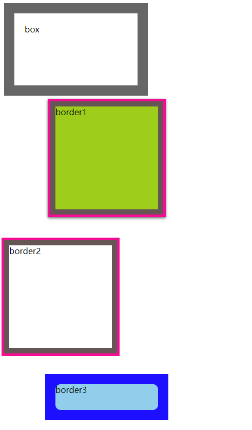

```html
<!DOCTYPE html>
<html lang="en">
<head>
    <meta charset="UTF-8">
    <title>Title</title>
    <link rel="stylesheet" href="style.css" type="text/css">
</head>
<body>
<div class="box">box</div>
<br/>
<div class="border1">border1</div>
<div class="border2">border2</div>
<div class="border3">border3</div>
</body>
</html>
```

```css
/*style.css*/
.box {
    width: 200px;
    height: 100px;
    background: #fff;
    padding: 20px;
    /*重点样式*/
    border: 20px solid rgba(0,0,0,.6);
    background-clip: padding-box;
}
.border1 {
    width: 200px;
    height: 200px;
    margin-left: 100px;
    margin-bottom: 60px;
    background: yellowgreen;
    /*重点样式*/
    box-shadow: 
        0 0 0 10px #655, 
        0 0 0 15px deeppink, 
        0 2px 5px 15px rgba(0,0,0,.6);
}
.border2 {
    width: 200px;
    height: 200px;
    margin-bottom: 60px;
    /*重点样式*/
    border: 10px solid #655;
    outline: 5px solid deeppink;
}
.border3 {
    width: 200px;
    height: 50px;
    background: skyblue;
    border-radius: 10px;
    margin-left: 100px;
    /*重点样式*/
    box-shadow: 0 0 0 10px blue;
    outline: 20px solid blue;
}
```

