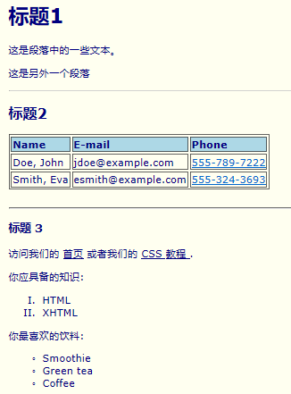
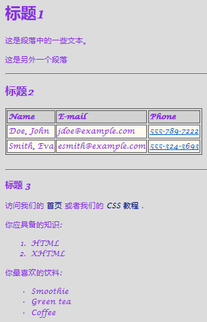
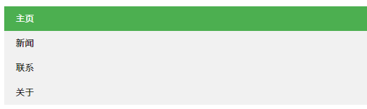
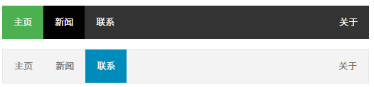

[[_TOC_]]

# CSS 教程

```css
body {
    background-color: #d0e4fe;
}
h1 {
    color: orange;
    text-align: center;
}
p {
    font-family: "Times New Roman";
    font-size: 20px;
}
```

# CSS 简介

## 你需要具备的知识

在继续学习之前，你需要对下面的知识有基本的了解：

- HTML / XHTML

------

## 什么是 CSS?

- CSS 指层叠样式表 (**C**ascading **S**tyle **S**heets)
- 样式定义**如何显示** HTML 元素
- 样式通常存储在**样式表**中
- 把样式添加到 HTML 4.0 中，是为了**解决内容与表现分离的问题**
- **外部样式表**可以极大提高工作效率
- 外部样式表通常存储在 **CSS 文件**中
- 多个样式定义可**层叠**为一个

------

## CSS 实例

一个HTML文档可以显示不同的样式: [查看CSS是如何工作的](https://www.runoob.com/try/demo_source/demo_default.htm)

```html
<!DOCTYPE html>
<html lang="en">
<head>
    <meta charset="UTF-8">
    <title>Title</title>
<!--    <link rel="stylesheet" href="style.css" type="text/css">-->
    <style type="text/css">
        table, th, td {
            border-width: 1px;
            border-style: groove;
            border-color: black;
            text-align: left;
            width: auto;
        }
    </style>
</head>
<body>
<h1>标题1</h1>
<p>这是段落中的一些文本。</p>
<p>这是另外一个段落</p>
<hr>
<h2>标题2</h2>
<table>
    <tbody>
    <tr>
        <th>Name</th>
        <th>E-mail</th>
        <th>Phone</th>
    </tr>
    <tr>
        <td>Doe, John</td>
        <td>jdoe@example.com</td>
        <td>555-789-7222</td>
    </tr>
    <tr>
        <td>Smith, Eva</td>
        <td>esmith@example.com</td>
        <td>555-324-3693</td>
    </tr>
    </tbody>
</table>
<br/>
<hr>
<h3>标题 3</h3>
<p>访问我们的 <a href="https://www.runoob.com/">首页</a>
    或者我们的 <a href="https://www.runoob.com/css/">CSS 教程 </a>.</p>
<p>你应具备的知识:</p>
<ol>
	<li>HTML</li>
	<li>XHTML</li>
</ol>
<p>你最喜欢的饮料:</p>
<ul>
	<li>Smoothie</li>
	<li>Green tea</li>
  	<li>Coffee</li>
</ul>
</body>
</html>
```

### 样式1

```css
body {
    font-size: 75%;
    font-family: Verdana, Arial, Sans-Serif;
    background-color: #fffff0;
    color: #000080;
    margin: 10px;
}
h1 {
    font-size: 200%;
}
h2 {
    font-size: 140%;
}
h3 {
    font-size: 110%;
}
th {
    background-color: #add8e6;
}
ul {
    list-style: circle;
}
ol {
    list-style: upper-roman;
}
a:link {
    color: #000080;
}
a:hover {
    color: red;
}
```



### 样式2

```css
body {
    font-size: 75%;
    font-family: "Lucida Calligraphy", Arial, Sans-Serif;
    background-color: #dcdcdc;
    color: #8a2be2;
    margin: 10px;
}
h1 {
    font-size: 200%;
}
h2 {
    font-size: 140%;
}
h3 {
    font-size: 110%;
}
th {
    background-color: #d3d3d3;
}
td {
    background-color: #fffaf0;
}

a:link {
    color: #000080;
    text-decoration: none;
}
a:hover {
    color: red;
    font-weight: bold;
    text-decoration: none;
}
a:visited {
    text-decoration: none;
}
```



```css
body {
    font-size: 75%;
    font-family: Verdana, Arial, Sans-Serif;
    background-image: url("gradient.png");
    background-repeat: repeat-x;
    background-color: #fffff0;
    color: #000080;
    margin: 70px;
}
h1 {
    font-size: 200%;
}
h2 {
    font-size: 140%;
}
h3 {
    font-size: 110%;
}
th {
    background-color: #add8e6;
}

ul {
    list-style: circle;
}
ol {
    list-style: upper-roman;
}
```

------

## 样式解决了一个很大的问题

HTML 标签原本被设计为用于定义文档内容，如下实例：

```html
<h1>这是一个标题</h1>
<p>这是一个段落。</p>
```

样式表定义如何显示 HTML 元素，就像 HTML 中的字体标签和颜色属性所起的作用那样。样式通常保存在外部的 .css 文件中。我们只需要编辑一个简单的 CSS 文档就可以改变所有页面的布局和外观。

---

# CSS 语法

## 实例

- 查看 [实例 1](https://www.runoob.com/try/try.php?filename=ex1)

```html
<!DOCTYPE html>
<html lang="en">
<head>
    <meta charset="UTF-8">
    <title>Title</title>
    <link rel="stylesheet" href="style.css" type="text/css">
    <style type="text/css">
        body {
            background-color: yellow;
        }
        h1 {
            font-size: 36pt;
        }
        h2 {
            color: blue;
        }
        p {
            margin-left: 50px;
        }
    </style>
</head>
<body>
<h1>这个标题设置的大小为 36 pt</h1>
<h2>这个标题设置的颜色为蓝色：blue</h2>
<p>这个段落的左外边距为 50 像素：50px</p>
</body>
</html>
```

- 查看 [实例 2](https://www.runoob.com/try/try.php?filename=ex2)

```html
<!DOCTYPE html>
<html lang="en">
<head>
    <meta charset="UTF-8">
    <title>Title</title>
<!--    <link rel="stylesheet" href="style.css" type="text/css">-->
    <style type="text/css">
        body {
            background-color: tan;
        }
        h1 {
            color: maroon;
            font-size: 20pt;
        }
        hr {
            color: navy;
        }
        p {
            font-size: 11pt;
            margin-left: 15px;
        }
        a:link {
            color: green;
        }
        a:visited {
            color: yellow;
        }
        a:hover {
            color: black;
        }
        a:active {
            color: blue;
        }
    </style>
</head>
<body>
<h1>这是标题</h1>
<hr>
<p>你可以看到这个段落是 被设定的 CSS 渲染的。</p>
<p><a href="https://www.runoob.com" target="_blank">这是一个链接</a></p>
</body>
</html>
```

## CSS 实例

CSS 规则由两个主要的部分构成：选择器，以及一条或多条声明:


选择器通常是您需要改变样式的 HTML 元素。

每条声明由一个属性和一个值组成。

属性（`property`）是您希望设置的样式属性（`style attribute`）。每个属性有一个值。属性和值被冒号分开。

## CSS 实例

CSS声明总是以分号(`;`)结束，声明总以大括号(`{}`)括起来:

```css
p {color: red;text-align: center;}
```

为了让CSS可读性更强，你可以每行只描述一个属性:

```css
p {
	color: red;
	text-align: center;
}
```

## CSS 注释

注释是用来解释你的代码，并且可以随意编辑它，浏览器会忽略它。

CSS注释以 "`/*`" 开始, 以 "`*/`" 结束, 实例如下:

```css
/*这是个注释*/
p {
    text-align: center;
    /*这是另一个注释*/
    color: black;
    font-family: Arial;
}
```

---

# CSS Id 和 Class

## id 和 class 选择器

如果你要在HTML元素中设置CSS样式，你需要在元素中设置"`id`" 和 "`class`"选择器。

## id 选择器

`id `选择器可以为标有特定 `id `的 HTML 元素指定特定的样式。

HTML元素以`id`属性来设置`id`选择器,CSS 中 `id `选择器以 "`#`" 来定义。

以下的样式规则应用于元素属性 `id="para1"`:

```css
#para1 {
    text-align: center;
    color: red;
}
```

> ID属性不要以数字开头，数字开头的ID在 Mozilla/Firefox 浏览器中不起作用。

## class 选择器

class 选择器用于描述一组元素的样式，class 选择器有别于id选择器，class可以在多个元素中使用。

class 选择器在HTML中以class属性表示, 在 CSS 中，类选择器以一个点"`.`"号显示：

在以下的例子中，所有拥有 center 类的 HTML 元素均为居中。

```css
.center {
    text-align: center;
}
```

你也可以指定特定的HTML元素使用class。

在以下实例中, 所有的 `p` 元素使用` class="center"` 让该元素的文本居中:

```css
p.center {
    text-align: center;
}
```

>类名的第一个字符不能使用数字！它无法在 Mozilla 或 Firefox 中起作用。

## css 选择器

如果你要在 html 标签中设置 CSS 样式，那么你有四种方法，即 css 选择器有四种。

除了提到的 `id `和 `class `选择器外，第三种选择器为`标签`选择器，即以 html 标签作为 css 修饰所用的选择器。

```css
h3 {
    font-size: 110%;
}
```

第四种选择器即直接在标签内部写css代码。

```css
<h3 style="color: red;">菜鸟教程</h3>
```

这四种 css 选择器有修饰上的优先级，即：

<p style="background: linen; color: sandybrown; opacity: 50%; border-top: antiquewhite 3px solid">
    第四种 > id > class > 第三种
</p>
---

除了教程中的`id`选择器和`class`选择器，另还有元素选择器、属性选择器、包含选择器、子选择器和CSS3中新增的兄弟选择器，以下带上ID选择器和类选择器一起举例。

1\. ID 选择器（ID selector，IS）：使用 `#` 标识selector，语法格式：``#S{...}``（S为选择器名）。例：`id`为`name`的标签会匹配下面的样式

```css
#name {
	color: red;
}
```

2\. 类选择器（class selector，CS）：使用 `.` 标识selector，语法格式：`.S{...}`（S为选择器名）。例：`class`属性值为`value`的标签会匹配下面的样式

```css
.value {
    text-align: center;
}
```

3\. 元素选择器（element selector，ES）：又叫标签选择器，使用标签名作为selector名，语法格式：`S{...}`（S为选择器名）。例：所有的`p`标签都会匹配以下的样式

```css
p {
    font-style: italic;
}
```

4\. 属性选择器（attribute selector，AS）：ES其实是AS的一个特例，在AS基础上还能对selector描述得更具体，语法格式为 `E[attr[~=][|=][^=][$=][*=]VALUE]{...}`，是并没有得到所有浏览器支持的选择器，因此不举例

5\. 包含选择器（package selector，PS）：指定目标选择器必须处在某个选择器对应的元素内部，语法格式：`A B{...}`（A、B为HTML元素/标签，表示对处于A中的B标签有效）。例：以下`div`内的`p`标签和`div`外的`p`标签分别匹配不同的样式

```css
p {
    color: red;
}
div p {
    color: yellow;
}
```

```html
<p>red text</p>
<div><p>yellow text</p></div>
```

6\. 子选择器（sub-selector，SS）：类似于PS，指定目标选择器必须处在某个选择器对应的元素内部，两者区别在于PS允许"子标签"甚至"孙子标签"及嵌套更深的标签匹配相应的样式，而SS强制指定目标选择器作为 包含选择器对应的标签 内部的标签，语法格式：`A>B{...}`（A、B为HTML元素/标签）。例：以下`div`内的`p`标签匹配样式，`div`内的`table`内的`p`不匹配

```css
div>p {
    color: red
}
```

```html
<div>
    <p>red text</p>
    <table>
        <tr>
            <td>
                <p>not red text</p>
            </td>
        </tr>
    </table>
</div>
```

7\. 兄弟选择器（brother selector，BS）：BS是CSS3.0新增的一个选择器，语法格式：`A~B{...}`（A、B为HTML元素/标签，表示A标签匹配selector的A，B标签匹配selector的B时，B标签匹配样式）

```css
div~p {
    color: red;
}
```

```html
<div><p>no red text</p>
  <div>no red text</div>
  <p>red text</p>
</div>
```

8\. 补充包含选择器：

包含选择器除了有 `A B{...} `的形式外（A和B都是标签），还可以有这种形式：`.A B{...}` 的形式（`A`是类名，`B`是标签）。

作用与上面介绍的相同，会使 `class `名为` A` 的标签里面所有名为 `B` 的子代标签的内容按照设定的内容显示。

```html
<!DOCTYPE html>
<html lang="en">
<head>
    <meta charset="UTF-8">
    <title>Title</title>
    <style type="text/css">
        .first span {
            color: red;
        }
    </style>
</head>
<body>
<p class="first"><span>red text</span>
</body>
</html>
```

9\. 补充子选择器

子选择器除了有 `A >B{...}` 的形式外（A和B都是标签），还可以有这种形式：`.A >B{...}` 的形式（A是类名，B是标签）。

作用与上面介绍的相同，会使 class 为 A 的标签里面所有名为 B 的直接子代标签的内容按照设定的内容显示。而非直接子代的 B 标签的内容是不会改变的。

```html
<!DOCTYPE html>
<html lang="en">
<head>
    <meta charset="UTF-8">
    <title>Title</title>
    <style type="text/css">
        .first>span {
            color: red;
        }
    </style>
</head>
<body>
<p class="first"><span>red text</span>
</body>
</html>
```

10\. 通用选择器
语法形式为：`*{属性：属性值}`。它的作用是匹配 html 中的所有元素标签。

```css
* {
    color: red
}
```

11\. 相邻选择器。

```css
div+p {
    color: red
}
```

---

# CSS 创建

当读到一个样式表时，浏览器会根据它来格式化 HTML 文档。

## 如何插入样式表

插入样式表的方法有三种:

- 外部样式表(External style sheet)
- 内部样式表(Internal style sheet)
- 内联样式(Inline style)

## 外部样式表

当样式需要应用于很多页面时，外部样式表将是理想的选择。在使用外部样式表的情况下，你可以通过改变一个文件来改变整个站点的外观。每个页面使用 <link> 标签链接到样式表。 `<link>` 标签在（文档的）头部：

```html
<head>
	<link rel="stylesheet" type="text/css" href="mystyle.css">
</head>
```

浏览器会从文件 `mystyle.css` 中读到样式声明，并根据它来格式文档。

外部样式表可以在任何文本编辑器中进行编辑。文件不能包含任何的 html 标签。样式表应该以 `.css` 扩展名进行保存。下面是一个样式表文件的例子：

```css
hr {color: sienna;}
p {margin-left: 20px;}
body {background-image: url("/images/back40.gif");}
```

## 内部样式表

当单个文档需要特殊的样式时，就应该使用内部样式表。你可以使用` <style>` 标签在文档头部定义内部样式表，就像这样:

```html
<head>
    <style>
        hr {color: sienna;}
        p {margin-left: 20px;}
        body {background-image: url("images/back40.gif");}
    </style>
</head>
```

## 内联样式

由于要将表现和内容混杂在一起，内联样式会损失掉样式表的许多优势。请慎用这种方法，例如当样式仅需要在一个元素上应用一次时。

要使用内联样式，你需要在相关的标签内使用样式（`style`）属性。Style 属性可以包含任何 CSS 属性。本例展示如何改变段落的颜色和左外边距：

```html
<p style="color: sienna; margin-left: 20px">这是一个段落。</p>
```

## 多重样式

如果某些属性在不同的样式表中被同样的选择器定义，那么属性值将从更具体的样式表中被继承过来。 

例如，外部样式表拥有针对 `h3 `选择器的三个属性：

```css
h3 {
    color: red;
    text-align: left;
    font-size: 8pt;
}
```

而内部样式表拥有针对 `h3 `选择器的两个属性：

```css
h3 {
    text-align: right;
    font-size: 20pt;
}
```

假如拥有内部样式表的这个页面同时与外部样式表链接，那么 `h3 `得到的样式是：

```css
color: red;
text-align: right;
font-size: 20pt;
```

即颜色属性将被继承于外部样式表，而文字排列（text-alignment）和字体尺寸（font-size）会被内部样式表中的规则取代。

## 多重样式优先级

样式表允许以多种方式规定样式信息。样式可以规定在单个的 HTML 元素中，在 HTML 页的头元素中，或在一个外部的 CSS 文件中。甚至可以在同一个 HTML 文档内部引用多个外部样式表。

一般情况下，优先级如下：

```css
（内联样式）Inline style > （内部样式）Internal style sheet >（外部样式）External style sheet > 浏览器默认样式
```

> **注意：**  *如果外部样式放在内部样式的后面，则外部样式将覆盖内部样式。*

## 多重样式优先级深入概念

优先级是浏览器是通过判断哪些属性值与元素最相关以决定并应用到该元素上的。优先级仅由选择器组成的匹配规则决定的。

优先级就是分配给指定的CSS声明的一个权重，它由匹配的选择器中的每一种选择器类型的数值决定。

### 优先级顺序

下列是一份优先级逐级增加的选择器列表：

- 通用选择器（`*`）
- 元素(类型)选择器
- 类选择器
- 属性选择器
- 伪类
- ID 选择器
- 内联样式

### !important 规则例外

当 `!important` 规则被应用在一个样式声明中时,该样式声明会覆盖CSS中任何其他的声明, 无论它处在声明列表中的哪里. 尽管如此, `!important`规则还是与优先级毫无关系.使用` !important` 不是一个好习惯，因为它改变了你样式表本来的级联规则，从而使其难以调试。

一些经验法则：

- **Always** 要优化考虑使用样式规则的优先级来解决问题而不是 `!important`
- **Only** 只在需要覆盖全站或外部 css（例如引用的 ExtJs 或者 YUI ）的特定页面中使用 `!important`
- **Never** 永远不要在全站范围的 css 上使用` !important`
- **Never** 永远不要在你的插件中使用 `!important`

### 权重计算:


解释：

-  1\. 内联样式表的权值最高 1000；
-  2\. ID 选择器的权值为 100
-  3\. Class 类选择器的权值为 10
-  4\. HTML 标签选择器的权值为 1

### CSS 优先级法则：

-  A 选择器都有一个权值，权值越大越优先；
-  B 当权值相等时，后出现的样式表设置要优于先出现的样式表设置；
-  C 创作者的规则高于浏览者：即网页编写者设置的CSS 样式的优先权高于浏览器所设置的样式；
-  D 继承的CSS 样式不如后来指定的CSS 样式；
-  E 在同一组属性设置中标有“`!important`”规则的优先级最大；
  结果：在Firefox 下显示为蓝色；在IE 6 下显示为红色；

---

# CSS 背景

CSS 背景属性用于定义HTML元素的背景。

CSS 属性定义背景效果:

- `background-color`
- `background-image`
- `background-repeat`
- `background-attachment`
- `background-position`

## 背景颜色

`background-color` 属性定义了元素的背景颜色.

页面的背景颜色使用在`body`的选择器中:

```css
body {background-color: #b0c4de;}
```

CSS中，颜色值通常以以下方式定义:

- 十六进制 - 如："`#ff0000`"
- RGB - 如："`rgb(255,0,0)`"
- 颜色名称 - 如："`red`"

以下实例中, `h1`, `p`, 和 `div `元素拥有不同的背景颜色:

```css
h1 {background-color: #6495ed;}
p {background-color: #e0ffff;}
div {background-color: #b0c4de;}
```

## 背景图像

`background-image` 属性描述了元素的背景图像.

默认情况下，背景图像进行平铺重复显示，以覆盖整个元素实体.

页面背景图片设置实例:

```css
body {background-image: url('paper.gif');}
```

## 背景图像 - 水平或垂直平铺

默认情况下 `background-image` 属性会在页面的水平或者垂直方向平铺。

一些图像如果在水平方向与垂直方向平铺，这样看起来很不协调，如下所示: 

```css
body {
    background-image: url('gradient2.png');
    background-repeat: repeat-x;
}
```

## 背景图像- 设置定位与不平铺

 让背景图像不影响文本的排版

如果你不想让图像平铺，你可以使用 `background-repeat` 属性:

```css
body {
    background-image: url('gradient2.png');
    background-repeat: no-repeat;
}
```

以上实例中，背景图像与文本显示在同一个位置，为了让页面排版更加合理，不影响文本的阅读，我们可以改变图像的位置。

可以利用 `background-position` 属性改变图像在背景中的位置:

```css
body {
    background-image: url('gradient2.png');
    background-repeat: no-repeat;
    background-position: right top;
}
```

## 背景- 简写属性

在以上实例中我们可以看到页面的背景颜色通过了很多的属性来控制。

为了简化这些属性的代码，我们可以将这些属性合并在同一个属性中.

背景颜色的简写属性为 "`background`":

```css
body {
    background: #ffffff url("img_tree.png") no-repeat right top;
}
```

当使用简写属性时，属性值的顺序为：:

- `background-color`
- `background-image`
- `background-repeat`
- `background-attachment`
- `background-position`

以上属性无需全部使用，你可以按照页面的实际需要使用.

这个实例使用了先前介绍的CSS，你可以查看相应实例: [CSS 实例](https://www.runoob.com/try/try.php?filename=trycss_background_shorthand2)

```html
<!DOCTYPE html>
<html lang="en">
<head>
    <meta charset="UTF-8">
    <title>Title</title>
    <style type="text/css">
        body {
            margin-left: 200px;
            background: #5d9ab2 url("img_tree.png") no-repeat top left;
        }
        .container {
            text-align: center;
        }
        .center_div {
            border: 1px solid gray;
            margin-left: auto;
            margin-right: auto;
            width: 90%;
            background-color: #d0f0f6;
            text-align: left;
            padding: 8px;
        }
    </style>
</head>
<body>
<div class="container">
    <div class="center_div">
        <h1>Hello World!</h1>
        <p>This example contains some advanced CSS methods you may not have learned yet. But, we will explain these methods in a later chapter in the tutorial.</p>
    </div>
</div>
</body>
</html>
```

[如何设置固定的背景图像](https://www.runoob.com/try/try.php?filename=trycss_background-attachment)

```css
<!DOCTYPE html>
<html lang="en">
<head>
    <meta charset="UTF-8">
    <title>Title</title>
    <style type="text/css">
        body {
            background-image: url("smiley.gif");
            background-repeat: no-repeat;
            background-attachment: fixed;
        }
    </style>
</head>
<body>
<p>背景图片是固定的。尝试向下滚动页面。</p>
<p>背景图片是固定的。尝试向下滚动页面。</p>
<p>背景图片是固定的。尝试向下滚动页面。</p>
<p>背景图片是固定的。尝试向下滚动页面。</p>
<p>背景图片是固定的。尝试向下滚动页面。</p>
<p>背景图片是固定的。尝试向下滚动页面。</p>
<p>背景图片是固定的。尝试向下滚动页面。</p>
<p>背景图片是固定的。尝试向下滚动页面。</p>
<p>背景图片是固定的。尝试向下滚动页面。</p>
<p>背景图片是固定的。尝试向下滚动页面。</p>
<p>背景图片是固定的。尝试向下滚动页面。</p>
<p>背景图片是固定的。尝试向下滚动页面。</p>
<p>背景图片是固定的。尝试向下滚动页面。</p>
<p>背景图片是固定的。尝试向下滚动页面。</p>
<p>背景图片是固定的。尝试向下滚动页面。</p>
</body>
</html>
```

## CSS 背景属性

| Property                                                     | 描述                                         |
| :----------------------------------------------------------- | :------------------------------------------- |
| [background](https://www.runoob.com/cssref/css3-pr-background.html) | 简写属性，作用是将背景属性设置在一个声明中。 |
| [background-attachment](https://www.runoob.com/cssref/pr-background-attachment.html) | 背景图像是否固定或者随着页面的其余部分滚动。 |
| [background-color](https://www.runoob.com/cssref/pr-background-color.html) | 设置元素的背景颜色。                         |
| [background-image](https://www.runoob.com/cssref/pr-background-image.html) | 把图像设置为背景。                           |
| [background-position](https://www.runoob.com/cssref/pr-background-position.html) | 设置背景图像的起始位置。                     |
| [background-repeat](https://www.runoob.com/cssref/pr-background-repeat.html) | 设置背景图像是否及如何重复。                 |

---

# CSS 文本格式

## 文本颜色

颜色属性被用来设置文字的颜色。

颜色是通过CSS最经常的指定：

- 十六进制值 - 如: `＃ff0000`
- 一个RGB值 - 如: `rgb(255,0,0)`
- 颜色的名称 - 如: `red`

一个网页的背景颜色是指在主体内的选择：

```css
body {
    color: red;
}
h1 {
    color: #00ff00;
}
h2 {
    color: rgb(255,0,0);
}
```


[尝试一下 »](https://www.runoob.com/try/try.php?filename=trycss_color)

 对于W3C标准的CSS：如果你定义了颜色属性，你还必须定义背景色属性。

## 文本的对齐方式

文本排列属性是用来设置文本的水平对齐方式。

文本可居中或对齐到左或右,两端对齐.

当`text-align`设置为"*justify*"，每一行被展开为宽度相等，左，右外边距是对齐（如杂志和报纸）。

```css
h1 {
    text-align: center;
}
p.data {
    text-align: right;
}
p.main {
    text-align: justify;
}
```

[尝试一下 »](https://www.runoob.com/try/try.php?filename=trycss_text-align_all)

## 文本修饰

`text-decoration` 属性用来设置或删除文本的装饰。

从设计的角度看 `text-decoration`属性主要是用来删除链接的下划线：

```css
a {
    text-decoration: none;
}
```

[尝试一下 »](https://www.runoob.com/try/try.php?filename=trycss_text-decoration_link)

也可以这样装饰文字：

```css
h1 {
    text-decoration: overline;
}
h2 {
    text-decoration: line-through;
}
h3 {
    text-decoration: underline;
}
```

[尝试一下 »](https://www.runoob.com/try/try.php?filename=trycss_text-decoration)

 我们不建议强调指出不是链接的文本，因为这常常混淆用户。

## 文本转换

文本转换属性是用来指定在一个文本中的大写和小写字母。

可用于所有字句变成大写或小写字母，或每个单词的首字母大写。

```css
p.uppercase {
    text-transform: uppercase;
}
p.lowercase {
    text-transform: lowercase;
}
p.capitalize {
    text-transform: capitalize;
}
```

[尝试一下 »](https://www.runoob.com/try/try.php?filename=trycss_text-transform)

## 文本缩进

文本缩进属性是用来指定文本的第一行的缩进。

```css
p {
    text-indent: 50px;
}
```

[尝试一下 »](https://www.runoob.com/try/try.php?filename=trycss_text-indent)

## 更多实例

[指定字符之间的空间](https://www.runoob.com/try/try.php?filename=trycss_letter-spacing)
这个例子演示了如何增加或减少字符之间的空间。

```css
h1 {letter-spacing: 2px;}
h2 {letter-spacing: -3px;}
```

[指定行与行之间的空间](https://www.runoob.com/try/try.php?filename=trycss_line-height)
这个例子演示了如何指定在一个段落中行之间的空间

```css
p.small {line-height: 70%;}
p.big {line-height: 200%;}
```

[设置元素的文本方向](https://www.runoob.com/try/try.php?filename=trycss_text-direction)
这个例子演示了如何改变元素的文本方向。

```css
div.ex1 {direction: rtl;}
```

[增加单词之间的空白空间](https://www.runoob.com/try/try.php?filename=trycss_text-word-spacing)
这个例子演示了如何增加一个段落中的单词之间的空白空间。

```
p {word-spacing: 30px;}
```

[在元素内禁用文字环绕](https://www.runoob.com/try/try.php?filename=trycss_text-white-space)
这个例子演示了如何禁用一个元素内的文字环绕。

```css
p {white-space: nowrap;}
```

[垂直对齐图像](https://www.runoob.com/try/try.php?filename=trycss_vertical-align)
这个例子演示了如何设置文本的垂直对齐图像。

```css
img.top {vertical-align: text-top;}
img.bottom {vertical-align: text-bottom;}
```

[添加文本阴影](https://www.runoob.com/try/try.php?filename=trycss_text-shadow)
这个例子演示了如何设置文本阴影。

```css
h1 {text-shadow: 2px 2px #ff0000;}
```

------

## 所有CSS文本属性

| 属性                                                         | 描述                     |
| :----------------------------------------------------------- | :----------------------- |
| [color](https://www.runoob.com/cssref/pr-text-color.html)    | 设置文本颜色             |
| [direction](https://www.runoob.com/cssref/pr-text-direction.html) | 设置文本方向。           |
| [letter-spacing](https://www.runoob.com/cssref/pr-text-letter-spacing.html) | 设置字符间距             |
| [line-height](https://www.runoob.com/cssref/pr-dim-line-height.html) | 设置行高                 |
| [text-align](https://www.runoob.com/cssref/pr-text-text-align.html) | 对齐元素中的文本         |
| [text-decoration](https://www.runoob.com/cssref/pr-text-text-decoration.html) | 向文本添加修饰           |
| [text-indent](https://www.runoob.com/cssref/pr-text-text-indent.html) | 缩进元素中文本的首行     |
| [text-shadow](https://www.runoob.com/cssref/css3-pr-text-shadow.html) | 设置文本阴影             |
| [text-transform](https://www.runoob.com/cssref/pr-text-text-transform.html) | 控制元素中的字母         |
| [unicode-bidi](https://www.runoob.com/cssref/pr-text-unicode-bidi.html) | 设置或返回文本是否被重写 |
| [vertical-align](https://www.runoob.com/cssref/pr-pos-vertical-align.html) | 设置元素的垂直对齐       |
| [white-space](https://www.runoob.com/cssref/pr-text-white-space.html) | 设置元素中空白的处理方式 |
| [word-spacing](https://www.runoob.com/cssref/pr-text-word-spacing.html) | 设置字间距               |

## letter-spacing 与 word-spacing：

```css
h1 {
    letter-spacing:30px;
}
...
<h1>letter spacing</h1>
```

`letter-spacing` 这个样式使用在英文单词时，是设置字母与字母之间的间距。

如果想设置英文单词之间的间距，可以使用 `word-spacing` 来实现。如下代码：

```css
h1 {
    word-spacing:30px;
}
...
<h1>word spacing</h1>
```

---

汉字的间隔调节也是用 `letter-spacing` 来实现的。

因为中文段落里字与字之间没有空格，因而 `word-spacing` 通常起不到调整间距的作用。

---

# CSS 字体

CSS字体属性定义字体，加粗，大小，文字样式。

## serif和sans-serif字体之间的区别


 在计算机屏幕上，sans-serif字体被认为是比serif字体容易阅读

------

## CSS字型

在CSS中，有两种类型的字体系列名称：

- **通用字体系列** - 拥有相似外观的字体系统组合（如 "Serif" 或 "Monospace"）
- **特定字体系列** - 一个特定的字体系列（如 "Times" 或 "Courier"）

<table class="reference">
<tr>
<th width="22%" align="left">Generic family</th>
<th width="31%" align="left">字体系列</th>
<th width="47%" align="left">说明</th>
</tr>
<tr>
<td>Serif</td>
<td><span style="font-size:150%;font-family:Times New Roman">Times New Roman</span><br>
<span style="font-size:150%;font-family:Georgia">Georgia</span></td>
<td>Serif字体中字符在行的末端拥有额外的装饰</td>
</tr>
<tr>
<td>Sans-serif</td>
<td><span style="font-size:150%;font-family:Arial">Arial</span><br>
<span style="font-size:150%;font-family:Verdana">Verdana</span></td>
<td>"Sans"是指无 - 这些字体在末端没有额外的装饰</td>
</tr>
<tr>
<td>Monospace</td>
<td><span style="font-size:150%;font-family:Courier New">Courier New</span><br>
<span style="font-size:150%;font-family:Lucida Console">Lucida Console</span></td>
<td>所有的等宽字符具有相同的宽度</td>
</tr>
</table>

## 字体系列

`font-family `属性设置文本的字体系列。

`font-family `属性应该设置几个字体名称作为一种"后备"机制，如果浏览器不支持第一种字体，他将尝试下一种字体。

**注意**: 如果字体系列的名称超过一个字，它必须用引号，如Font Family："宋体"。

多个字体系列是用一个逗号分隔指明：

```css
p {font-family: "Times New Roman", Times, serif;}
```


[尝试一下 »](https://www.runoob.com/try/try.php?filename=trycss_font-family)

对于较常用的字体组合，看看我们的 [Web安全字体组合](https://www.runoob.com/cssref/css-websafe-fonts.html)。

## 字体样式

主要是用于指定斜体文字的字体样式属性。

这个属性有三个值：

- 正常 - 正常显示文本
- 斜体 - 以斜体字显示的文字
- 倾斜的文字 - 文字向一边倾斜（和斜体非常类似，但不太支持）

```css
p.normal {font-style: normal;}
p.italic {font-style: italic;}
p.oblique {font-style: oblique;}
```

[尝试一下 »](https://www.runoob.com/try/try.php?filename=trycss_font-style)

## 字体大小

`font-size `属性设置文本的大小。

能否管理文字的大小，在网页设计中是非常重要的。但是，你不能通过调整字体大小使段落看上去像标题，或者使标题看上去像段落。

请务必使用正确的HTML标签，就`<h1>` - `<h6>`表示标题和`<p>`表示段落：

字体大小的值可以是绝对或相对的大小。

绝对大小：

- 设置一个指定大小的文本
- 不允许用户在所有浏览器中改变文本大小
- 确定了输出的物理尺寸时绝对大小很有用

相对大小：

- 相对于周围的元素来设置大小
- 允许用户在浏览器中改变文字大小

 如果你不指定一个字体的大小，默认大小和普通文本段落一样，是16像素（`16px=1em`）。

## 设置字体大小像素

设置文字的大小与像素，让您完全控制文字大小：

```css
h1 {font-size: 40px;}
h2 {font-size: 30px;}
p {font-size: 14px;}
```

[尝试一下 »](https://www.runoob.com/try/try.php?filename=trycss_font-size_px)

上面的例子可以在 Internet Explorer 9, Firefox, Chrome, Opera, 和 Safari 中通过缩放浏览器调整文本大小。

虽然可以通过浏览器的缩放工具调整文本大小，但是，这种调整是整个页面，而不仅仅是文本

## 用em来设置字体大小

为了避免Internet Explorer 中无法调整文本的问题，许多开发者使用 `em `单位代替像素。

`em`的尺寸单位由W3C建议。

`1em`和当前字体大小相等。在浏览器中默认的文字大小是`16px`。

因此，`1em`的默认大小是`16px`。可以通过下面这个公式将像素转换为em：**px/16=em**

```css
h1 {font-size: 2.5em;} /* 40px/16=2.5em */
h2 {font-size: 1.875em;} /* 30px/16=1.875em */
p {font-size: 0.875em;} /* 14px/16=0.875em */
```


[尝试一下 »](https://www.runoob.com/try/try.php?filename=trycss_font-size_em)

在上面的例子，`em`的文字大小是与前面的例子中像素一样。不过，如果使用 `em `单位，则可以在所有浏览器中调整文本大小。

不幸的是，仍然是IE浏览器的问题。调整文本的大小时，会比正常的尺寸更大或更小。

## 使用百分比和EM组合

在所有浏览器的解决方案中，设置 `<body>`元素的默认字体大小的是百分比：

```css
body {font-size: 100%;}
h1 {font-size: 2.5em;}
h2 {font-size: 1.875em;}
p {font-size: 0.875em;}
```


[尝试一下 »](https://www.runoob.com/try/try.php?filename=trycss_font-size_percent_em)

我们的代码非常有效。在所有浏览器中，可以显示相同的文本大小，并允许所有浏览器缩放文本的大小。

## 更多实例

[设置字体加粗](https://www.runoob.com/try/try.php?filename=trycss_font-weight)
这个例子演示了如何设置字体的加粗。

```css
p.normal {font-weight: normal;}
p.light {font-weight: lighter;}
p.thick {font-weight: bold;}
p.thicker {font-weight: 900;}
```

[可以设置字体的转变](https://www.runoob.com/try/try.php?filename=trycss_font-variant)
这个例子演示了如何设置字体的转变。

```css
p.normal {font-variant: normal;}
p.small {font-variant: small-caps;}
```

[在一个声明中的所有字体属性](https://www.runoob.com/try/try.php?filename=trycss_font)
本例演示如何使用简写属性将字体属性设置在一个声明之内。

```css
p.ex1 {
	font: 15px arial,sans-serif;
}
p.ex2 {
	font: italic bold 12px/30px Georgia,serif;
}
```

## 所有CSS字体属性

| Property                                                     | 描述                                 |
| :----------------------------------------------------------- | :----------------------------------- |
| [font](https://www.runoob.com/cssref/pr-font-font.html)      | 在一个声明中设置所有的字体属性       |
| [font-family](https://www.runoob.com/cssref/pr-font-font-family.html) | 指定文本的字体系列                   |
| [font-size](https://www.runoob.com/cssref/pr-font-font-size.html) | 指定文本的字体大小                   |
| [font-style](https://www.runoob.com/cssref/pr-font-font-style.html) | 指定文本的字体样式                   |
| [font-variant](https://www.runoob.com/cssref/pr-font-font-variant.html) | 以小型大写字体或者正常字体显示文本。 |
| [font-weight](https://www.runoob.com/cssref/pr-font-weight.html) | 指定字体的粗细。                     |


**italic 和 oblique 的区别**

一种字体有粗体、斜体、下划线、删除线等诸多属性。

但是并不是所有字体都做了这些，一些不常用的字体，或许就只有个正常体，如果你用 `italic`，就没有效果了~

这时候你就要用 `oblique`，可以理解成 `italic `是使用文字的斜体，`oblique `是让没有斜体属性的文字倾斜！

另 CSS2.0 上边的解释你参考下：`italic `和 `oblique `都是向右倾斜的文字, 但区别在于 `italic `是指斜体字，而 `oblique `是倾斜的文字，对于没有斜体的字体应该使用 `oblique `属性值来实现倾斜的文字效果。

---

# CSS 链接

不同的链接可以有不同的样式。

## 链接样式

链接的样式，可以用任何CSS属性（如颜色，字体，背景等）。

特别的链接，可以有不同的样式，这取决于他们是什么状态。

这四个链接状态是：

- `a:link` - 正常，未访问过的链接
- `a:visited` - 用户已访问过的链接
- `a:hover` - 当用户鼠标放在链接上时
- `a:active` - 链接被点击的那一刻

```css
a:link {color: #000000;}      /* 未访问链接*/
a:visited {color: #00ff00;}  /* 已访问链接 */
a:hover {color: #ff00ff;}  /* 鼠标移动到链接上 */
a:active {color: #0000ff;}  /* 鼠标点击时 */
```


[尝试一下 »](https://www.runoob.com/try/try.php?filename=trycss_link)

当设置为若干链路状态的样式，也有一些顺序规则：

- `a:hover` 必须跟在 `a:link` 和 `a:visited`后面
- `a:active` 必须跟在 `a:hover`后面

## 常见的链接样式

根据上述链接的颜色变化的例子，看它是在什么状态。

让我们通过一些其他常见的方式转到链接样式：

## 文本修饰

`text-decoration` 属性主要用于删除链接中的下划线：

```css
a:link {text-decoration: none;}
a:visited {text-decoration: none;}
a:hover {text-decoration: underline;}
a:active {text-decoration: underline;}
```


[尝试一下 »](https://www.runoob.com/try/try.php?filename=trycss_link_decoration)

## 背景颜色

背景颜色属性指定链接背景色：

```css
a:link {background-color: #B2FF99;}
a:visited {background-color: #FFFF85;}
a:hover {background-color: #FF704D;}
a:active {background-color: #FF704D;}
```

[尝试一下 »](https://www.runoob.com/try/try.php?filename=trycss_link_background)

## 更多实例

[添加不同样式的超链接](https://www.runoob.com/try/try.php?filename=trycss_link2)
这个例子演示了如何为超链接添加其他样式。

```css
a.one:link {color: #ff0000;}
a.one:visited {color: #0000ff;}
a.one:hover {color: #ffcc00;}

a.two:link {color: #ff0000;}
a.two:visited {color: #0000ff;}
a.two:hover {font-size: 150%;}

a.three:link {color: #ff0000;}
a.three:visited {color: #0000ff;}
a.three:hover {background: #66ff66;}

a.four:link {color: #ff0000;}
a.four:visited {color: #0000ff;}
a.four:hover {font-family: Georgia, serif;}

a.five:link {color: #ff0000; text-decoration: none;}
a.five:visited {color: #0000ff; text-decoration: none;}
a.five:hover {text-decoration: underline;}
```

[高级 - 创建链接框](https://www.runoob.com/try/try.php?filename=trycss_link_advanced)
这个例子演示了一个更高级的例子，我们结合若干CSS属性显示为方框。

```css
a:link,a:visited {
    display: block;
    font-weight: bold;
    color: #ffffff;
    background-color: #98bf21;
    width: 120px;
    text-align: center;
    padding: 4px;
    text-decoration: none;
}
a:hover,a:active {
    background-color: #7a991a;
}
```

---

# CSS 列表

CSS列表属性作用如下：

- 设置不同的列表项标记为有序列表
- 设置不同的列表项标记为无序列表
- 设置列表项标记为图像


------

## 列表

在HTML中，有两种类型的列表：

- 无序列表 - 列表项标记用特殊图形（如小黑点、小方框等）
- 有序列表 - 列表项的标记有数字或字母

使用CSS，可以列出进一步的样式，并可用图像作列表项标记。

------

## 不同的列表项标记

list-style-type属性指定列表项标记的类型是：

```css
ul.a {list-style-type: circle;}
ul.b {list-style-type: square;}
 
ol.c {list-style-type: upper-roman;}
ol.d {list-style-type: lower-alpha;}
```

一些值是无序列表，以及有些是有序列表。

## 作为列表项标记的图像

要指定列表项标记的图像，使用列表样式图像属性：

```css
ul {list-style-image: url('sqpurple.gif');}
```

上面的例子在所有浏览器中显示并不相同，IE和Opera显示图像标记比火狐，Chrome和Safari更高一点点。

如果你想在所有的浏览器放置同样的形象标志，就应使用浏览器兼容性解决方案，过程如下

## 浏览器兼容性解决方案

同样在所有的浏览器，下面的例子会显示的图像标记：

```css
ul {
    list-style-type: none;
    padding: 0px;
    margin: 0px;
}
ul li {
    background-image: url(sqpurple.gif);
    background-repeat: no-repeat;
    background-position: 0px 5px; 
    padding-left: 14px; 
}
```

例子解释：

- `ul:`
  - 设置列表类型为没有列表项标记
  - 设置填充和边距0px（浏览器兼容性）
- `ul`中所有`li:`
  - 设置图像的URL，并设置它只显示一次（无重复）
  - 您需要的定位图像位置（左0px和上下5px）
  - 用padding-left属性把文本置于列表中

## 列表 -简写属性

在单个属性中可以指定所有的列表属性。这就是所谓的简写属性。

为列表使用简写属性，列表样式属性设置如下：

```css
ul {list-style: square url("sqpurple.gif");}
```

可以按顺序设置如下属性：

- `list-style-type`
- l`ist-style-position` (有关说明，请参见下面的CSS属性表)
- `list-style-image`

如果上述值丢失一个，其余仍在指定的顺序，就没关系。

## 所有的CSS列表属性

| 属性                                                         | 描述                                               |
| :----------------------------------------------------------- | :------------------------------------------------- |
| [list-style](https://www.runoob.com/cssref/pr-list-style.html) | 简写属性。用于把所有用于列表的属性设置于一个声明中 |
| [list-style-image](https://www.runoob.com/cssref/pr-list-style-image.html) | 将图像设置为列表项标志。                           |
| [list-style-position](https://www.runoob.com/cssref/pr-list-style-position.html) | 设置列表中列表项标志的位置。                       |
| [list-style-type](https://www.runoob.com/cssref/pr-list-style-type.html) | 设置列表项标志的类型。                             |

---

# CSS 表格

使用 CSS 可以使 HTML 表格更美观。

## 表格边框

指定CSS表格边框，使用`border`属性。

下面的例子指定了一个表格的*th*和*td*元素的黑色边框：

```css
table, th, td {border: 1px solid black}
```

<table style="border:1px solid black;">
    <tr>
        <th style="border:1px solid black;">Firstname</th>
        <th style="border:1px solid black;">Lastname</th>
    </tr>
    <tr>
        <td style="border:1px solid black;">Peter</td>
        <td style="border:1px solid black;">Griffin</td>
    </tr>
    <tr>
        <td style="border:1px solid black;">Lois</td>
        <td style="border:1px solid black;">Griffin</td>
    </tr>
</table>

请注意，在上面的例子中的表格有双边框。这是因为表和*th*/ *td*元素有独立的边界。

为了显示一个表的单个边框，使用 `border-collapse`属性。

## 折叠边框

`border-collapse` 属性设置表格的边框是否被折叠成一个单一的边框或隔开：

```css
table {border-collapse: collapse}
table, th, td {border: 1px solid black}
```

## 表格宽度和高度

`width`和`height`属性定义表格的宽度和高度。

下面的例子是设置100％的宽度，50像素的*th*元素的高度的表格：

```css
table {width: 100%}
th {height: 50px}
```

## 表格文字对齐

表格中的文本对齐和垂直对齐属性。

`text-align`属性设置水平对齐方式，向左，右，或中心：

```css
td {text-align: center}
td {text-align: left}
td {text-align: right}
td {text-align: justify}
td {text-align: start}
td {text-align: end}
td {text-align: match-parent}
```

垂直对齐属性设置垂直对齐，比如顶部，底部或中间：

```css
td {vertical-align: top}
td {vertical-align: center}
td {vertical-align: bottom}
```

## 表格填充

如果在表的内容中控制空格之间的边框，应使用*td*和*th*元素的填充属性：

```css
td {padding: 15px}
```

## 表格颜色

下面的例子指定边框的颜色，和*th*元素的文本和背景颜色：

```css
table, th, td {border: 1px solid green}
th {
    background-color: green;
    color: white;
}
```

<table class="a">
<tr>
<th class="a">Firstname</th>
<th class="a">Lastname</th>
<th class="a">Savings</th>
</tr>
<tr>
<td class="a">Peter</td>
<td class="a">Griffin</td>
<td class="a">$100</td>
</tr>
<tr>
<td class="a">Lois</td>
<td class="a">Griffin</td>
<td class="a">$150</td>
</tr>
<tr>
<td class="a">Joe</td>
<td class="a">Swanson</td>
<td class="a">$300</td>
</tr>
<tr>
<td class="a">Cleveland</td>
<td class="a">Brown</td>
<td class="a">$250</td>
</tr>
</table>
---

# CSS 盒子模型

------

## CSS 盒子模型(Box Model)

所有HTML元素可以看作盒子，在CSS中，"box model"这一术语是用来设计和布局时使用。

CSS盒模型本质上是一个盒子，封装周围的HTML元素，它包括：边距，边框，填充，和实际内容。

盒模型允许我们在其它元素和周围元素边框之间的空间放置元素。

下面的图片说明了盒子模型(Box Model)：


不同部分的说明：

- **Margin(外边距)** - 清除边框外的区域，外边距是透明的。
- **Border(边框)** - 围绕在内边距和内容外的边框。
- **Padding(内边距)** - 清除内容周围的区域，内边距是透明的。
- **Content(内容)** - 盒子的内容，显示文本和图像。

为了正确设置元素在所有浏览器中的宽度和高度，你需要知道的盒模型是如何工作的。

## 元素的宽度和高度

**重要:** 当您指定一个CSS元素的宽度和高度属性时，你只是设置内容区域的宽度和高度。要知道，完全大小的元素，你还必须添加填充，边框和边距。.

下面的例子中的元素的总宽度为300px：

```css
div {
    width: 300px;
    border: 25px solid green;
    padding: 25px;
    margin: 25px;
}
```

<div style="background-color: lightgrey;
    width: 300px;
    border: 25px solid green;
    padding: 25px;
    margin: 25px;">这里是盒子内的实际内容。有 25px 内间距，25px 外间距、25px 绿色边框。</div>

让我们自己算算：
300px (宽)
\+ 50px (左 + 右填充)
\+ 50px (左 + 右边框)
\+ 50px (左 + 右边距)
= 450px

试想一下，你只有250像素的空间。让我们设置总宽度为250像素的元素:

```css
div {
    width: 220px;
    padding: 10px;
    border: 5px solid gray;
    margin: 0; 
}
```

最终元素的总宽度计算公式是这样的：

总元素的宽度=宽度+左填充+右填充+左边框+右边框+左边距+右边距

元素的总高度最终计算公式是这样的：

总元素的高度=高度+顶部填充+底部填充+上边框+下边框+上边距+下边距

## 浏览器的兼容性问题

一旦为页面设置了恰当的 DTD，大多数浏览器都会按照上面的图示来呈现内容。然而 IE 5 和 6 的呈现却是不正确的。根据 W3C 的规范，元素内容占据的空间是由 width 属性设置的，而内容周围的 padding 和 border 值是另外计算的。不幸的是，IE5.X 和 6 在怪异模式中使用自己的非标准模型。这些浏览器的 width 属性不是内容的宽度，而是内容、内边距和边框的宽度的总和。

虽然有方法解决这个问题。但是目前最好的解决方案是回避这个问题。也就是，不要给元素添加具有指定宽度的内边距，而是尝试将内边距或外边距添加到元素的父元素和子元素。

IE8 及更早IE版本不支持设置填充的宽度和边框的宽度属性。

解决IE8及更早版本不兼容问题可以在HTML页面声明 `<!DOCTYPE html>`即可。

---

# CSS 边框

## CSS 边框属性

CSS边框属性允许你指定一个元素边框的样式和颜色。

<div style="border: 1px solid #ccc!important;    border-color: #000!important;padding: 14px;">
<p>
在四边都有边框
</p>
</div>

<div style="border-bottom: 1px solid #ccc!important;padding:14px;border-color: #f44336!important;">
<p>
红色底部边框
</p>
</div>

<div style="border: 1px solid #ccc!important;padding:14px;border-radius: 16px!important;">
<p>
圆角边框
</p>
</div>

<div style="background-color: #ddffff!important;padding: 14px;border-left: 6px solid #ccc!important;border-color: #2196F3!important;">
<p>
左侧边框带宽度，颜色为蓝色
</p>
</div>

## 边框样式

边框样式属性指定要显示什么样的边界。

 **border-style**属性用来定义边框的样式

## border-style 值:

none: 默认无边框

<p style="border: 1px dotted #000000;padding:3px">dotted: 定义一个点线边框</p>

<p style="border: 1px dashed #000000;padding:3px">dashed: 定义一个虚线边框</p>

<p style="border: 1px solid #000000;padding:3px">solid: 定义实线边框</p>

<p style="border: 3px double #000000;padding:3px">double: 定义两个边框。 两个边框的宽度和 border-width 的值相同</p>

<p style="border: 5px groove #98bf21;padding:3px">groove: 定义3D沟槽边框。效果取决于边框的颜色值</p>

<p style="border: 5px ridge #98bf21;padding:3px">ridge: 定义3D脊边框。效果取决于边框的颜色值</p>

<p style="border: 5px inset #98bf21;padding:3px">inset:定义一个3D的嵌入边框。效果取决于边框的颜色值</p>

<p style="border: 5px outset #98bf21;padding:3px">outset: 定义一个3D突出边框。 效果取决于边框的颜色值</p>

尝试一下: [设置边框样式](https://www.runoob.com/try/try.php?filename=trycss_border-style)

## 边框宽度

您可以通过` border-width` 属性为边框指定宽度。

为边框指定宽度有两种方法：可以指定长度值，比如 2px 或 0.1em(单位为 px, pt, cm, em 等)，或者使用 3 个关键字之一，它们分别是 *thick* 、*medium*（默认值） 和 *thin*。

**注意：**CSS 没有定义 3 个关键字的具体宽度，所以一个用户可能把 thick 、medium 和 thin 分别设置为等于 5px、3px 和 2px，而另一个用户则分别设置为 3px、2px 和 1px。

```css
p.one {
    border-style: solid;
    border-width: 5px;
}
p.two {
    border-style: solid;
    border-width: medium;
}
```

## 边框颜色

`border-color`属性用于设置边框的颜色。可以设置的颜色：

- name - 指定颜色的名称，如 "red"
- RGB - 指定 RGB 值, 如 "rgb(255,0,0)"
- Hex - 指定16进制值, 如 "#ff0000"

您还可以设置边框的颜色为"*transparent*"。

**注意：**` border-color`单独使用是不起作用的，必须得先使用`border-style`来设置边框样式。

```css
p.one {
    border-style: solid;
    border-color: red;
}
p.two {
    border-style: solid;
    border-color: #98bf21;
}
```

<p class="one" style="border-style:solid!important;
	border-color:red;">实线红色边框</p>
<p class="two" style="border-style:solid;
	border-color:#98bf21;">实线绿色边框</p>

## 边框-单独设置各边

在CSS中，可以指定不同的侧面不同的边框：

```css
p {
    border-top-style: dotted;
    border-right-style: solid;
    border-bottom-style: dotted;
    border-left-style: solid;
}
```

<p style="border-top-style: dotted;
    border-right-style: solid;
    border-bottom-style: dotted;
    border-left-style: solid;">两个不同的边界样式。</p>

上面的例子也可以设置一个单一属性：

```css
border-style: dotted solid;
```

`border-style`属性可以有1-4个值：

- `border-style: dotted solid double dashed;`
  - 上边框是 *dotted*
  - 右边框是 *solid*
  - 底边框是 *double*
  - 左边框是 *dashed*
- `border-style:dotted solid double;`
  - 上边框是 *dotted*
  - 左、右边框是 *solid*
  - 底边框是 *double*
- `border-style:dotted solid;`
  - 上、底边框是 *dotted*
  - 右、左边框是 *solid*
- `border-style:dotted;`
  - 四面边框是 `dotted`

上面的例子用了`border-style`。然而，它也可以和`border-width` 、` border-color`一起使用。

## 边框-简写属性

上面的例子用了很多属性来设置边框。

你也可以在一个属性中设置边框。

你可以在"`border`"属性中设置：

- `border-width`
- `border-style` (required)
- `border-color`

```css
border:5px solid red;
```

## CSS 边框属性

| 属性                                                         | 描述                                                         |
| :----------------------------------------------------------- | :----------------------------------------------------------- |
| [border](https://www.runoob.com/cssref/pr-border.html)       | 简写属性，用于把针对四个边的属性设置在一个声明。             |
| [border-style](https://www.runoob.com/cssref/pr-border-style.html) | 用于设置元素所有边框的样式，或者单独地为各边设置边框样式。   |
| [border-width](https://www.runoob.com/cssref/pr-border-width.html) | 简写属性，用于为元素的所有边框设置宽度，或者单独地为各边边框设置宽度。 |
| [border-color](https://www.runoob.com/cssref/pr-border-color.html) | 简写属性，设置元素的所有边框中可见部分的颜色，或为 4 个边分别设置颜色。 |
| [border-bottom](https://www.runoob.com/cssref/pr-border-bottom.html) | 简写属性，用于把下边框的所有属性设置到一个声明中。           |
| [border-bottom-color](https://www.runoob.com/cssref/pr-border-bottom-color.html) | 设置元素的下边框的颜色。                                     |
| [border-bottom-style](https://www.runoob.com/cssref/pr-border-bottom-style.html) | 设置元素的下边框的样式。                                     |
| [border-bottom-width](https://www.runoob.com/cssref/pr-border-bottom-width.html) | 设置元素的下边框的宽度。                                     |
| [border-left](https://www.runoob.com/cssref/pr-border-left.html) | 简写属性，用于把左边框的所有属性设置到一个声明中。           |
| [border-left-color](https://www.runoob.com/cssref/pr-border-left-color.html) | 设置元素的左边框的颜色。                                     |
| [border-left-style](https://www.runoob.com/cssref/pr-border-left-style.html) | 设置元素的左边框的样式。                                     |
| [border-left-width](https://www.runoob.com/cssref/pr-border-left-width.html) | 设置元素的左边框的宽度。                                     |
| [border-right](https://www.runoob.com/cssref/pr-border-right.html) | 简写属性，用于把右边框的所有属性设置到一个声明中。           |
| [border-right-color](https://www.runoob.com/cssref/pr-border-right-color.html) | 设置元素的右边框的颜色。                                     |
| [border-right-style](https://www.runoob.com/cssref/pr-border-right-style.html) | 设置元素的右边框的样式。                                     |
| [border-right-width](https://www.runoob.com/cssref/pr-border-right-width.html) | 设置元素的右边框的宽度。                                     |
| [border-top](https://www.runoob.com/cssref/pr-border-top.html) | 简写属性，用于把上边框的所有属性设置到一个声明中。           |
| [border-top-color](https://www.runoob.com/cssref/pr-border-top-color.html) | 设置元素的上边框的颜色。                                     |
| [border-top-style](https://www.runoob.com/cssref/pr-border-top-style.html) | 设置元素的上边框的样式。                                     |
| [border-top-width](https://www.runoob.com/cssref/pr-border-top-width.html) | 设置元素的上边框的宽度。                                     |

```css
border-style：属性1，属性2，属性3，属性4
上->右->下->左

border-style：属性1，属性2，属性3
上->左右->下

border-style：属性1，属性2
上下->左右

border-style：属性1
上下左右属性相同
```

---

# CSS 轮廓（outline）

轮廓（outline）是绘制于元素周围的一条线，位于边框边缘的外围，可起到突出元素的作用。

轮廓（outline）属性指定元素轮廓的样式、颜色和宽度。

## 轮廓（outline）实例

在元素周围画线

```html
<p style="border: 1px solid red; outline: green dotted thick"><b>注意:</b> 如果只有一个 !DOCTYP E指定 IE8 支持 outline 属性。</p>
```

<p style="border: 1px solid red; outline: green dotted thick"><b>注意:</b> 如果只有一个 !DOCTYP E指定 IE8 支持 outline 属性。</p>

设置轮廓的样式

```css
p {border:1px solid red;}
p.dotted {outline-style:dotted;}
p.dashed {outline-style:dashed;}
p.solid {outline-style:solid;}
p.double {outline-style:double;}
p.groove {outline-style:groove;}
p.ridge {outline-style:ridge;}
p.inset {outline-style:inset;}
p.outset {outline-style:outset;}
```

设置轮廓的颜色

```css
p {
    border:1px solid red;
    outline-style:dotted;
    outline-color:#00ff00;
}
```

设置轮廓的宽度

```css
p.one {
	border:1px solid red;
	outline-style:solid;
	outline-width:thin;
}
p.two {
	border:1px solid red;
	outline-style:dotted;
	outline-width:3px;
}
```

## CSS 轮廓（outline）

轮廓（outline）是绘制于元素周围的一条线，位于边框边缘的外围，可起到突出元素的作用。

CSS outline 属性规定元素轮廓的样式、颜色和宽度。


## 所有CSS 轮廓（outline）属性

"CSS" 列中的数字表示哪个CSS版本定义了该属性(CSS1 或者CSS2)。

<table width="100%" cellspacing="0" cellpadding="0" border="1" class="reference">
  <tbody><tr>
    <th width="20%" align="left">属性</th>
    <th width="53%" align="left">说明</th>
    <th width="20%" align="left">值</th>
    <th width="7%" align="left">CSS</th>
  </tr>
  <tr>
    <td><a href="/cssref/pr-outline.html">outline</a>
    </td>
    <td>在一个声明中设置所有的轮廓属性</td>
    <td><i>outline-color<br>
      outline-style<br>
      outline-width<br>
	</i>inherit</td>
    <td>2</td>
  </tr>
  <tr>
    <td>
      <a href="/cssref/pr-outline-color.html">
      outline-color</a>
    </td>
    <td>设置轮廓的颜色</td>
    <td><i>color-name<br>
	hex-number<br>
	rgb-number<br>
      </i>invert<br>
	inherit</td>
    <td>2</td>
  </tr>
  <tr>
    <td>
      <a href="/cssref/pr-outline-style.html">
      outline-style</a>
    </td>
    <td>设置轮廓的样式</td>
    <td>none<br>
      dotted<br>
      dashed<br>
      solid<br>
      double<br>
      groove<br>
      ridge<br>
      inset<br>
      outset<br>
	inherit</td>
    <td>2</td>
  </tr>
  <tr>
    <td>
      <a href="/cssref/pr-outline-width.html">
      outline-width</a>
    </td>
    <td>设置轮廓的宽度</td>
    <td>thin<br>
      medium<br>
      thick<br>
      <i>length<br>
	</i>inherit</td>
    <td>2</td>
  </tr>
</tbody></table>
---

# CSS margin(外边距)

CSS margin(外边距)属性定义元素周围的空间。

## margin

`margin` 清除周围的（外边框）元素区域。`margin `没有背景颜色，是完全透明的。

`margin `可以单独改变元素的上，下，左，右边距，也可以一次改变所有的属性。


## 可能的值

| 值       | 说明                                        |
| :------- | :------------------------------------------ |
| auto     | 设置浏览器边距。 这样做的结果会依赖于浏览器 |
| *length* | 定义一个固定的margin（使用像素，pt，em等）  |
| *%*      | 定义一个使用百分比的边距                    |

 Margin可以使用负值，重叠的内容。

## Margin - 单边外边距属性

在CSS中，它可以指定不同的侧面不同的边距：

```css
p {
    margin-top: 100px;
    margin-bottom: 100px;
    margin-right: 50px;
    margin-left: 50px;
}
```

## Margin - 简写属性

为了缩短代码，有可能使用一个属性中margin指定的所有边距属性。这就是所谓的简写属性。

所有边距属性的简写属性是 **margin** :

```css
p {margin:100px 50px;}
```

`margin`属性可以有一到四个值。

- `margin:25px 50px 75px 100px;`
  - 上边距为25px
  - 右边距为50px
  - 下边距为75px
  - 左边距为100px
- `margin:25px 50px 75px;`
  - 上边距为25px
  - 左右边距为50px
  - 下边距为75px
- `margin:25px 50px;`
  - 上下边距为25px
  - 左右边距为50px
- `margin:25px;`
  - 所有的4个边距都是25px

## 所有的CSS边距属性

| 属性                                                         | 描述                                       |
| :----------------------------------------------------------- | :----------------------------------------- |
| [margin](https://www.runoob.com/cssref/pr-margin.html)       | 简写属性。在一个声明中设置所有外边距属性。 |
| [margin-bottom](https://www.runoob.com/cssref/pr-margin-bottom.html) | 设置元素的下外边距。                       |
| [margin-left](https://www.runoob.com/cssref/pr-margin-left.html) | 设置元素的左外边距。                       |
| [margin-right](https://www.runoob.com/cssref/pr-margin-right.html) | 设置元素的右外边距。                       |
| [margin-top](https://www.runoob.com/cssref/pr-margin-top.html) | 设置元素的上外边距。                       |

---

# CSS padding（填充）

CSS padding（填充）是一个简写属性，定义元素边框与元素内容之间的空间，即上下左右的内边距。

## padding（填充）

当元素的 padding（填充）内边距被清除时，所释放的区域将会受到元素背景颜色的填充。

单独使用 padding 属性可以改变上下左右的填充。


## 可能的值

| 值       | 说明                                |
| :------- | :---------------------------------- |
| *length* | 定义一个固定的填充(像素, pt, em,等) |
| *%*      | 使用百分比值定义一个填充            |

## 填充- 单边内边距属性

在CSS中，它可以指定不同的侧面不同的填充：

```css
p {
    padding-top: 25px;
    padding-bottom: 25px;
    padding-right: 50px;
    padding-left: 50px;
}
```

- 上内边距是 25px
- 右内边距是 50px
- 下内边距是 25px
- 左内边距是 50px

## 填充 - 简写属性

为了缩短代码，它可以在一个属性中指定的所有填充属性。

这就是所谓的简写属性。所有的填充属性的简写属性是 **padding** :

```css 
p {
    padding: 25px 50px;
}
```

Padding属性，可以有一到四个值。

 **padding:25px 50px 75px 100px;**

- 上填充为25px
- 右填充为50px
- 下填充为75px
- 左填充为100px

 **padding:25px 50px 75px;**

- 上填充为25px
- 左右填充为50px
- 下填充为75px

 **padding:25px 50px;**

- 上下填充为25px
- 左右填充为50px

 **padding:25px;**

- 所有的填充都是25px

## 所有的CSS填充属性

| 属性                                                         | 说明                                       |
| :----------------------------------------------------------- | :----------------------------------------- |
| [padding](https://www.runoob.com/cssref/pr-padding.html)     | 使用简写属性设置在一个声明中的所有填充属性 |
| [padding-bottom](https://www.runoob.com/cssref/pr-padding-bottom.html) | 设置元素的底部填充                         |
| [padding-left](https://www.runoob.com/cssref/pr-padding-left.html) | 设置元素的左部填充                         |
| [padding-right](https://www.runoob.com/cssref/pr-padding-right.html) | 设置元素的右部填充                         |
| [padding-top](https://www.runoob.com/cssref/pr-padding-top.html) | 设置元素的顶部填充                         |

`padding `属性的书写格式总共有以下几种：

```css
padding: 10px;             /* 意思是上下左右值全是 10px */
padding:5px 10px;          /* 意思是上下为 5px，左右为 10px */
padding:1px 2px 3px 4px;   /* 这个写法意思是：上为 1px，右为 2px，下为 3px，左为 4px */
padding:5px 10px 7px;      /* 这种写法意思是：上为 5px，左右为 10px，下为 7px */
```

注意：`padding` 后面 4 个值定义的顺序分别为 -- 上 右 下 左

而 `padding-top` 或者 `padding-bottom` 这种写法，只是单方面的定义了一个方向的值，这样写会增加 CSS 代码的长度，增加 CSS 样式的代码量，拖慢页面的加载速度。

```css
padding：填充
padding-top：上边距
padding-bottom：下边距
padding-left：左边距
padding-right：右边距
```

对于 **margin** 和 **padding** ，百分比按照父元素的宽计算， 这只发生在默认的 **writing-mode: horizontal-tb;** 和 **direction: ltr;** 的情况下。

当书写模式变成纵向的时候，其参照将会变成包含块的高度。

对于定位元素，其百分比是按照定位了的父元素来计算（未定位的父元素会被跳过）。

`margin` 是指从自身边框到另一个容器边框之间的距离，就是容器外距离。（外边距）

`padding `是指自身边框到自身内部另一个容器边框之间的距离，就是容器内距离。（内边距）

```css
（1）padding-left:10px;/margin-left:10px;　　　　　　　  　　    左内/外边距
（2）padding-right:10px;/margin-right:10px; 　　　　　　　　     右内/外边距
（3）padding-top:10px;/margin-top:10px; 　　　　　　   　　      上内/外边距
（4）padding-bottom:10px/margin-bottom:10px;           　　    下内/外边距
（5）padding：10px;/margin:10px; 　　             　　          四边统一内/外边距
（6）padding:10px 20px;/margin:10px 20px; 　　　　　　　　       上下、左右内/外边距
（7）padding:10px 20px 30px; /margin:10px 20px 30px; 　　      上、左右、下内/外边距
（8）padding:10px 20px 30px 40px;/margin:10px 20px 30px 40px;  上、右、下、左内/外边距
```

**注意**：将 `padding `设置为负值无效：`margin：0 auto; `只对块级元素起作用

---

# CSS 分组 和 嵌套 选择器

## 分组选择器

在样式表中有很多具有相同样式的元素。

```css
h1 {color: green}
h2 {color: green}
p {color: green}
```

为了尽量减少代码，你可以使用分组选择器。

每个选择器用逗号分隔。

在下面的例子中，我们对以上代码使用分组选择器：

```css
h1, h2, p {color: green}
```

## 嵌套选择器

它可能适用于选择器内部的选择器的样式。

在下面的例子设置了三个样式：

- `p{ }`: 为所有 p 元素指定一个样式。
- `.marked{ }`: 为所有 class="marked" 的元素指定一个样式。
- `.marked p{ }`: 为所有 class="marked" 元素内的 p 元素指定一个样式。
- `p.marked{ }`: 为所有 class="marked" 的 p 元素指定一个样式。

```css
p {color: blue; text-align: center;}
.marked {background-color: red}
.marked p {color: white}
p.marked {text-decoration: underline}
```

---

# CSS 尺寸 (Dimension)

CSS 尺寸 (Dimension) 属性允许你控制元素的高度和宽度。同样，它允许你增加行间距。

设置元素的高度

```css
img.normal{height:auto}
img.big {height: 120px}
p.ex {height: 100px; width: 100px}
```

使用百分比设置图像的高度

```css
html {height: 100%;}
body {height: 100%;}
img.normal {height: auto;}
img.big {height: 50%;}
img.small {height: 10%;}
```

使用像素值来设置元素的宽度

```css
img {width: 200px;}
```

设置元素的最大高度

```css
p {
    max-height: 50px; 
    background-color: yellow;
}
```

使用百分比来设置元素的最大宽度

```css
p {
    max-width: 20%;
    background-color: yellow;
}
```

设置元素的最低高度

```css
p {
    min-height: 100px; 
    background-color: yellow;
}
```

使用像素值设置元素的最小宽度

```css
p {
    min-width: 150px; 
    background-color: yellow;
}
```

## 所有CSS 尺寸 (Dimension)属性

| 属性                                                         | 描述                 |
| :----------------------------------------------------------- | :------------------- |
| [height](https://www.runoob.com/cssref/pr-dim-height.html)   | 设置元素的高度。     |
| [line-height](https://www.runoob.com/cssref/pr-dim-line-height.html) | 设置行高。           |
| [max-height](https://www.runoob.com/cssref/pr-dim-max-height.html) | 设置元素的最大高度。 |
| [max-width](https://www.runoob.com/cssref/pr-dim-max-width.html) | 设置元素的最大宽度。 |
| [min-height](https://www.runoob.com/cssref/pr-dim-min-height.html) | 设置元素的最小高度。 |
| [min-width](https://www.runoob.com/cssref/pr-dim-min-width.html) | 设置元素的最小宽度。 |
| [width](https://www.runoob.com/cssref/pr-dim-width.html)     | 设置元素的宽度。     |

---

# CSS Display(显示) 与 Visibility（可见性）

`display`属性设置一个元素应如何显示，`visibility`属性指定一个元素应可见还是隐藏。

## 隐藏元素 - display:none或visibility:hidden

隐藏一个元素可以通过把`display`属性设置为"`none`"，或把`visibility`属性设置为"`hidden`"。但是请注意，这两种方法会产生不同的结果。

`visibility:hidden`可以隐藏某个元素，但隐藏的元素仍需占用与未隐藏之前一样的空间。也就是说，该元素虽然被隐藏了，但仍然会影响布局。

```css
h1.hidden {visibility: hidden;}
```

<h1>这是一个可见标题</h1>
<h1 class="hidden" style="visibility:hidden;">这是一个隐藏标题</h1>
<p>注意, 实例中的隐藏标题仍然占用空间。</p>

`display:none`可以隐藏某个元素，且隐藏的元素不会占用任何空间。也就是说，该元素不但被隐藏了，而且该元素原本占用的空间也会从页面布局中消失。

```css
h1.hidden {display: none;}
```

<h1>这是一个可见标题</h1>
<p>注意, 实例中的隐藏标题不占用空间。</p>

## CSS Display - 块和内联元素

块元素是一个元素，占用了全部宽度，在前后都是换行符。

块元素的例子：

- `<h1>`
- `<p>`
- `<div>`

内联元素只需要必要的宽度，不强制换行。

内联元素的例子：

- `<span>`
- `<a>`

## 如何改变一个元素显示

可以更改内联元素和块元素，反之亦然，可以使页面看起来是以一种特定的方式组合，并仍然遵循web标准。

下面的示例把列表项显示为内联元素：

```css
li {display: inline;}
```

下面的示例把`span`元素作为块元素：

```css
span {display: block;}
```

**注意：**变更元素的显示类型看该元素是如何显示，它是什么样的元素。例如：一个内联元素设置为display:block是不允许有它内部的嵌套块元素。

如何显示元素的内联元素。

```css
p {display: inline;}
```

<p style="display: inline;">display 属性的值为 "inline"的结果</p>
<p style="display: inline;">两个元素显示在同一水平线上。</p>


```css
span {display: block;}
```

<span style="display: block;">display 属性值为 "block" 的结果</span>

 <span style="display: block;">这两个元素之间的换行符。</span>

**块级元素(block)特性：**

- 总是独占一行，表现为另起一行开始，而且其后的元素也必须另起一行显示;
- 宽度(width)、高度(height)、内边距(padding)和外边距(margin)都可控制;

**内联元素(inline)特性：**

- 和相邻的内联元素在同一行;
- 宽度(width)、高度(height)、内边距的top/bottom(padding-top/padding-bottom)和外边距的top/bottom(margin-top/margin-bottom)都不可改变，就是里面文字或图片的大小;

**块级元素主要有：**

-  `address `, `blockquote `, `center `, `dir `, `div `, `dl `, `fieldset `, `form `, `h1 `, `h2 `, `h3 `, `h4 `, `h5 `, `h6 `, `hr `, `isindex `, `menu `, `noframes `, `noscript `, `ol `, `p `, `pre `, `table `, `ul `, `li`

**内联元素主要有：**

- `a `, `abbr `, `acronym `, `b `, `bdo `, `big `, `br `, `cite `, `code `, `dfn `, `em `, `font `, `i `, `img `, `input `, `kbd `, `label `, `q` , `s` , `samp `, `select `, `small `, `span `, `strike `, `strong `, `sub `, `sup `,`textarea `, `tt `, `u `, `var`

**可变元素(根据上下文关系确定该元素是块元素还是内联元素)：**

- `applet `,`button `,`del `,`iframe `, `ins` ,`map `,`object `, `script`

**CSS中块级、内联元素的应用：**

利用CSS我们可以摆脱上面表格里HTML标签归类的限制，自由地在不同标签/元素上应用我们需要的属性。

主要用的CSS样式有以下三个：

- `display: block` -- 显示为块级元素
- `display: inline` -- 显示为内联元素
- `display: inline-block `-- 显示为内联块元素，表现为同行显示并可修改宽高内外边距等属性

我们常将`<ul>`元素加上`display: inline-block`样式，原本垂直的列表就可以水平显示了。

---

# CSS Position(定位)

`position `属性指定了元素的定位类型。

`position `属性的五个值：

- [`static`](https://www.runoob.com/css/css-positioning.html#position-static)
- [`relative`](https://www.runoob.com/css/css-positioning.html#position-relative)
- [`fixed`](https://www.runoob.com/css/css-positioning.html#position-fixed)
- [`absolute`](https://www.runoob.com/css/css-positioning.html#position-absolute)
- [`sticky`](https://www.runoob.com/css/css-positioning.html#position-sticky)

元素可以使用的顶部，底部，左侧和右侧属性定位。然而，这些属性无法工作，除非是先设定`position`属性。他们也有不同的工作方式，这取决于定位方法。

## static 定位

HTML 元素的默认值，即没有定位，遵循正常的文档流对象。

静态定位的元素不会受到 top, bottom, left, right影响。

```css
div.static {
    position: static;
    border: 3px solid #73AD21;
}
```

## fixed 定位

元素的位置相对于浏览器窗口是固定位置。

即使窗口是滚动的它也不会移动：

```css
p.pos_fixed {
    position: fixed;
    top: 30px;
    right: 5px;
}
```

**注意：** `fixed `定位在 IE7 和 IE8 下需要描述 `!DOCTYPE` 才能支持。

`fixed`定位使元素的位置与文档流无关，因此不占据空间。

`fixed`定位的元素和其他元素重叠。

## relative 定位

相对定位元素的定位是相对其正常位置。

```css
h2.pos_left {
    position:relative;
    left:-20px;
}
h2.pos_right {
    position:relative;
    left:20px;
}
```

移动相对定位元素，但它原本所占的空间不会改变。

```css
h2.pos_top {
    position:relative;
    top:-50px;
}
```

相对定位元素经常被用来作为绝对定位元素的容器块。

## absolute 定位

绝对定位的元素的位置相对于最近的已定位父元素，如果元素没有已定位的父元素，那么它的位置相对于`<html>`:

```css
h2 {
    position:absolute;
    left:100px;
    top:150px;
}
```

`absolute` 定位使元素的位置与文档流无关，因此不占据空间。

`absolute` 定位的元素和其他元素重叠。

## sticky 定位

`sticky `英文字面意思是粘，粘贴，所以可以把它称之为粘性定位。

**position: sticky;** 基于用户的滚动位置来定位。

粘性定位的元素是依赖于用户的滚动，在 **position:relative** 与 **position:fixed** 定位之间切换。

它的行为就像 **position:relative;** 而当页面滚动超出目标区域时，它的表现就像 **position:fixed;**，它会固定在目标位置。

元素定位表现为在跨越特定阈值前为相对定位，之后为固定定位。

这个特定阈值指的是 top, right, bottom 或 left 之一，换言之，指定 top, right, bottom 或 left 四个阈值其中之一，才可使粘性定位生效。否则其行为与相对定位相同。

**注意:** Internet Explorer, Edge 15 及更早 IE 版本不支持 sticky 定位。 Safari 需要使用 -webkit- prefix (查看以下实例)。

```css
div.sticky {
    position: -webkit-sticky; /* Safari */
    position: sticky;
    top: 0;
    background-color: green;
    border: 2px solid #4CAF50;
}
```

## 重叠的元素

元素的定位与文档流无关，所以它们可以覆盖页面上的其它元素

`z-index`属性指定了一个元素的堆叠顺序（哪个元素应该放在前面，或后面）

一个元素可以有正数或负数的堆叠顺序：

```css
img {
    position:absolute;
    left:0px;
    top:0px;
    z-index:-1;
}
```

具有更高堆叠顺序的元素总是在较低的堆叠顺序元素的前面。

**注意：** 如果两个定位元素重叠，没有指定`z-index`，最后定位在HTML代码中的元素将被显示在最前面。

裁剪元素的外形

```css
img {
	position:absolute;
	clip:rect(0px,60px,200px,0px);
}
```

## 所有的CSS定位属性

"CSS" 列中的数字表示哪个CSS(CSS1 或者CSS2)版本定义了该属性。

<table >
  <tbody><tr>
    <th width="25%" align="left">属性</th>
    <th width="43%" align="left">说明</th>
    <th width="27%" align="left">值</th>
    <th width="5%" align="left">CSS</th>
  </tr>
  <tr>
    <td><a href="/cssref/pr-pos-bottom.html">bottom</a></td>
    <td>定义了定位元素下外边距边界与其包含块下边界之间的偏移。</td>
    <td>auto<br>
      <i>length<br>
	%<br>
	</i>inherit</td>
    <td>2</td>
  </tr>
  <tr>
    <td><a href="/cssref/pr-pos-clip.html">clip</a></td>
    <td>剪辑一个绝对定位的元素</td>
    <td><i>shape<br>
      </i>auto<br>
	inherit</td>
    <td>2</td>
  </tr>
  <tr>
    <td><a href="/cssref/pr-class-cursor.html">cursor</a></td>
    <td>显示光标移动到指定的类型</td>
    <td><span class="value-inst-uri noxref"><i>url</i><br>
      </span>auto<br>
      crosshair<br>
      default<br>
      pointer<br>
      move<br>
      e-resize<br>
      ne-resize<br>
      nw-resize<br>
      n-resize<br>
      se-resize<br>
      sw-resize<br>
      s-resize<br>
      w-resize<br>
      text<br>
      wait<br>
      help</td>
    <td>2</td>
  </tr>
  <tr>
    <td><a href="/cssref/pr-pos-left.html">left</a></td>
    <td>定义了定位元素左外边距边界与其包含块左边界之间的偏移。</td>
    <td>auto<br>
      <i>length<br>
	%<br>
	</i>inherit</td>
    <td>2</td>
  </tr>
  <tr>
    <td><a href="/cssref/pr-pos-overflow.html">overflow</a><br>
    </td>
    <td>设置当元素的内容溢出其区域时发生的事情。</td>
    <td>auto<br>
      hidden<br>
      scroll<br>
	visible<br>
      inherit</td>
    <td>2</td>
  </tr>
<tr>
    <td><a href="cssref/css3-pr-overflow-y.html">overflow-y</a><br>
    </td>
    <td>指定如何处理顶部/底部边缘的内容溢出元素的内容区域</td>
    <td>auto<br>
      hidden<br>
      scroll<br>
	visible<br>
      no-display<br>
      no-content</td>
    <td>2</td>
  </tr>
<tr>
    <td><a href="cssref//cssref/css3-pr-overflow-x.html">overflow-x</a><br>
    </td>
    <td>指定如何处理右边/左边边缘的内容溢出元素的内容区域</td>
    <td>auto<br>
      hidden<br>
      scroll<br>
	visible<br>
      no-display<br>
      no-content</td>
    <td>2</td>
  </tr>
  <tr>
    <td><a href="/cssref/pr-class-position.html">position</a></td>
    <td>指定元素的定位类型</td>
    <td>absolute<br>
      fixed<br>
      relative<br>
      static<br>
      inherit</td>
    <td>2</td>
  </tr>
  <tr>
    <td><a href="/cssref/pr-pos-right.html">right</a></td>
    <td>定义了定位元素右外边距边界与其包含块右边界之间的偏移。</td>
    <td>auto<br>
      <i>length<br>
	%<br>
	</i>inherit</td>
    <td>2</td>
  </tr>
  <tr>
    <td><a href="/cssref/pr-pos-top.html">top</a></td>
    <td>定义了一个定位元素的上外边距边界与其包含块上边界之间的偏移。</td>
    <td>auto<br>
      <i>length<br>
	%<br>
	</i>inherit</td>
    <td>2</td>
  </tr>
  <tr>
    <td><a href="/cssref/pr-pos-z-index.html">z-index</a></td>
    <td>设置元素的堆叠顺序</td>
    <td>
      <i>number<br>
	</i>auto<br>
	inherit</td>
    <td>2</td>
  </tr>
</tbody></table>


**relative**：定位是相对于自身位置定位（设置偏移量的时候，会相对于自身所在的位置偏移）。设置了 `relative `的元素仍然处在文档流中，元素的宽高不变，设置偏移量也不会影响其他元素的位置。最外层容器设置为 `relative `定位，在没有设置宽度的情况下，宽度是整个浏览器的宽度。

**absolute**：定位是相对于离元素最近的设置了绝对或相对定位的父元素决定的，如果没有父元素设置绝对或相对定位，则元素相对于根元素即 *html* 元素定位。设置了 `absolute `的元素脱了了文档流，元素在没有设置宽度的情况下，宽度由元素里面的内容决定。脱离后原来的位置相当于是空的，下面的元素会来占据位置。

**postion:**

-  1、**absolute(绝对定位)**，其位置相对于最近已定位的父元素，如果元素没有已定位的父元素那么它的位置相对于html
-  2、**static(默认的静态定位)**，即没有定位，遵循正常的文档流对象，静态定位的元素不受top、left、right、bottom影响。
-  3、**relative(相对定位)**，其位置相对其正常时的位置。相对定位元素经常被用来作为绝对定位元素的容器块。
-  4、**fixed**，元素的位置相对于浏览器窗口，是固定位置。即使窗口是滚动的它也不会移动。
-  5、**sticky(粘性定位)**，基于用户滚动位置来定位，在未滚动出目标区域时，它的行为就像`position:relative;`它的表现就像 `position:fixed;`，它会固定在目标位置。元素定位表现为在跨越特定阈值前为相对定位，之后为固定定位。

这个特定阈值指的是 top, right, bottom 或 left 之一，换言之，指定 top, right, bottom 或 left 四个阈值其中之一，才可使粘性定位生效。否则其行为与相对定位相同。

**层级问题（谁高）**

**总结：**标准流盒子，低于浮动的盒子，浮动的盒子又低于定位的盒子。

定位高于浮动，浮动高于标准流。（高低和占不占位置无关）

用法：

1、必须有定位。（除去static之外）。

2、给定 `z-index` 的值为层级的值。（不给默认为0）

- a. 层级为0的盒子，也比标准流和浮动高。
- b. 层级为负数的盒子，比标准流和浮动低。
- c. 层级不取小数）
- d. 层级一样，后面的盒子比前面的层级高。
- e. 浮动或者标准流的盒子，后面的盒子比前面的层级高。
- f. `absolute`是不占位置的，`relative`是站位的的。而层级的高低，是和占不占位置没有关系的。

---

# CSS 布局 - Overflow

CSS `overflow `属性用于控制内容溢出元素框时显示的方式。

```css
#overflowTest {
    background: #4CAF50;
    color: white;
    padding: 15px;
    width: 80%;
    height: 100px;
    overflow: scroll;
    border: 1px solid #ccc;
}
```

<div id="overflowTest" 
     style="background: #4caf50; 
     color: white; 
     padding: 15px;
     width: 70%;
     height: 100px;
     overflow: scroll;
     border: 1px solid #ccc;
            font-size: 12px">
<p>这里的文本内容是可以滚动的，滚动条方向是垂直方向。</p>
<p>这里的文本内容是可以滚动的，滚动条方向是垂直方向。</p>
<p>这里的文本内容是可以滚动的，滚动条方向是垂直方向。</p>
<p>这里的文本内容是可以滚动的，滚动条方向是垂直方向。</p>
<p>这里的文本内容是可以滚动的，滚动条方向是垂直方向。</p>
<p>这里的文本内容是可以滚动的，滚动条方向是垂直方向。</p>
</div>

## CSS Overflow

CSS `overflow `属性可以控制内容溢出元素框时在对应的元素区间内添加滚动条。

`overflow`属性有以下值：

| 值      | 描述                                                     |
| :------ | :------------------------------------------------------- |
| visible | 默认值。内容不会被修剪，会呈现在元素框之外。             |
| hidden  | 内容会被修剪，并且其余内容是不可见的。                   |
| scroll  | 内容会被修剪，但是浏览器会显示滚动条以便查看其余的内容。 |
| auto    | 如果内容被修剪，则浏览器会显示滚动条以便查看其余的内容。 |
| inherit | 规定应该从父元素继承 overflow 属性的值。                 |

**注意:**overflow 属性只工作于指定高度的块元素上。

**注意:** 在 OS X Lion ( Mac 系统) 系统上，滚动条默认是隐藏的，使用的时候才会显示 (设置 "overflow:scroll" 也是一样的)。

## overflow: visible

默认情况下，`overflow `的值为 *visible*， 意思是内容溢出元素框：

```css
div {
    width: 200px;
    height: 50px;
    background-color: #eee;
    overflow: visible;
}
```

<div id="overflowTest" style="background: #eee; width: 200px; height: 60px; overflow: visible">
<p>这里的文本内容会溢出元素框。</p>
<p>这里的文本内容会溢出元素框。</p>
<p>这里的文本内容会溢出元素框。</p>
</div>


---

# CSS Float(浮动)

## 什么是 CSS Float（浮动）？

CSS 的 Float（浮动），会使元素向左或向右移动，其周围的元素也会重新排列。

Float（浮动），往往是用于图像，但它在布局时一样非常有用。

## 元素怎样浮动

元素的水平方向浮动，意味着元素只能左右移动而不能上下移动。

一个浮动元素会尽量向左或向右移动，直到它的外边缘碰到包含框或另一个浮动框的边框为止。

浮动元素之后的元素将围绕它。

浮动元素之前的元素将不会受到影响。

如果图像是右浮动，下面的文本流将环绕在它左边：

```css
img {
    float:right;
}
```

## 彼此相邻的浮动元素

如果你把几个浮动的元素放到一起，如果有空间的话，它们将彼此相邻。

在这里，我们对图片廊使用 `float `属性：

```css
.thumbnail {
	float:left;
	width:110px;
	height:90px;
	margin:5px;
}
```

```html
<p>试着调整窗口,看看当图片没有足够的空间会发生什么。</p>


```

## 清除浮动 - 使用 clear

元素浮动之后，周围的元素会重新排列，为了避免这种情况，使用 clear 属性。

`clear `属性指定元素两侧不能出现浮动元素。

使用 `clear `属性往文本中添加图片廊：

```css
.text_line {
    clear:both;
}
```

## CSS 中所有的浮动属性

"CSS" 列中的数字表示不同的 CSS 版本（CSS1 或 CSS2）定义了该属性。

<table class="reference notranslate">
<tbody><tr>
<th width="25%" align="left">属性</th>
    <th width="43%" align="left">描述</th>
    <th width="27%" align="left">值</th>
    <th width="5%" align="left">CSS</th>
  </tr>
<tr>
<td><a href="/cssref/pr-class-clear.html">clear</a></td>
    <td>指定不允许元素周围有浮动元素。</td>
    <td>left<br>
	right<br>
	both<br>
	none<br>
	inherit</td>
    <td>1</td>
  </tr>
<tr>
<td><a href="/cssref/pr-class-float.html">float</a></td>
    <td>指定一个盒子（元素）是否可以浮动。</td>
    <td>left<br>
	right<br>
	none<br>
	inherit</td>
    <td>1</td>
  </tr>
</tbody></table>

# CSS 布局 - 水平 & 垂直对齐

```css
<div style="text-align: center">
    <div style="border: 1px solid grey; padding: 2px 14px; margin-left: auto; margin-right: auto; width: 45%; background-color: #e5eecc; text-align: left">
        <p>水平 &amp; 垂直居中对齐</p>
    </div>
</div>
```

<div style="text-align: center">
    <div style="border: 1px solid grey; padding: 2px 14px; margin-left: auto; margin-right: auto; width: 45%; background-color: #e5eecc; text-align: left">
        <p>水平 &amp; 垂直居中对齐</p>
    </div>
</div>

## 元素居中对齐

要水平居中对齐一个元素(如 `<div>`), 可以使用 **margin: auto;**。

设置到元素的宽度将防止它溢出到容器的边缘。

元素通过指定宽度，并将两边的空外边距平均分配：

```css
.center {
    margin: auto;
    width: 50%;
    border: 3px solid green;
    padding: 10px;
}
```

<div style="margin: 0 auto; width: 50%; border: 3px solid green; padding: 10px">
    <p>div 元素是居中的</p>
</div>

**注意:** 如果没有设置 **width** 属性(或者设置 100%)，居中对齐将不起作用。

## 文本居中对齐

如果仅仅是为了文本在元素内居中对齐，可以使用 **text-align: center;**

```css
.center {
    text-align: center;
    border: 3px solid green;
}
```

<div style="text-align: center; border: 3px solid green;">
    <p>文本居中对齐</p>
</div>

## 图片居中对齐

要让图片居中对齐, 可以使用 **margin: auto;** 并将它放到 **块** 元素中:

```css
img {
    display: block;
    margin: auto;
    width: 40%;
}
```

## 左右对齐 - 使用定位方式

我们可以使用 **position: absolute;** 属性来对齐元素:

```css
<div style="position: absolute;right: 0px;width: 300px;border: 3px solid #73AD21;padding: 10px;">
 <p>菜鸟教程 -- 学的不仅是技术，更是梦想！！！</p>
</div>
```

<div style="position: absolute;right: 0px;width: 300px;border: 3px solid #73AD21;padding: 10px;">
 <p>菜鸟教程 -- 学的不仅是技术，更是梦想！！！</p>
</div>


```css
.right {
    position: absolute;
    right: 0px;
    width: 300px;
    border: 3px solid #73AD21;
    padding: 10px;
}
```

注释：绝对定位元素会被从正常流中删除，并且能够交叠元素。

**提示:** 当使用 **position** 来对齐元素时, 通常 **** 元素会设置 **margin** 和 **padding**。 这样可以避免在不同的浏览器中出现可见的差异。

当使用 `position `属性时，IE8 以及更早的版本存在一个问题。如果容器元素（在我们的案例中是` <div class="container">`）设置了指定的宽度，并且省略了 !DOCTYPE 声明，那么 IE8 以及更早的版本会在右侧增加 17px 的外边距。这似乎是为滚动条预留的空间。当使用 `position `属性时，请始终设置 `!DOCTYPE` 声明：

```css
body {
    margin: 0;
    padding: 0;
}
 
.container {
    position: relative;
    width: 100%;
}
 
.right {
    position: absolute;
    right: 0px;
    width: 300px;
    background-color: #b0e0e6;
}
```

## 左右对齐 - 使用 float 方式

我们也可以使用 **float** 属性来对齐元素:

```css
.right {
    float: right;
    width: 300px;
    border: 3px solid #73AD21;
    padding: 10px;
}
```

<div class="right" style="float: right;
    width: 300px;
    border: 3px solid #73AD21;
    padding: 10px;">
  <p>我老爹在小时候给我的一些人生建议，我现在还记忆深刻。</p>
</div>


当像这样对齐元素时，对 `<body> `元素的外边距和内边距进行预定义是一个好主意。这样可以避免在不同的浏览器中出现可见的差异。

> 注意：如果子元素的高度大于父元素，且子元素设置了浮动，那么子元素将溢出，这时候你可以使用 "**clearfix**(清除浮动)" 来解决该问题。

我们可以在父元素上添加 `overflow: auto; `来解决子元素溢出的问题:

```css
.clearfix {
    overflow: auto;
}
```

当使用 `float `属性时，IE8 以及更早的版本存在一个问题。如果省略` !DOCTYPE` 声明，那么 IE8 以及更早的版本会在右侧增加 17px 的外边距。这似乎是为滚动条预留的空间。当使用 `float `属性时，请始终设置 `!DOCTYPE` 声明：

```css
body {
    margin: 0;
    padding: 0;
}
 
.right {
    float: right;
    width: 300px;
    background-color: #b0e0e6;
}
```

## 垂直居中对齐 - 使用 padding

CSS 中有很多方式可以实现垂直居中对齐。 一个简单的方式就是头部顶部使用 **padding**:

```css
.center {
    padding: 70px 0;
    border: 3px solid green;
}
```

<div style="border:3px solid green;padding:10px 2px;">
  <p>我是垂直居中。</p>
</div>

如果要水平和垂直都居中，可以使用 **padding** 和 **text-align: center**:

```css
.center {
    padding: 70px 0;
    border: 3px solid green;
    text-align: center;
}
```

<div style="border:3px solid green;padding:10px 2px;;text-align:center;">
  <p>我是水平和垂直都居中的。</p>
</div>

## 垂直居中 - 使用 line-height

```css
.center {
    line-height: 200px;
    height: 200px;
    border: 3px solid green;
    text-align: center;
}
 
/* 如果文本有多行，添加以下代码: */
.center p {
    line-height: 1.5;
    display: inline-block;
    vertical-align: middle;
}
```

<div style="line-height:50px; height:50px;border:3px solid green;text-align:center;">
  <p style=" line-height:1.2; display:inline-block; vertical-align:middle;">我是垂直居中的。</p>
</div>

## 垂直居中 - 使用 position 和 transform

除了使用 **padding** 和 **line-height** 属性外,我们还可以使用 **transform** 属性来设置垂直居中:

```css
.center { 
    height: 200px;
    position: relative;
    border: 3px solid green; 
}
 
.center p {
    margin: 0;
    position: absolute;
    top: 50%;
    left: 50%;
    transform: translate(-50%, -50%);
}
```

设置容器上下 `padding `相同实现垂直居中和使用 l`ine-height=height` 实现垂直居中仅对单行文本有效，当文本行数超过单行时：

-  1）**padding**：文本仍然处于容器垂直居中的位置，但是容器的 `height `会随着文本行数的增加而增大；
-  2）**line-height=height**：容器的 height 不变，line-height 是文本的行间距，文本会溢出容器显示；

多行文本可使用 **vertical-align: middle;** 来实现元素的垂直居中，但是如果子元素的内容体积大于父元素的内容体积时，仍然会溢出，后面需要使用文字溢出处理来解决。

---

# CSS 组合选择符

## CSS 组合选择符

<table class="lamp"><tbody><tr>
<th style="width:34px"></th>
<td>组合选择符说明了两个选择器直接的关系。</td>
</tr></tbody></table>

CSS组合选择符包括各种简单选择符的组合方式。

在 CSS3 中包含了四种组合方式:

- 后代选择器(以空格分隔)
- 子元素选择器(以大于号分隔）
- 相邻兄弟选择器（以加号分隔）
- 普通兄弟选择器（以破折号分隔）

## 后代选择器

后代选择器用于选取某元素的后代元素。

以下实例选取所有 `<p>` 元素插入到 `<div>` 元素中: 

```css
div p {
    background-color: yellow;
}
```

## 子元素选择器

与后代选择器相比，子元素选择器（Child selectors）只能选择作为某元素子元素的元素。

以下实例选择了`<div>`元素中所有直接子元素 `<p>` ：

```css
div>p {
    background-color: yellow;
}
```

## 相邻兄弟选择器

相邻兄弟选择器（Adjacent sibling selector）可选择紧接在另一元素后的元素，且二者有相同父元素。

如果需要选择紧接在另一个元素后的元素，而且二者有相同的父元素，可以使用相邻兄弟选择器（Adjacent sibling selector）。

以下实例选取了所有位于` <div>` 元素后的第一个` <p>` 元素:

```css
div+p {
    background-color: yellow;
}
```

## 后续兄弟选择器

后续兄弟选择器选取所有指定元素之后的相邻兄弟元素。

以下实例选取了所有 `<div>` 元素之后的所有相邻兄弟元素 `<p>` : 

```css
div~p {
    background-color: yellow;
}
```

---

# CSS 伪类(Pseudo-classes)

CSS伪类是用来添加一些选择器的特殊效果。

## 语法

伪类的语法：

```css
selector:pseudo-class {property:value;}
```

CSS类也可以使用伪类：

```css
selector.class:pseudo-class {property:value;}
```

## anchor伪类

在支持 CSS 的浏览器中，链接的不同状态都可以以不同的方式显示

```css
a:link {color:#FF0000;} /* 未访问的链接 */
a:visited {color:#00FF00;} /* 已访问的链接 */
a:hover {color:#FF00FF;} /* 鼠标划过链接 */
a:active {color:#0000FF;} /* 已选中的链接 */
```

**注意：** 在CSS定义中，`a:hover` 必须被置于 `a:link` 和 `a:visited `之后，才是有效的。

**注意：** 在 CSS 定义中，`a:active` 必须被置于 `a:hover` 之后，才是有效的。

**注意：**伪类的名称不区分大小写。

## 伪类和CSS类

伪类可以与 CSS 类配合使用：

```html
a.red:visited {color:#FF0000;}
 
<a class="red" href="css-syntax.html">CSS 语法</a>
```

如果在上面的例子的链接已被访问，它会显示为红色。

## CSS :first-child 伪类

您可以使用 :first-child 伪类来选择父元素的第一个子元素。

**注意：**在IE8的之前版本必须声明`<!DOCTYPE>` ，这样 `:first-child` 才能生效。

## 匹配第一个 \<p> 元素

在下面的例子中，选择器匹配作为任何元素的第一个子元素的` <p>` 元素：

```css
p:first-child {
    color:blue;
}
```

## 匹配所有\<p> 元素中的第一个 \<i> 元素

在下面的例子中，选择相匹配的所有`<p>`元素的第一个` <i>` 元素：

```css
p > i:first-child {
    color: blue;
}
```

## 匹配所有作为第一个子元素的 \<p> 元素中的所有 \<i> 元素

在下面的例子中，选择器匹配所有作为元素的第一个子元素的 `<p>` 元素中的所有 `<i>` 元素：

```css
p:first-child i {
    color:blue;
}
```

## 所有CSS伪类/元素

<table width="100%" cellspacing="0" cellpadding="0" border="1" id="table13" class="reference">
  <tbody><tr>
    <th width="20%" align="left">选择器</th>
    <th width="17%" align="left">示例</th>
    <th width="63%" align="left">示例说明</th>
  </tr>
<tr>
    <td><a href="/cssref/sel-checked.html">:checked</a></td>
    <td>input:checked</td>
    <td>选择所有选中的表单元素</td>
  </tr>
<tr>
    <td><a href="cssref/sel-disabled.html">:disabled</a></td>
    <td>input:disabled</td>
    <td>选择所有禁用的表单元素</td>
  </tr>
<tr>
    <td><a href="/cssref/sel-empty.html">:empty</a></td>
    <td>p:empty</td>
    <td>选择所有没有子元素的p元素</td>
  </tr>
<tr>
    <td><a href="/cssref/sel-enable.html">:enabled</a></td>
    <td>input:enabled</td>
    <td>选择所有启用的表单元素</td>
  </tr>
<tr>
    <td><a href="/cssref/sel-first-of-type.html">:first-of-type</a></td>
    <td>p:first-of-type</td>
    <td>选择的每个 p 元素是其父元素的第一个 p 元素</td>
  </tr>
<tr>
    <td><a href="/cssref/sel-in-range.html">:in-range</a></td>
    <td>input:in-range</td>
    <td>选择元素指定范围内的值</td>
  </tr>
<tr>
    <td><a href="/cssref/sel-invalid.html">:invalid</a></td>
    <td>input:invalid</td>
    <td>选择所有无效的元素</td>
  </tr>
<tr>
    <td><a href="/cssref/sel-last-child.html">:last-child</a></td>
    <td>p:last-child</td>
    <td>选择所有p元素的最后一个子元素</td>
  </tr>
<tr>
    <td><a href="/cssref/sel-last-of-type.html">:last-of-type</a></td>
    <td>p:last-of-type</td>
    <td>选择每个p元素是其母元素的最后一个p元素</td>
  </tr>
<tr>
    <td><a href="/cssref/sel-not.html">:not(selector)</a></td>
    <td>:not(p)</td>
    <td>选择所有p以外的元素</td>
  </tr>
<tr>
    <td><a href="/cssref/sel-nth-child.html">:nth-child(n)</a></td>
    <td>p:nth-child(2)</td>
    <td>选择所有 p 元素的父元素的第二个子元素</td>
  </tr>
<tr>
    <td><a href="/cssref/sel-nth-last-child.html">:nth-last-child(n)</a></td>
    <td>p:nth-last-child(2)</td>
    <td>选择所有p元素倒数的第二个子元素</td>
  </tr>
<tr>
    <td><a href="/cssref/sel-nth-last-of-type.html">:nth-last-of-type(n)</a></td>
    <td>p:nth-last-of-type(2)</td>
    <td>选择所有p元素倒数的第二个为p的子元素</td>
  </tr>
<tr>
    <td><a href="/cssref/sel-nth-of-type.html">:nth-of-type(n)</a></td>
    <td>p:nth-of-type(2)</td>
    <td>选择所有p元素第二个为p的子元素</td>
  </tr>
<tr>
    <td><a href="/cssref/sel-only-of-type.html">:only-of-type</a></td>
    <td>p:only-of-type</td>
    <td>选择所有仅有一个子元素为p的元素</td>
  </tr>
<tr>
    <td><a href="/cssref/sel-only-child.html">:only-child</a></td>
    <td>p:only-child</td>
    <td>选择所有仅有一个子元素的p元素</td>
  </tr>
<tr>
    <td><a href="/cssref/sel-optional.html">:optional</a></td>
    <td>input:optional</td>
    <td>选择没有"required"的元素属性</td>
  </tr>
<tr>
    <td><a href="/cssref/sel-out-of-range.html">:out-of-range</a></td>
    <td>input:out-of-range</td>
    <td>选择指定范围以外的值的元素属性</td>
  </tr>
<tr>
    <td><a href="/cssref/sel-read-only.html">:read-only</a></td>
    <td>input:read-only</td>
    <td>选择只读属性的元素属性</td>
  </tr>
<tr>
    <td><a href="/cssref/sel-read-write.html">:read-write</a></td>
    <td>input:read-write</td>
    <td>选择没有只读属性的元素属性</td>
  </tr>
<tr>
    <td><a href="/cssref/sel-required.html">:required</a></td>
    <td>input:required</td>
    <td>选择有"required"属性指定的元素属性</td>
  </tr>
<tr>
    <td><a href="/cssref/sel-root.html">:root</a></td>
    <td>root</td>
    <td>选择文档的根元素</td>
  </tr>
<tr>
    <td><a href="/cssref/sel-target.html">:target</a></td>
    <td>#news:target</td>
    <td>选择当前活动#news元素(点击URL包含锚的名字)</td>
  </tr>
<tr>
    <td><a href="/cssref/sel-valid.html">:valid</a></td>
    <td>input:valid</td>
    <td>选择所有有效值的属性</td>
  </tr>
  <tr>
    <td><a href="/cssref/sel-link.html">:link</a></td>
    <td>a:link</td>
    <td>选择所有未访问链接</td>
  </tr>
	<tr>
    <td><a href="/cssref/sel-visited.html">:visited</a></td>
    <td>a:visited</td>
    <td>选择所有访问过的链接</td>
  </tr>
	<tr>
    <td><a href="/cssref/sel-active.html">:active</a></td>
    <td>a:active</td>
    <td>选择正在活动链接</td>
  </tr>
	<tr>
    <td><a href="/cssref/sel-hover.html">:hover</a></td>
    <td>a:hover</td>
    <td>把鼠标放在链接上的状态</td>
  </tr>
	<tr>
    <td><a href="/cssref/sel-focus.html">:focus</a></td>
    <td>input:focus</td>
    <td>选择元素输入后具有焦点</td>
  </tr>
	<tr>
    <td><a href="/cssref/sel-firstletter.html">:first-letter</a></td>
    <td>p:first-letter</td>
    <td>选择每个&lt;p&gt; 元素的第一个字母</td>
  </tr>
	<tr>
    <td><a href="/cssref/sel-firstline.html">:first-line</a></td>
    <td>p:first-line</td>
    <td>选择每个&lt;p&gt; 元素的第一行</td>
  </tr>
  <tr>
    <td><a href="/cssref/sel-firstchild.html">:first-child</a></td>
    <td>p:first-child</td>
    <td>选择器匹配属于任意元素的第一个子元素的 &lt;p&gt; 元素</td>
  </tr>
	<tr>
    <td><a href="/cssref/sel-before.html">:before</a></td>
    <td>p:before</td>
    <td>在每个&lt;p&gt;元素之前插入内容</td>
  </tr>
	<tr>
    <td><a href="/cssref/sel-after.html">:after</a></td>
    <td>p:after</td>
    <td>在每个&lt;p&gt;元素之后插入内容</td>
  </tr>
	<tr>
    <td><a href="/cssref/sel-lang.html">:lang(<i>language</i>)</a></td>
    <td>p:lang(it)</td>
    <td>为&lt;p&gt;元素的lang属性选择一个开始值</td>
  </tr>
	</tbody></table>
---

# CSS 伪元素

CSS伪元素是用来添加一些选择器的特殊效果。

## 语法

伪元素的语法：

```css
selector: pseudo-element {property:value;}
```

CSS类也可以使用伪元素：

```css
selector.class: pseudo-element {property:value;}
```

## :first-line 伪元素

"`first-line`" 伪元素用于向文本的首行设置特殊样式。

在下面的例子中，浏览器会根据 "`first-line`" 伪元素中的样式对 `p` 元素的第一行文本进行格式化：

```css
p:first-line {
    color:#ff0000;
    font-variant:small-caps;
}
```

**意：**"first-line" 伪元素只能用于块级元素。

**注意：** 下面的属性可应用于 "first-line" 伪元素：

- font properties
- color properties 
- background properties
- word-spacing
- letter-spacing
- text-decoration
- vertical-align
- text-transform
- line-height
- clear

## :first-letter 伪元素

"first-letter" 伪元素用于向文本的首字母设置特殊样式：

```css
p:first-letter {
    color:#ff0000;
    font-size:xx-large;
}
```

**注意：** "first-letter" 伪元素只能用于块级元素。

**注意：** 下面的属性可应用于 "first-letter" 伪元素： 

- font properties
- color properties 
- background properties
- margin properties
- padding properties
- border properties
- text-decoration
- vertical-align (only if "float" is "none")
- text-transform
- line-height
- float
- clear

## 伪元素和CSS类

伪元素可以结合CSS类： 

```css
p.article:first-letter {color:#ff0000;}

<p class="article">文章段落</p>
```

上面的例子会使所有 class 为 article 的段落的首字母变为红色。

------

## 多个伪元素

可以结合多个伪元素来使用。

在下面的例子中，段落的第一个字母将显示为红色，其字体大小为 xx-large。第一行中的其余文本将为蓝色，并以小型大写字母显示。

段落中的其余文本将以默认字体大小和颜色来显示：

```css
p:first-letter {
    color:#ff0000;
    font-size:xx-large;
}
p:first-line {
    color:#0000ff;
    font-variant:small-caps;
}
```

## CSS - :before 伪元素

"`:before`" 伪元素可以在元素的内容前面插入新内容。

下面的例子在每个 `<h1>`元素前面插入一幅图片：

```css
h1:before {
    content:url(smiley.gif);
}
```

## CSS - :after 伪元素

":after" 伪元素可以在元素的内容之后插入新内容。

下面的例子在每个` <h1>` 元素后面插入一幅图片：

```css
h1:after {
    content:url(smiley.gif);
}
```

## 所有CSS伪类/元素

| 选择器                                                       | 示例           | 示例说明                                        |
| :----------------------------------------------------------- | :------------- | :---------------------------------------------- |
| [:link](https://www.runoob.com/cssref/sel-link.html)         | a:link         | 选择所有未访问链接                              |
| [:visited](https://www.runoob.com/cssref/sel-visited.html)   | a:visited      | 选择所有访问过的链接                            |
| [:active](https://www.runoob.com/cssref/sel-active.html)     | a:active       | 选择正在活动链接                                |
| [:hover](https://www.runoob.com/cssref/sel-hover.html)       | a:hover        | 把鼠标放在链接上的状态                          |
| [:focus](https://www.runoob.com/cssref/sel-focus.html)       | input:focus    | 选择元素输入后具有焦点                          |
| [:first-letter](https://www.runoob.com/cssref/sel-firstletter.html) | p:first-letter | 选择每个<p> 元素的第一个字母                    |
| [:first-line](https://www.runoob.com/cssref/sel-firstline.html) | p:first-line   | 选择每个<p> 元素的第一行                        |
| [:first-child](https://www.runoob.com/cssref/sel-firstchild.html) | p:first-child  | 选择器匹配属于任意元素的第一个子元素的 <p> 元素 |
| [:before](https://www.runoob.com/cssref/sel-before.html)     | p:before       | 在每个<p>元素之前插入内容                       |
| [:after](https://www.runoob.com/cssref/sel-after.html)       | p:after        | 在每个<p>元素之后插入内容                       |
| [:lang(*language*)](https://www.runoob.com/cssref/sel-lang.html) | p:lang(it)     | 为<p>元素的lang属性选择一个开始值               |

**伪类**选择元素基于的是当前元素处于的状态，或者说元素当前所具有的特性，而不是元素的id、class、属性等静态的标志。由于状态是动态变化的，所以一个元素达到一个特定状态时，它可能得到一个伪类的样式；当状态改变时，它又会失去这个样式。由此可以看出，它的功能和class有些类似，但它是基于文档之外的抽象，所以叫伪类。

与伪类针对特殊状态的元素不同的是，**伪元素**是对元素中的特定内容进行操作，它所操作的层次比伪类更深了一层，也因此它的动态性比伪类要低得多。实际上，设计伪元素的目的就是去选取诸如元素内容第一个字（母）、第一行，选取某些内容前面或后面这种普通的选择器无法完成的工作。它控制的内容实际上和元素是相同的，但是它本身只是基于元素的抽象，并不存在于文档中，所以叫伪元素。

---

# CSS 导航栏

### 垂直

```css
ul.horizontal {
    list-style-type: none;
    margin: 0;
    padding: 0;
    overflow: hidden;
    background-color: #333;
}
ul.horizontal li {
    float: left;
    padding: 0;
    margin: 0;
    background-image: none;
}
ul.horizontal li a {
    display: inline-block;
    color: white;
    text-align: center;
    padding: 14px 16px;
    text-decoration: none;
}
ul.horizontal li a:hover:not(.active) {
    background-color: #000;
}
ul.horizontal li a.active {
    background-color: #4caf50;
}
```

```css
ul.horizontal2 {
    list-style-type: none;
    margin: 0;
    padding: 0;
    overflow: hidden;
    border: 1px solid #e7e7e7;
    background-color: #f3f3f3;
}
ul.horizontal2 li {
    float: left;
}
ul.horizontal2 li a {
    display: inline-block;
    color: #666;
    text-align: center;
    padding: 14px 16px;
    text-decoration: none;
}
ul.horizontal2 li a:hover:not(.active) {
    background-color: #ddd;
}
ul.horizontal2 a.active {
    color: white;
    background-color: #4caf50;
}
```



### 水平



```css
ul.vertical {
    list-style-type: none;
    margin: 0;
    padding: 0;
    width: 200px;
    background-color: #f1f1f1;
}
ul.vertical li {
    padding: 0;
    margin: 0;
    background-image: none;
}
ul.vertical li a {
    display: block;
    color: #000;
    padding: 8px 0 8px 16px;
    text-decoration: none;
}
ul.vertical li a:hover:not(.active) {
    background-color: #555;
    color: white;
}
ul.vertical a.active {
    background-color: #4caf50;
    color: white;
}
```

## 导航栏

熟练使用导航栏，对于任何网站都非常重要。

使用CSS你可以转换成好看的导航栏而不是枯燥的HTML菜单。

## 导航栏=链接列表

作为标准的HTML基础一个导航栏是必须的

。在我们的例子中我们将建立一个标准的HTML列表导航栏。

导航条基本上是一个链接列表，所以使用` <ul>` 和` <li>`元素非常有意义：

```css
<ul>
  <li><a href="#home">主页</a></li>
  <li><a href="#news">新闻</a></li>
  <li><a href="#contact">联系</a></li>
  <li><a href="#about">关于</a></li>
</ul>
```

现在，让我们从列表中删除边距和填充：

```css
ul {
    list-style-type: none;
    margin: 0;
    padding: 0;
}
```

例子解析：

- `list-style-type: none` - 移除列表前小标志。一个导航栏并不需要列表标记
- 移除浏览器的默认设置将边距和填充设置为0

上面的例子中的代码是垂直和水平导航栏使用的标准代码。

## 垂直导航栏

上面的代码，我们只需要 `<a>`元素的样式，建立一个垂直的导航栏：

```css
a {
    display:block;
    width:60px;
}
```

示例说明：

- `display: block` - 显示块元素的链接，让整体变为可点击链接区域（不只是文本），它允许我们指定宽度
- `width: 60px` - 块元素默认情况下是最大宽度。我们要指定一个60像素的宽度

**注意：** 请务必指定 `<a>`元素在垂直导航栏的的宽度。如果省略宽度，IE6可能产生意想不到的效果。

## 垂直导航条实例

创建一个简单的垂直导航条实例，在鼠标移动到选项时，修改背景颜色：

```css
ul {
    list-style-type: none;
    margin: 0;
    padding: 0;
    width: 200px;
    background-color: #f1f1f1;
}
li a {
    display: block;
    color: #000;
    padding: 8px 16px;
    text-decoration: none;
}
/* 鼠标移动到选项上修改背景颜色 */
li a:hover {
    background-color: #555;
    color: white;
}
```

## 激活/当前导航条实例

在点击了选项后，我们可以添加 "`active`" 类来标准哪个选项被选中：

```css
.active {
    background-color: #4CAF50;
    color: white;
}
```

## 创建链接并添加边框

可以在 `<li>` or `<a>` 上添加**text-align:center** 样式来让链接居中。

可以在 **border** `<ul>` 上添加 **border** 属性来让导航栏有边框。如果要在每个选项上添加边框，可以在每个 `<li>` 元素上添加**border-bottom** :

```css
ul {
    list-style-type: none;
    margin: 0;
    padding: 0;
    width: 200px;
    background-color: #f1f1f1;
    border: 1px solid #555;
}
li a {
    display: block;
    color: #000;
    padding: 8px 16px;
    text-decoration: none;
}
li {
    text-align: center;
    border-bottom: 1px solid #555;
}
li:last-child {
    border-bottom: none;
}
li a:hover:not(.active) {
    background-color: #555;
    color: white;
}
```

```html
<!DOCTYPE html>
<html>
<head>
<meta charset="utf-8">
<title>菜鸟教程(runoob.com)</title>
<style>
ul {
    list-style-type: none;
    margin: 0;
    padding: 0;
    width: 200px;
    background-color: #f1f1f1;
    border: 1px solid #555;
}
li a {
    display: block;
    color: #000;
    padding: 8px 16px;
    text-decoration: none;
}
li {
    text-align: center;
    border-bottom: 1px solid #555;
}
li:last-child {
    border-bottom: none;
}
li a.active {
    background-color: #4CAF50;
    color: white;
}
li a:hover:not(.active) {
    background-color: #555;
    color: white;
}
</style>
</head>
<body>
<h2>垂直导航条</h2>
<p>以下实例让每个链接居中，并给每个列表选项添加边框。</p>
<ul>
  <li><a class="active" href="#home">主页</a></li>
  <li><a href="#news">新闻</a></li>
  <li><a href="#contact">联系</a></li>
  <li><a href="#about">关于</a></li>
</ul>
</body>
</html>
```

## 全屏高度的固定导航条

接下来我们创建一个左边是全屏高度的固定导航条，右边是可滚动的内容。

```css
ul {
    list-style-type: none;
    margin: 0;
    padding: 0;
    width: 25%;
    background-color: #f1f1f1;
    height: 100%; /* 全屏高度 */
    position: fixed; 
    overflow: auto; /* 如果导航栏选项多，允许滚动 */
}
```

## 水平导航栏

有两种方法创建横向导航栏。使用**内联(inline)**或**浮动(float)**的列表项。

这两种方法都很好，但如果你想链接到具有相同的大小，你必须使用浮动的方法。

## 内联列表项

建立一个横向导航栏的方法之一是指定元素， 上述代码是标准的内联:

```css
li {
    display:inline;
}
```

## 浮动列表项

在上面的例子中链接有不同的宽度。

对于所有的链接宽度相等，浮动 `<li>`元素，并指定为` <a>`元素的宽度：

```css
li {
    float:left;
}
a {
    display:block;
    width:60px;
}
```

## 水平导航条实例

创建一个水平导航条，在鼠标移动到选项后修改背景颜色。

```css
ul {
    list-style-type: none;
    margin: 0;
    padding: 0;
    overflow: hidden;
    background-color: #333;
}
 
li {
    float: left;
}
 
li a {
    display: block;
    color: white;
    text-align: center;
    padding: 14px 16px;
    text-decoration: none;
}
 
/*鼠标移动到选项上修改背景颜色 */
li a:hover {
    background-color: #111;
}
```

### 活/当前导航条实例

在点击了选项后，我们可以添加 "`active`" 类来标准哪个选项被选中：

```css
.active {
    background-color: #4CAF50;
}
```

### 链接右对齐

将导航条最右边的选项设置右对齐 (float:right;)：

```html
<ul>
  <li><a href="#home">主页</a></li>
  <li><a href="#news">新闻</a></li>
  <li><a href="#contact">联系</a></li>
  <li style="float:right"><a class="active" href="#about">关于</a></li>
</ul>
```

### 添加分割线

`<li>` 通过 **border-right** 样式来添加分割线:

```css
/* 除了最后一个选项(last-child) 其他的都添加分割线 */
li {
    border-right: 1px solid #bbb;
}
 
li:last-child {
    border-right: none;
}
```

### 固定导航条

可以设置页面的导航条固定在头部或者底部：

**固定在头部**

```css
ul {
    position: fixed;
    top: 0;
    width: 100%
}
```

**固定在底部**

```css
ul {
    position: fixed;
    bottom: 0;
    width: 100%
}
```

## 灰色水平导航条

```css
ul {
    border: 1px solid #e7e7e7;
    background-color: #f3f3f3;
}
 
li a {
    color: #666;
}
```

---

# CSS 下拉菜单

使用 CSS 创建一个鼠标移动上去后显示下拉菜单的效果。

## 基本下拉菜单

当鼠标移动到指定元素上时，会出现下拉菜单。

```css
<style>
.dropdown {
    position: relative;
    display: inline-block;
}

.dropdown-content {
    display: none;
    position: absolute;
    background-color: #f9f9f9;
    min-width: 160px;
    box-shadow: 0px 8px 16px 0px rgba(0,0,0,0.2);
    padding: 12px 16px;
    z-index: 1;
}

.dropdown:hover .dropdown-content {
    display: block;
}
</style>

<div class="dropdown">
  <span>Mouse over me</span>
  <div class="dropdown-content">
    <p>Hello World!</p>
  </div>
</div>
```

### 实例解析

**HTML 部分：**

我们可以使用任何的 HTML 元素来打开下拉菜单，如：`<span>`, 或 `a <button>` 元素。

使用容器元素 (如：` <div>`) 来创建下拉菜单的内容，并放在任何你想放的位置上。

使用 `<div>` 元素来包裹这些元素，并使用 CSS 来设置下拉内容的样式。

**CSS 部分：**

`.dropdown` 类使用 `position:relative`, 这将设置下拉菜单的内容放置在下拉按钮 (使用 `position:absolute`) 的右下角位置。

`.dropdown-content` 类中是实际的下拉菜单。默认是隐藏的，在鼠标移动到指定元素后会显示。 注意 `min-width` 的值设置为 160px。你可以随意修改它。 **注意:** 如果你想设置下拉内容与下拉按钮的宽度一致，可设置 `width` 为 100% ( `overflow:auto` 设置可以在小尺寸屏幕上滚动)。

我们使用 `box-shadow` 属性让下拉菜单看起来像一个"卡片"。

`:hover` 选择器用于在用户将鼠标移动到下拉按钮上时显示下拉菜单。

## 下拉菜单

创建下拉菜单，并允许用户选取列表中的某一项：

```css
<style>
/* 下拉按钮样式 */
.dropbtn {
    background-color: #4CAF50;
    color: white;
    padding: 16px;
    font-size: 16px;
    border: none;
    cursor: pointer;
}

/* 容器 <div> - 需要定位下拉内容 */
.dropdown {
    position: relative;
    display: inline-block;
}

/* 下拉内容 (默认隐藏) */
.dropdown-content {
    display: none;
    position: absolute;
    background-color: #f9f9f9;
    min-width: 160px;
    box-shadow: 0px 8px 16px 0px rgba(0,0,0,0.2);
}

/* 下拉菜单的链接 */
.dropdown-content a {
    color: black;
    padding: 12px 16px;
    text-decoration: none;
    display: block;
}

/* 鼠标移上去后修改下拉菜单链接颜色 */
.dropdown-content a:hover {background-color: #f1f1f1}

/* 在鼠标移上去后显示下拉菜单 */
.dropdown:hover .dropdown-content {
    display: block;
}

/* 当下拉内容显示后修改下拉按钮的背景颜色 */
.dropdown:hover .dropbtn {
    background-color: #3e8e41;
}
</style>

<div class="dropdown">
  <button class="dropbtn">下拉菜单</button>
  <div class="dropdown-content">
    <a href="#">菜鸟教程 1</a>
    <a href="#">菜鸟教程 2</a>
    <a href="#">菜鸟教程 3</a>
  </div>
</div>
```

# CSS 提示工具(Tooltip)

本文我们为大家介绍如何使用 HTML 与 CSS 来创建提示工具。

## 基础提示框(Tooltip)

提示框在鼠标移动到指定元素上显示：

```css
.tooltip {
    position: relative;
    display: inline-block;
    border-bottom: 1px dotted black;
}
.tooltip .tooltiptext {
    visibility: hidden;
    width: 120px;
    background-color: black;
    color: #fff;
    text-align: center;
    border-radius: 6px;
    padding: 5px 0;
    
    position: absolute;
    z-index: 1;
}
.tooltip:hover .tooltiptext {
    visibility: visible;
}
```

```css
<style>
/* Tooltip 容器 */
.tooltip {
    position: relative;
    display: inline-block;
    border-bottom: 1px dotted black; /* 悬停元素上显示点线 */
}
 
/* Tooltip 文本 */
.tooltip .tooltiptext {
    visibility: hidden;
    width: 120px;
    background-color: black;
    color: #fff;
    text-align: center;
    padding: 5px 0;
    border-radius: 6px;
 
    /* 定位 */
    position: absolute;
    z-index: 1;
}
 
/* 鼠标移动上去后显示提示框 */
.tooltip:hover .tooltiptext {
    visibility: visible;
}
</style>
 
<div class="tooltip">鼠标移动到这
  <span class="tooltiptext">提示文本</span>
</div>
```

