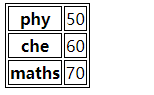

# Flask 模板

可以以HTML的形式返回绑定到某个URL的函数的输出。例如，在以下脚本中，**hello()**函数将使用标签呈现**'Hello World'。 **

```python
from flask import Flask
app = Flask(name)

@app.route('/')
def index():
   return ''Hello World''
if name == 'main':
   app.run(debug = True)
```

但是，从Python代码生成HTML内容很麻烦，尤其是在需要放置变量数据和Python语言元素（如条件或循环）时。这需要经常从HTML中转义。

这是可以利用Flask所基于的**Jinja2**模板引擎的地方。而不是从函数返回硬编码HTML，可以通过**render_template()**函数呈现HTML文件。

```python
from flask import Flask, render_template
app = Flask(name)

@app.route('/')
def index():
   return render_template(‘hello.html’)
if name == 'main':
   app.run(debug=True)
```

Flask将尝试在`templates`文件夹中找到HTML文件，该文件存在于此脚本所在的文件夹中。

- Application folder
  - Hello.py
  - templates
    - hello.html

术语**web templating system（web模板系统）** 指的是设计一个HTML脚本，其中可以动态插入变量数据。web模板系统包括模板引擎，某种数据源和模板处理器。

Flask使用**jinga2**模板引擎。Web模板包含用于变量和表达式（在这些情况下为Python表达式）的HTML语法散布占位符，这些是在呈现模板时替换的值。

以下代码在templates文件夹中另存为**hello.html** 。

```html
<!DOCTYPE html>
<html lang="en">
<head>
    <meta charset="UTF-8">
    <title></title>
</head>
<body>
    <h1>Hello from Flask.</h1>
    
        <p>Hello {{ name }}!</p>
    
        <p>ello World!</p>
    
</body>
</html>
```

   接下来，从Python shell运行以下脚本：

```python
from flask import Flask, render_template
app = Flask(__name__)

@app.route('/hello/<user>')
def hello_name(user):
   return render_template('hello.html', name=user)

if __name__ == '__main__':
   app.run(debug = True)
```

当开发服务器开始运行时，打开浏览器并输入URL - **http://localhost:5000/hello/mvl**

URL的变量部分插入`{{name}}`占位符。

**Jinja2**模板引擎使用以下分隔符从HTML转义。

- ``用于语句
- `{{ ... }}`用于表达式可以打印到模板输出
- `{# ... #}`用于未包含在模板输出中的注释
- `# ... ##`用于行语句

在下面的示例中，演示了在模板中使用条件语句。**hello()**函数的URL规则接受整数参数。它被传递到**hello.html**模板。其中，比较接收的数字（marks）的值（大于或小于60），因此有条件地呈现HTML。

Python脚本如下：

```python
from flask import Flask, render_template
app = Flask(__name__)

@app.route('/hello/<int:score>')
def hello_name(score):
   return render_template('hello.html', marks=score)

if __name__ == '__main__':
   app.run(debug = True)
```

**hello.html**的HTML模板脚本如下：

```html
<!DOCTYPE html>
<html lang="en">
<head>
    <meta charset="UTF-8">
    <title></title>
</head>
<body>
    
    <h1> Your result is pass!</h1>
    
    <h1>Your result is fail</h1>
    
</body>
</html>
```

请注意，条件语句**if-else**和**endif**包含在分隔符{％..％}中。

运行Python脚本并访问URL **http://localhost/hello/60**，然后访问**http://localhost/hello/30**，以查看HTML的输出是否有条件地更改。

Python循环结构也可以在模板中使用。在以下脚本中，当在浏览器中打开URL **http://localhost:5000/result**时，**result()**函数会将字典对象发送到模板**results.html**。

**result.html**的Template部分使用**for循环**将字典对象**result{}**的键和值对呈现为HTML表的单元格。

从Python shell运行以下代码：

```python
from flask import Flask, render_template
app = Flask(__name__)

@app.route('/result')
def result():
    dictList = {'phy': 50, 'che': 60, 'maths': 70}
    return render_template('result.html', result=dictList)

if __name__ == '__main__':
    app.run(debug=True)
```

将以下HTML脚本保存为templates文件夹中的**result.html**：

```html
<!DOCTYPE html>
<html lang="en">
<head>
    <meta charset="UTF-8">
    <title></title>
</head>
<body>
    <table style="border: 1px solid black">
        
        <tr style="border: 1px solid black">
            <th style="border: 1px solid black">{{key}}</th>
            <td style="border: 1px solid black">{{value}}</td>
        </tr>
        
    </table>
</body>
</html>
```

这里，对应于**for**循环的Python语句再次包含在``中，而表达式`key`和`value`放在`{{}}`中。

开始运行后，在浏览器中打开**http://localhost:5000/result**即可获得以下输出：




