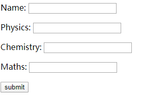
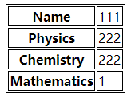

# Flask 将表单数据发送到模板

我们已经看到，可以在URL规则中指定`http`方法。触发函数接收的**Form**数据可以以字典对象的形式收集它并将其转发到模板以在相应的网页上呈现它。

在以下示例中，'`/`' URL会呈现具有表单的网页（`student.html`）。填入的数据会发布到触发 `result()`函数的'`/result`' URL。

`results()`函数的作用是收集字典对象中的`request.form`中存在的表单数据，并将其发送给`result.html`。

该模板动态呈现**表单**数据的HTML表格。

下面给出的是应用程序的Python代码：

```python
from flask import Flask, render_template, request
app = Flask(__name__)

@app.route('/')
def student():
   return render_template('student.html')

@app.route('/result', methods=['POST', 'GET'])
def result():
   if request.method == 'POST':
      result = request.form
      return render_template('result.html', result=result)
              
if __name__ == '__main__':
   app.run(debug=True)
```

下面给出的是**student.html**的HTML脚本。

```html
<!DOCTYPE html>
<html lang="en">
<head>
    <meta charset="UTF-8">
    <title></title>
</head>
<body>
    <form action="http://localhost:5000/result" method="POST">
        <p>Name: <input type="text" name="Name"/></p>
        <p>Physics: <input type="text" name="Physics"/></p>
        <p>Chemistry: <input type="text" name="Chemistry"/></p>
        <p>Maths: <input type="text" name="Mathematics"/></p>
        <p><input type="submit" value="submit"</p>
    </form>
</body>
</html>
```

下面给出了模板**（result.html）**的代码：

```html
<!DOCTYPE html>
<html lang="en">
<head>
    <meta charset="UTF-8">
    <title></title>
</head>
<body>
    <table style="border: 1px solid black">
        
        <tr style="border: 1px solid black">
            <th style="border: 1px solid black">{{key}}</th>
            <td style="border: 1px solid black">{{value}}</td>
        </tr>
        
    </table>
</body>
</html>
```

运行Python脚本，并在浏览器中输入URL **http://localhost:5000/**。



当点击**提交**按钮时，表单数据以HTML表格的形式呈现在**result.html**上。

